# 📊 インサイダーゲーム ブラウザアプリ 仕様書

完璧です！すべての要件が明確になりました。それでは成果物を作成します。

---

## 1. 全体状態遷移図

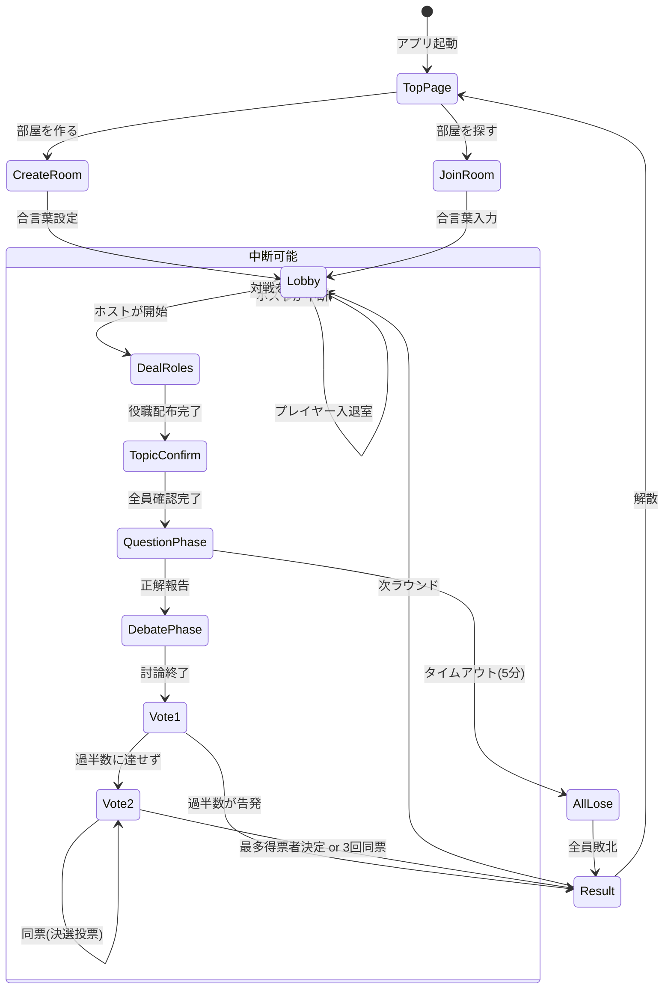

---

## 2. 詳細フローチャート

### 2-1. トップページ・ルーム作成/参加フロー

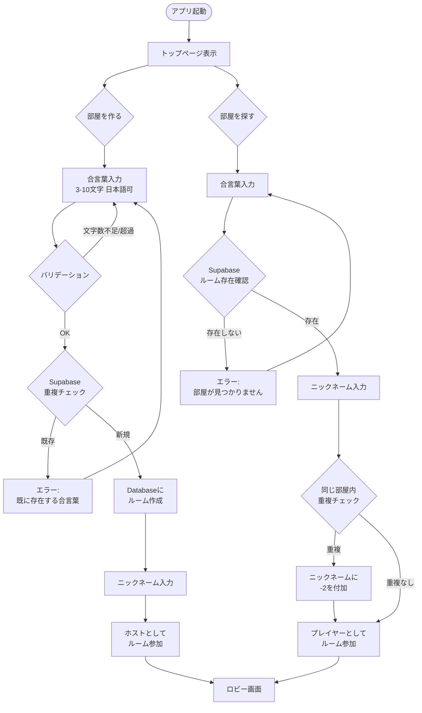

### 2-2. ロビー・ゲーム開始フロー

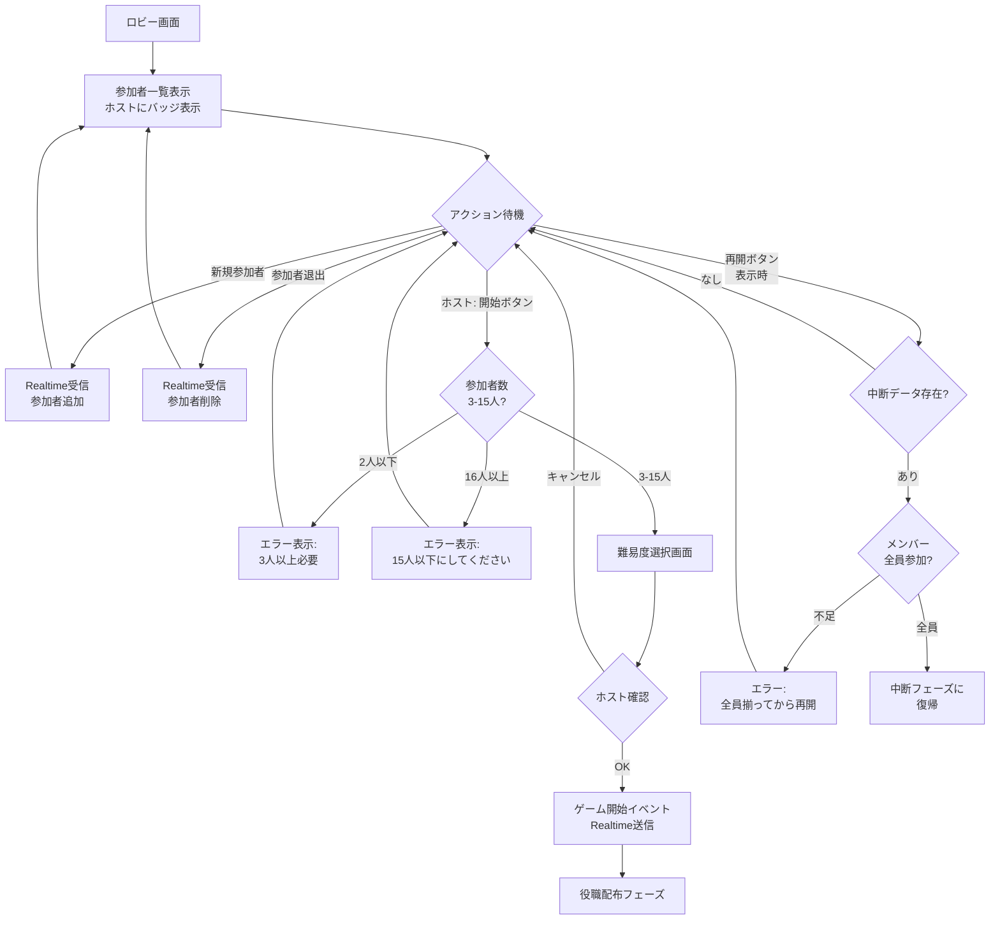

### 2-3. 役職配布フロー

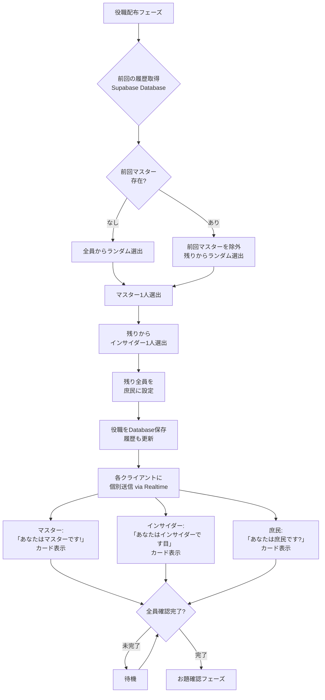

### 2-4. お題確認フロー

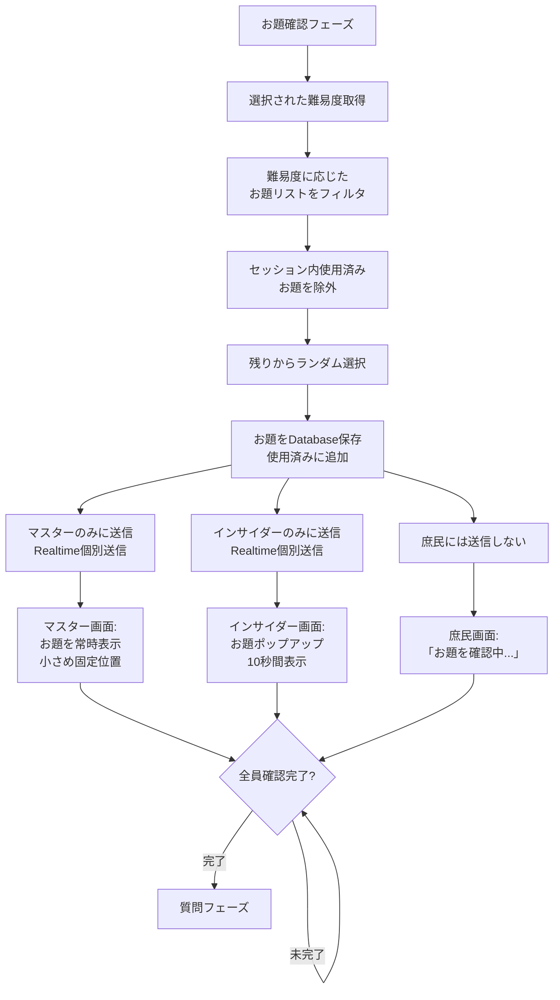

### 2-5. 質問フェーズフロー

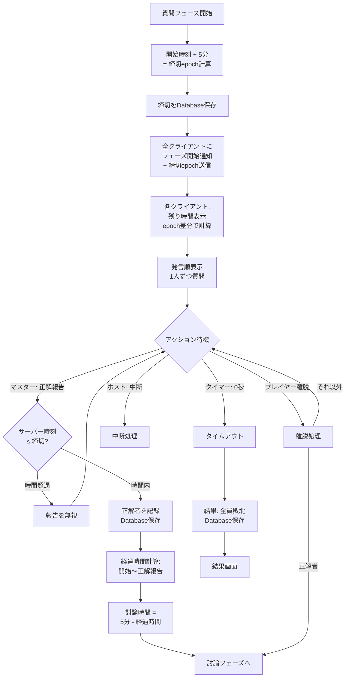

### 2-6. 討論フェーズフロー

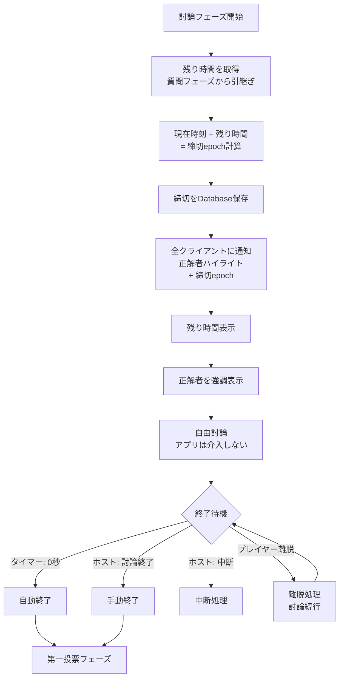

### 2-7. 第一投票フロー

```mermaid
flowchart TD
    Vote1Phase[第一投票フェーズ] --> ShowQuestion[画面表示:<br/>「正解者をインサイダーとして<br/>告発しますか?」]
    
    ShowQuestion --> ShowButtons[Yes/Noボタン表示<br/>大きなタップ領域]
    ShowButtons --> WaitVotes{投票待機}
    
    WaitVotes -->|プレイヤー: 投票| RecordVote1[投票をDatabase記録<br/>個別テーブル]
    RecordVote1 --> CheckComplete1{全員投票完了?}
    
    CheckComplete1 -->|未完了| WaitVotes
    CheckComplete1 -->|完了| CountVotes1[集計処理]
    
    CountVotes1 --> CalcMajority{Yes票が過半数?<br/>|中央値|票以上}
    
    CalcMajority -->|Yes過半数| RevealCorrector[正解者の役職を公開]
    RevealCorrector --> CheckInsider{インサイダー?}
    CheckInsider -->|Yes| CitizenWin[勝敗: 庶民勝利]
    CheckInsider -->|No| InsiderWin1[勝敗: インサイダー勝利]
    CitizenWin --> Result1[結果画面]
    InsiderWin1 --> Result1
    
    CalcMajority -->|No過半数| Vote2Phase[第二投票フェーズ]
    
    WaitVotes -->|ホスト: 中断| Suspend3[中断処理]
    WaitVotes -->|プレイヤー離脱| InvalidVote[その人の票を無効化<br/>離脱者除外して再集計]
    InvalidVote --> CheckComplete1
```

### 2-8. 第二投票フロー（決選投票含む）

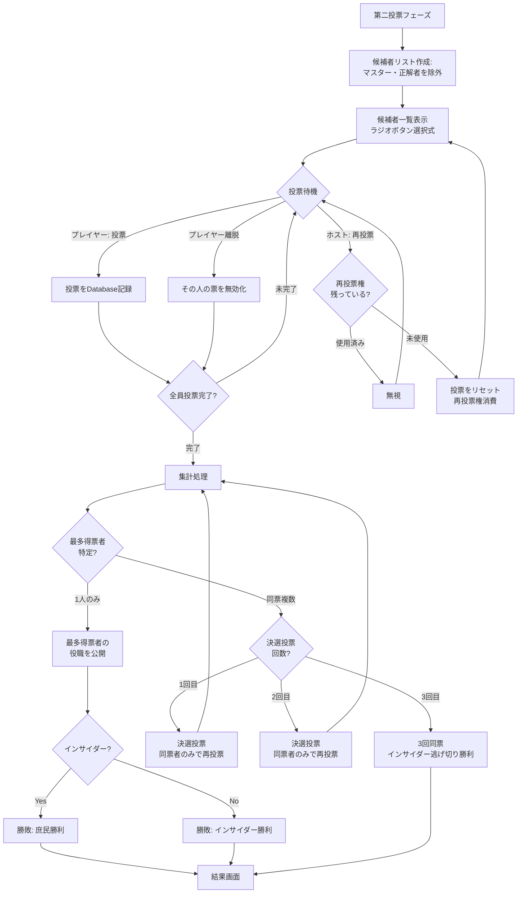

### 2-9. 結果表示・次ラウンドフロー

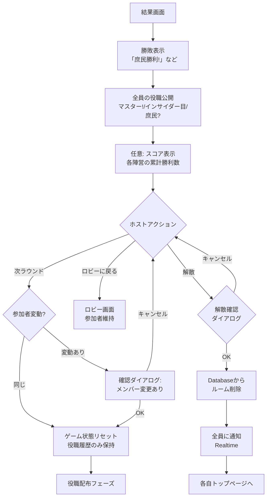

### 2-10. 中断・再開フロー

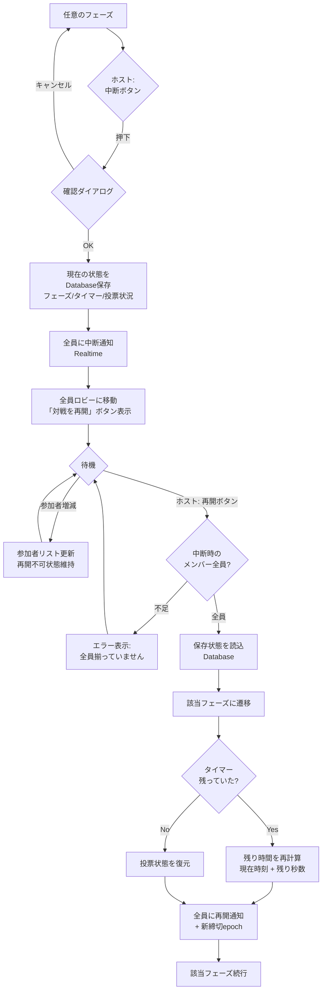

---

## 3. シーケンス図

### 3-1. 部屋作成・参加シーケンス

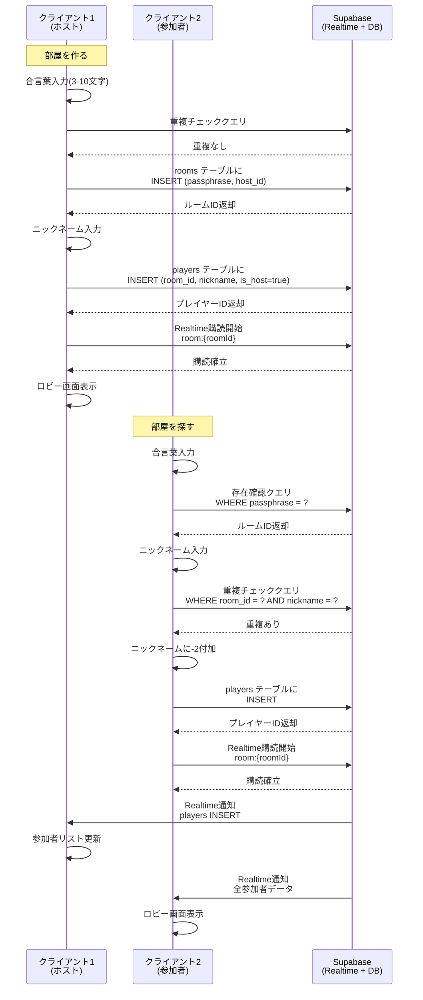

### 3-2. ゲーム開始・役職配布シーケンス

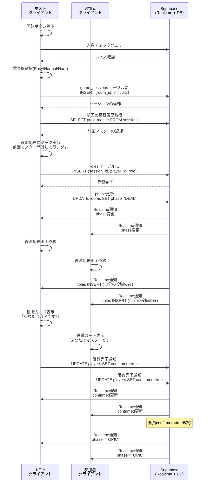

### 3-3. お題確認シーケンス

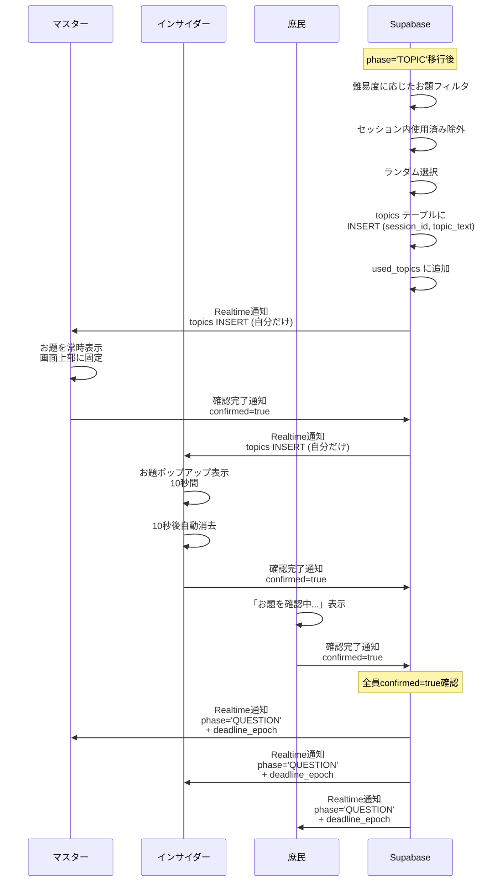

### 3-4. 質問フェーズシーケンス

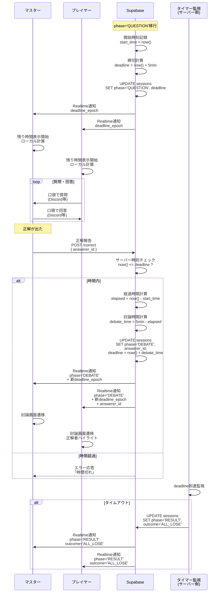

### 3-5. 投票フェーズシーケンス（第一・第二投票）

```mermaid
sequenceDiagram
    participant P1 as プレイヤー1
    participant P2 as プレイヤー2
    participant SB as Supabase
    
    Note over SB: phase='DEBATE'終了
    SB->>SB: UPDATE sessions<br/>SET phase='VOTE1'
    SB->>P1: Realtime通知<br/>phase='VOTE1'
    SB->>P2: Realtime通知<br/>phase='VOTE1'
    
    P1->>P1: 「正解者をインサイダーとして<br/>告発しますか?」表示
    P2->>P2: 同じ画面表示
    
    P1->>SB: 投票<br/>POST /vote1<br/>{ vote: 'yes' }
    SB->>SB: votes テーブルに<br/>INSERT (session_id, player_id, vote)
    SB->>P1: Realtime通知<br/>投票済みステータス
    SB->>P2: Realtime通知<br/>「P1投票完了」
    
    P2->>SB: 投票<br/>POST /vote1<br/>{ vote: 'no' }
    SB->>SB: INSERT votes
    
    Note over SB: 全員投票完了検出
    SB->>SB: 集計処理<br/>COUNT(vote='yes')
    SB->>SB: 過半数判定<br/>yes_count > total/2 ?
    
    alt Yes過半数
        SB->>SB: 正解者の役職取得
        SB->>SB: UPDATE sessions<br/>SET phase='RESULT',<br/>revealed_player_id
        
        SB->>P1: Realtime通知<br/>phase='RESULT'<br/>+ 正解者役職公開<br/>+ 勝敗
        SB->>P2: Realtime通知<br/>同上
        
    else No過半数
        SB->>SB: UPDATE sessions<br/>SET phase='VOTE2'
        SB->>SB: 候補者リスト生成<br/>(マスター・正解者除外)
        
        SB->>P1: Realtime通知<br/>phase='VOTE2'<br/>+ 候補者リスト
        SB->>P2: Realtime通知<br/>同上
        
        P1->>P1: 候補者一覧表示
        P2->>P2: 同じ画面表示
        
        P1->>SB: 投票<br/>POST /vote2<br/>{ candidate_id }
        P2->>SB: 投票<br/>POST /vote2<br/>{ candidate_id }
        
        Note over SB: 全員投票完了検出
        SB->>SB: 集計処理<br/>各候補の得票数計算
        SB->>SB: 最多得票者判定
        
        alt 最多1人
            SB->>SB: その人の役職取得
            SB->>SB: UPDATE sessions<br/>SET phase='RESULT'
            SB->>P1: Realtime通知<br/>結果 + 役職公開
            SB->>P2: Realtime通知<br/>同上
            
        else 同票複数
            SB->>SB: UPDATE sessions<br/>SET phase='VOTE2_RUNOFF',<br/>runoff_round++
            SB->>SB: 同票者のみリスト化
            
            alt 3回目同票
                SB->>SB: UPDATE sessions<br/>SET phase='RESULT',<br/>outcome='INSIDER_WIN'
                SB->>P1: Realtime通知<br/>「インサイダー逃げ切り」
                SB->>P2: Realtime通知<br/>同上
            else 1-2回目
                SB->>P1: Realtime通知<br/>「決選投票」<br/>+ 同票者リスト
                SB->>P2: Realtime通知<br/>同上
                Note over P1,P2: 決選投票へ<br/>(同じフロー)
            end
        end
    end
```

### 3-6. 再投票シーケンス

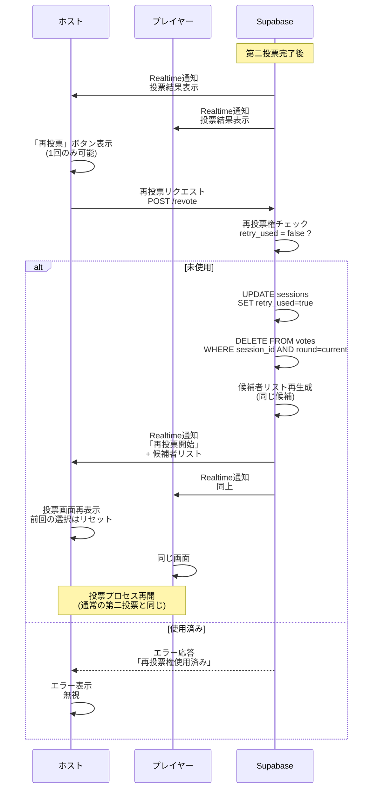

### 3-7. 中断・再開シーケンス

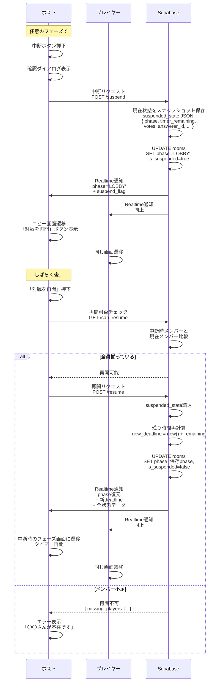

### 3-8. 離脱・再接続シーケンス

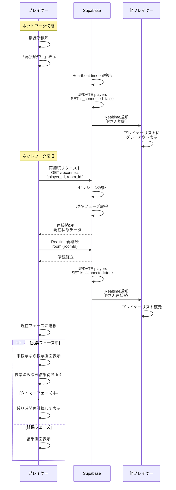

---

## 4. データベーススキーマ（補足）

### 4-1. 主要テーブル

```sql
-- ルーム
CREATE TABLE rooms (
  id UUID PRIMARY KEY DEFAULT gen_random_uuid(),
  passphrase TEXT NOT NULL UNIQUE, -- 合言葉（3-10文字）
  host_id UUID REFERENCES players(id),
  phase TEXT NOT NULL DEFAULT 'LOBBY', -- LOBBY/DEAL/TOPIC/QUESTION/DEBATE/VOTE1/VOTE2/RESULT
  is_suspended BOOLEAN DEFAULT false,
  suspended_state JSONB, -- 中断時の状態スナップショット
  created_at TIMESTAMP DEFAULT now(),
  updated_at TIMESTAMP DEFAULT now()
);

-- プレイヤー
CREATE TABLE players (
  id UUID PRIMARY KEY DEFAULT gen_random_uuid(),
  room_id UUID REFERENCES rooms(id) ON DELETE CASCADE,
  nickname TEXT NOT NULL,
  is_host BOOLEAN DEFAULT false,
  is_connected BOOLEAN DEFAULT true,
  confirmed BOOLEAN DEFAULT false, -- フェーズ確認フラグ
  created_at TIMESTAMP DEFAULT now()
);

-- ゲームセッション（ラウンド単位）
CREATE TABLE game_sessions (
  id UUID PRIMARY KEY DEFAULT gen_random_uuid(),
  room_id UUID REFERENCES rooms(id) ON DELETE CASCADE,
  difficulty TEXT NOT NULL, -- Easy/Normal/Hard
  start_time TIMESTAMP,
  deadline_epoch BIGINT, -- タイマー締切（epoch秒）
  answerer_id UUID REFERENCES players(id), -- 正解者
  phase TEXT NOT NULL,
  prev_master_id UUID REFERENCES players(id), -- 前回のマスター
  created_at TIMESTAMP DEFAULT now()
);

-- 役職
CREATE TABLE roles (
  id UUID PRIMARY KEY DEFAULT gen_random_uuid(),
  session_id UUID REFERENCES game_sessions(id) ON DELETE CASCADE,
  player_id UUID REFERENCES players(id) ON DELETE CASCADE,
  role TEXT NOT NULL, -- MASTER/INSIDER/CITIZEN
  created_at TIMESTAMP DEFAULT now(),
  UNIQUE(session_id, player_id)
);

-- お題
CREATE TABLE topics (
  id UUID PRIMARY KEY DEFAULT gen_random_uuid(),
  session_id UUID REFERENCES game_sessions(id) ON DELETE CASCADE,
  topic_text TEXT NOT NULL,
  difficulty TEXT NOT NULL,
  created_at TIMESTAMP DEFAULT now()
);

-- 使用済みお題（セッション内重複回避）
CREATE TABLE used_topics (
  session_id UUID REFERENCES game_sessions(id) ON DELETE CASCADE,
  topic_id UUID,
  PRIMARY KEY(session_id, topic_id)
);

-- 投票
CREATE TABLE votes (
  id UUID PRIMARY KEY DEFAULT gen_random_uuid(),
  session_id UUID REFERENCES game_sessions(id) ON DELETE CASCADE,
  player_id UUID REFERENCES players(id) ON DELETE CASCADE,
  vote_type TEXT NOT NULL, -- VOTE1/VOTE2/RUNOFF
  vote_value TEXT, -- VOTE1: yes/no, VOTE2: candidate_id
  round INT DEFAULT 1, -- 決選投票の回数
  created_at TIMESTAMP DEFAULT now()
);

-- 結果
CREATE TABLE results (
  id UUID PRIMARY KEY DEFAULT gen_random_uuid(),
  session_id UUID REFERENCES game_sessions(id) ON DELETE CASCADE,
  outcome TEXT NOT NULL, -- CITIZENS_WIN/INSIDER_WIN/ALL_LOSE
  revealed_player_id UUID REFERENCES players(id), -- 公開された人
  created_at TIMESTAMP DEFAULT now()
);
```

---

## 5. 実装チェックリスト

### フロントエンド（React）

- [ ] トップページ（部屋作成/検索UI）
- [ ] ロビー画面（参加者リスト、開始ボタン、再開ボタン）
- [ ] 役職配布画面（カード表示、アニメーション）
- [ ] お題確認画面（役職別の表示制御）
- [ ] 質問フェーズ画面（タイマー表示、正解報告ボタン）
- [ ] 討論フェーズ画面（正解者ハイライト、残り時間）
- [ ] 第一投票画面（Yes/Noボタン、集計表示）
- [ ] 第二投票画面（候補者リスト、決選投票UI）
- [ ] 結果画面（勝敗、全役職公開、次ラウンド/解散）
- [ ] 中断・再開UI（確認ダイアログ、状態復元）
- [ ] エラーハンドリング（トースト通知、再接続表示）
- [ ] レスポンシブ対応（PC/スマホ）
- [ ] アクセシビリティ（フォントサイズ、タップ領域、色覚対応）

### バックエンド（Supabase）

- [ ] Databaseスキーマ作成
- [ ] Realtime設定（room単位の購読）
- [ ] RPC関数実装（役職配布、集計処理、状態遷移）
- [ ] Row Level Security設定（役職情報の秘匿）
- [ ] Webhooks/Edge Functions（タイマー監視、自動遷移）
- [ ] お題データ投入（JSON→Database）
- [ ] 再接続ロジック
- [ ] 中断・再開ロジック
- [ ] 投票集計・同票処理
- [ ] ログ記録（監査用）

### テスト

- [ ] 役職配布の偏りテスト（100回実行して統計）
- [ ] 同時正解の排他制御テスト
- [ ] タイマー境界値テスト（0秒、1秒前）
- [ ] 同票・決選投票の全パターン
- [ ] 離脱・再接続の全フェーズ
- [ ] 中断・再開の状態復元
- [ ] 再投票権の1回制限
- [ ] 合言葉重複チェック
- [ ] ニックネーム重複時の-2付加
- [ ] 負荷テスト（30名同時接続）

---

## 6. 補足事項

### タイマー同期の実装例（React側）

```typescript
// クライアント側でのタイマー表示
useEffect(() => {
  if (!deadlineEpoch) return;
  
  const interval = setInterval(() => {
    const now = Math.floor(Date.now() / 1000);
    const remaining = deadlineEpoch - now;
    
    if (remaining <= 0) {
      setTimeRemaining(0);
      clearInterval(interval);
      // タイムアウト処理はサーバー側で実施
    } else {
      setTimeRemaining(remaining);
    }
  }, 100); // 0.1秒ごとに更新
  
  return () => clearInterval(interval);
}, [deadlineEpoch]);
```

### Supabase Realtime購読例

```typescript
const channel = supabase.channel(`room:${roomId}`)
  .on('postgres_changes', 
    { event: 'UPDATE', schema: 'public', table: 'rooms' },
    (payload) => {
      // フェーズ変更を検知
      if (payload.new.phase !== currentPhase) {
        setCurrentPhase(payload.new.phase);
      }
    }
  )
  .on('postgres_changes',
    { event: 'INSERT', schema: 'public', table: 'players', filter: `room_id=eq.${roomId}` },
    (payload) => {
      // 新規参加者を追加
      setPlayers(prev => [...prev, payload.new]);
    }
  )
  .subscribe();
```

---

以上が「インサイダーゲーム オンライン版」の完全な仕様書となります。 不明点や追加で詳細化が必要な箇所があればお知らせください！