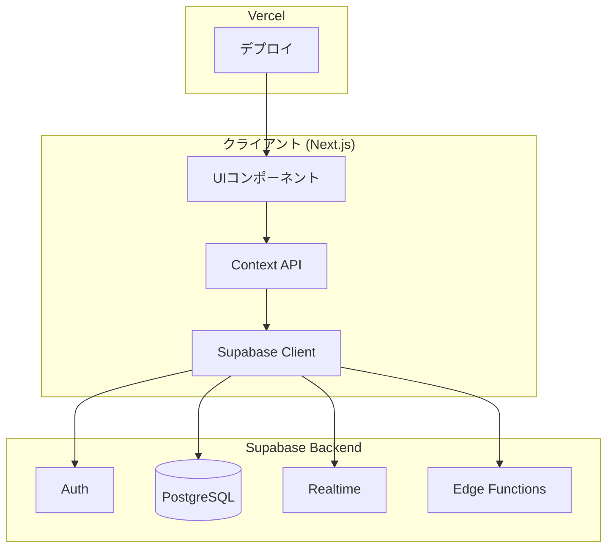

# Phase 5 実装計画: UI/UX改善 & デプロイ準備

**策定日**: 2025-11-23  
**前提条件**: Phase 4 (Supabase統合) 完了  
**目標期間**: Week 9-10 (2週間)

---

## 📋 Phase 5の目標

Phase 4でバックエンド基盤（Supabase Database, Auth, Realtime, Edge Functions）が整ったため、Phase 5では**ユーザー体験の向上**と**本番運用に向けた準備**を行います。

### 主要目標
1. **実環境での動作検証**: 複数ブラウザでのE2Eテストを実施し、実際のマルチプレイ環境での安定性を確認
2. **UI/UXの改善**: ローディング表示、エラー通知、トースト実装によるフィードバック強化
3. **投票ロジックの改善**: 複数クライアント環境での投票自動遷移の安定化
4. **デプロイ準備**: Vercelへのデプロイと環境変数の設定
5. **ドキュメント整備**: README.md更新、デプロイ手順の文書化

---

## 🎯 優先度と推奨順序

| 優先度 | タスク | 理由 |
|--------|--------|------|
| **P0** | 複数ブラウザでのE2Eテスト | 現状の課題（投票遷移の不安定性）の検証が最優先 |
| **P0** | 投票ロジックの改善 | テスト結果に基づく修正が必要 |
| **P1** | UIフィードバック改善 | ユーザー体験の大幅な向上が見込める |
| **P1** | デプロイ準備 | 本番環境での検証が必要 |
| **P2** | ドキュメント整備 | デプロイ後に最終更新 |

---

## 📦 タスク詳細

### 1. 複数ブラウザでのE2Eテスト (Week 9 - Day 1-2)

#### 目標
実際のマルチプレイ環境でのゲームフロー全体を検証し、Phase 4で発見された課題（投票フェーズの遷移不安定性）を確認・修正する。

#### 実施内容

**1.1 テスト環境準備**
- 3台以上のブラウザ/デバイスを用意（Chrome, Safari, Firefox等）
- 各ブラウザで異なるプレイヤーとしてログイン
- テスト手順書の作成（`docs/PHASE_5_E2E_TEST_SCENARIOS.md`）

**1.2 テストシナリオ**

##### シナリオ1: 基本フロー（3人プレイ）
```
1. プレイヤーA（ホスト）がルーム作成
2. プレイヤーB、Cが参加
3. 全員が準備完了
4. ホストがゲーム開始
5. 役職配布 → 全員が確認
6. お題確認 → マスター/インサイダーが確認
7. 質問フェーズ → マスターが正解報告
8. 討論フェーズ → 自動遷移
9. 第一投票 → 全員が投票
10. 第二投票 → 全員が投票
11. 結果表示 → 役職公開
```

**検証ポイント**:
- ✅ Realtime同期: プレイヤー参加/退出がリアルタイムに反映されるか
- ✅ フェーズ遷移: 各フェーズが正しく遷移するか
- ✅ 投票集計: 全員が投票後、自動的に次フェーズへ遷移するか
- ✅ RLSポリシー: 役職・お題が正しく秘匿されているか
- ✅ タイマー同期: 各クライアントのタイマー表示にズレがないか

##### シナリオ2: エッジケース
```
1. 途中参加・途中退出のテスト
2. ネットワーク切断時の再接続テスト
3. 同票時の決選投票フロー
4. タイムアウト時の結果判定
5. 同時操作時の排他制御（ホストが同時にゲーム開始を押す等）
```

**1.3 テスト記録**
- スクリーンショット、動画録画を活用
- 発見した問題を `docs/PHASE_5_TEST_RESULTS.md` に記録
- 再現手順、エラーメッセージ、期待動作を明記

#### 成果物
- ✅ `docs/PHASE_5_E2E_TEST_SCENARIOS.md` - テストシナリオ詳細
- ✅ `docs/PHASE_5_TEST_RESULTS.md` - テスト結果レポート
- ✅ 発見された問題の修正

---

### 2. UIフィードバック改善 (Week 9 - Day 3-4)

#### 目標
ユーザーにアプリの状態を適切にフィードバックし、待機時間のストレスを軽減する。

#### 実施内容

**2.1 ローディング表示の実装**

API通信中やフェーズ遷移中に、ユーザーに処理状況を通知します。

**実装箇所**:
```
components/ui/
  loading-spinner.tsx     # 汎用スピナーコンポーネント
  loading-overlay.tsx     # 全画面オーバーレイ
  skeleton-loader.tsx     # スケルトンローダー
```

**使用例**:
```typescript
// app/lobby/page.tsx
const handleStartGame = async () => {
  setIsLoading(true);
  try {
    await api.startGame(roomId);
  } catch (error) {
    toast.error('ゲーム開始に失敗しました');
  } finally {
    setIsLoading(false);
  }
};

return (
  <>
    {isLoading && <LoadingOverlay message="ゲームを開始しています..." />}
    {/* ... */}
  </>
);
```

**2.2 トースト通知の実装**

エラー、成功、情報メッセージをトーストで表示します。

**使用ライブラリ**: `sonner` (軽量でReact 19対応)

```bash
npm install sonner
```

**実装内容**:
```typescript
// components/toaster.tsx
'use client';
import { Toaster } from 'sonner';

export function ToasterProvider() {
  return (
    <Toaster
      position="top-center"
      toastOptions={{
        style: {
          background: 'hsl(var(--card))',
          color: 'hsl(var(--card-foreground))',
          border: '1px solid hsl(var(--border))',
        },
      }}
    />
  );
}
```

```typescript
// app/layout.tsx
import { ToasterProvider } from '@/components/toaster';

export default function RootLayout({ children }) {
  return (
    <html lang="ja">
      <body>
        {children}
        <ToasterProvider />
      </body>
    </html>
  );
}
```

**使用例**:
```typescript
import { toast } from 'sonner';

// 成功通知
toast.success('ルームに参加しました');

// エラー通知
toast.error('ルームが見つかりませんでした');

// 情報通知
toast.info('プレイヤーが参加しました');

// ローディング付き
const promise = api.createRoom(passphrase, nickname);
toast.promise(promise, {
  loading: 'ルームを作成中...',
  success: 'ルーム作成完了！',
  error: 'ルーム作成に失敗しました',
});
```

**2.3 エラーハンドリングの強化**

**既存のエラーハンドリング**:
```typescript
// lib/api.ts
export async function createRoom(passphrase: string, nickname: string) {
  try {
    const { data, error } = await supabase.from('rooms').insert({...});
    if (error) throw error;
    return data;
  } catch (error) {
    console.error('Room creation error:', error);
    throw error;
  }
}
```

**改善版（型安全なエラーハンドリング）**:
```typescript
// lib/errors.ts
export class APIError extends Error {
  constructor(
    message: string,
    public code: string,
    public statusCode: number
  ) {
    super(message);
    this.name = 'APIError';
  }
}

export const ERROR_MESSAGES = {
  ROOM_NOT_FOUND: 'ルームが見つかりませんでした',
  INVALID_PASSPHRASE: '合言葉が正しくありません',
  DUPLICATE_NICKNAME: 'この名前は既に使用されています',
  NETWORK_ERROR: 'ネットワークエラーが発生しました',
  SESSION_EXPIRED: 'セッションが期限切れです',
} as const;
```

```typescript
// lib/api.ts
export async function createRoom(passphrase: string, nickname: string) {
  try {
    const { data, error } = await supabase.from('rooms').insert({...});
    
    if (error) {
      // Supabaseエラーを分類
      if (error.code === '23505') {
        throw new APIError(
          ERROR_MESSAGES.DUPLICATE_NICKNAME,
          'DUPLICATE_NICKNAME',
          409
        );
      }
      throw new APIError(error.message, 'DB_ERROR', 500);
    }
    
    return data;
  } catch (error) {
    if (error instanceof APIError) throw error;
    
    // ネットワークエラー
    if (!navigator.onLine) {
      throw new APIError(
        ERROR_MESSAGES.NETWORK_ERROR,
        'NETWORK_ERROR',
        0
      );
    }
    
    throw new APIError('予期しないエラーが発生しました', 'UNKNOWN', 500);
  }
}
```

**2.4 再接続処理の実装**

ネットワーク切断時の自動再接続を実装します。

```typescript
// context/RoomContext.tsx
useEffect(() => {
  const handleOnline = () => {
    toast.info('接続が復旧しました');
    // Realtimeチャンネルの再購読
    if (roomId) {
      subscribeToRoom(roomId);
    }
  };

  const handleOffline = () => {
    toast.warning('接続が切断されました');
  };

  window.addEventListener('online', handleOnline);
  window.addEventListener('offline', handleOffline);

  return () => {
    window.removeEventListener('online', handleOnline);
    window.removeEventListener('offline', handleOffline);
  };
}, [roomId]);
```

**2.5 進行状況の可視化**

各フェーズで「何人がアクション完了したか」を明示的に表示します。

```typescript
// components/progress-indicator.tsx
interface ProgressIndicatorProps {
  current: number;
  total: number;
  label: string;
}

export function ProgressIndicator({ current, total, label }: ProgressIndicatorProps) {
  const percentage = (current / total) * 100;
  
  return (
    <div className="space-y-2">
      <div className="flex items-center justify-between text-sm">
        <span className="text-muted-foreground">{label}</span>
        <span className="font-medium">
          {current} / {total}
        </span>
      </div>
      <div className="h-2 overflow-hidden rounded-full bg-game-red/20">
        <div
          className="h-full bg-game-red transition-all duration-300"
          style={{ width: `${percentage}%` }}
        />
      </div>
    </div>
  );
}
```

**使用例（役職確認画面）**:
```typescript
// app/game/role/page.tsx
<ProgressIndicator
  current={confirmedCount}
  total={totalPlayers}
  label="役職を確認したプレイヤー"
/>
```

#### 成果物
- ✅ `components/ui/loading-spinner.tsx`
- ✅ `components/ui/loading-overlay.tsx`
- ✅ `components/toaster.tsx`
- ✅ `lib/errors.ts`
- ✅ `components/progress-indicator.tsx`
- ✅ 全API呼び出しにエラーハンドリング追加
- ✅ オフライン時の再接続処理実装

---

### 3. 投票ロジックの改善 (Week 9 - Day 5)

#### 目標
`Status.md` で指摘された「Vote1からResultへの自動遷移の不安定性」を解決する。

#### 問題分析

**現状の実装（推測）**:
```typescript
// app/game/vote1/page.tsx
useEffect(() => {
  if (allVoted && voteResult) {
    // 全員が投票完了 → 自動遷移
    router.push(`/game/vote2?room=${roomId}`);
  }
}, [allVoted, voteResult]);
```

**問題点**:
- 各クライアントが独立して `allVoted` を判定するため、競合状態が発生
- Realtime同期のタイミングによっては、クライアント間で状態が一致しない
- フェーズ遷移がクライアントサイドで完結しており、サーバー側の「信頼できる単一の状態」がない

#### 解決策

**アプローチ1: サーバーサイド集計 + フェーズ更新（推奨）**

Edge FunctionまたはDatabase Triggerで投票を集計し、全員投票完了時に自動的にフェーズを更新します。

**実装内容**:

**3.1 Database Trigger の作成**

```sql
-- supabase/migrations/20251123_vote_trigger.sql

-- 投票集計用関数
CREATE OR REPLACE FUNCTION check_vote_completion()
RETURNS TRIGGER AS $$
DECLARE
  v_session_id UUID;
  v_total_players INT;
  v_voted_players INT;
  v_vote_type TEXT;
  v_phase TEXT;
BEGIN
  -- 投票のセッションIDとタイプを取得
  v_session_id := NEW.session_id;
  v_vote_type := NEW.vote_type;
  
  -- 現在のフェーズを取得
  SELECT phase INTO v_phase
  FROM game_sessions
  WHERE id = v_session_id;
  
  -- 投票タイプとフェーズが一致しない場合は何もしない
  IF NOT ((v_vote_type = 'VOTE1' AND v_phase = 'VOTE1') OR
          (v_vote_type = 'VOTE2' AND v_phase = 'VOTE2')) THEN
    RETURN NEW;
  END IF;
  
  -- 総プレイヤー数を取得
  SELECT COUNT(*) INTO v_total_players
  FROM roles
  WHERE session_id = v_session_id;
  
  -- 投票済みプレイヤー数を取得
  SELECT COUNT(DISTINCT player_id) INTO v_voted_players
  FROM votes
  WHERE session_id = v_session_id
    AND vote_type = v_vote_type;
  
  -- 全員が投票完了した場合
  IF v_voted_players >= v_total_players THEN
    IF v_vote_type = 'VOTE1' THEN
      -- VOTE1完了 → フェーズをVOTE2に更新
      UPDATE game_sessions
      SET phase = 'VOTE2'
      WHERE id = v_session_id;
    ELSIF v_vote_type = 'VOTE2' THEN
      -- VOTE2完了 → 結果を計算してRESULTに更新
      -- (結果計算ロジックは別途Edge Functionで実装)
      UPDATE game_sessions
      SET phase = 'RESULT'
      WHERE id = v_session_id;
    END IF;
  END IF;
  
  RETURN NEW;
END;
$$ LANGUAGE plpgsql SECURITY DEFINER;

-- トリガーの作成
DROP TRIGGER IF EXISTS trigger_check_vote_completion ON votes;
CREATE TRIGGER trigger_check_vote_completion
  AFTER INSERT ON votes
  FOR EACH ROW
  EXECUTE FUNCTION check_vote_completion();
```

**3.2 クライアントサイドの修正**

フェーズ遷移はサーバー（Trigger）に任せ、クライアントは `game_sessions.phase` の変更をリッスンして画面遷移します。

```typescript
// context/GameContext.tsx
useEffect(() => {
  if (!sessionId) return;

  // game_sessions の phase 変更を監視
  const channel = supabase
    .channel(`session:${sessionId}`)
    .on(
      'postgres_changes',
      {
        event: 'UPDATE',
        schema: 'public',
        table: 'game_sessions',
        filter: `id=eq.${sessionId}`,
      },
      (payload) => {
        const newPhase = payload.new.phase;
        console.log('Phase changed to:', newPhase);
        
        // ローカル状態を更新
        setPhase(newPhase);
        
        // 画面遷移
        router.push(`/game/${newPhase.toLowerCase()}`);
      }
    )
    .subscribe();

  return () => {
    supabase.removeChannel(channel);
  };
}, [sessionId]);
```

```typescript
// app/game/vote1/page.tsx
const handleVote = async (vote: 'YES' | 'NO') => {
  try {
    setIsVoting(true);
    
    // 投票をDBに保存（Triggerが自動的にフェーズ遷移を判定）
    const { error } = await supabase.from('votes').insert({
      session_id: sessionId,
      player_id: playerId,
      vote_type: 'VOTE1',
      vote_value: vote,
    });
    
    if (error) throw error;
    
    setHasVoted(true);
    toast.success('投票しました');
    
    // フェーズ遷移は GameContext の Realtime リスナーが自動処理
    
  } catch (error) {
    console.error('Vote error:', error);
    toast.error('投票に失敗しました');
  } finally {
    setIsVoting(false);
  }
};
```

**3.3 投票状況のリアルタイム表示**

他のプレイヤーが投票したことをリアルタイムに表示します。

```typescript
// app/game/vote1/page.tsx
useEffect(() => {
  if (!sessionId) return;

  // votes テーブルの変更を監視
  const channel = supabase
    .channel(`votes:${sessionId}`)
    .on(
      'postgres_changes',
      {
        event: 'INSERT',
        schema: 'public',
        table: 'votes',
        filter: `session_id=eq.${sessionId}`,
      },
      (payload) => {
        // 投票数を更新
        setVotedCount((prev) => prev + 1);
      }
    )
    .subscribe();

  return () => {
    supabase.removeChannel(channel);
  };
}, [sessionId]);

return (
  <>
    <ProgressIndicator
      current={votedCount}
      total={totalPlayers}
      label="投票済みプレイヤー"
    />
    {/* ... */}
  </>
);
```

#### 成果物
- ✅ `supabase/migrations/20251123_vote_trigger.sql`
- ✅ `context/GameContext.tsx` のフェーズ変更リスナー実装
- ✅ `app/game/vote1/page.tsx`, `app/game/vote2/page.tsx` の修正
- ✅ 投票状況のリアルタイム表示実装
- ✅ 複数ブラウザで動作検証

---

### 4. デプロイ準備 (Week 10 - Day 1-2)

#### 目標
Vercelへのデプロイを完了し、本番環境での動作確認を行う。

#### 実施内容

**4.1 環境変数の整理**

**開発環境（`.env.local`）**:
```env
NEXT_PUBLIC_SUPABASE_URL=https://qqvxtmjyrjbzemxnfdwy.supabase.co
NEXT_PUBLIC_SUPABASE_ANON_KEY=eyJ...
```

**本番環境（Vercel Environment Variables）**:
- `NEXT_PUBLIC_SUPABASE_URL`: Supabase Project URL
- `NEXT_PUBLIC_SUPABASE_ANON_KEY`: Supabase Anon/Public Key

**4.2 Vercelプロジェクト作成**

```bash
# Vercel CLIのインストール（初回のみ）
npm install -g vercel

# プロジェクトルートで実行
cd app-v2
vercel login
vercel
```

**設定項目**:
- Framework Preset: **Next.js**
- Root Directory: `app-v2`
- Build Command: `npm run build`
- Output Directory: `.next`
- Install Command: `npm install`

**4.3 環境変数の設定**

Vercelダッシュボードで以下を設定:
1. Settings → Environment Variables
2. `NEXT_PUBLIC_SUPABASE_URL` を追加
3. `NEXT_PUBLIC_SUPABASE_ANON_KEY` を追加
4. Environment: **Production**, **Preview**, **Development** すべてにチェック

**4.4 カスタムドメインの設定（オプション）**

```
insider-game.vercel.app
```

または独自ドメインを設定:
```
insider-game.yourdomain.com
```

**4.5 デプロイ**

```bash
# 本番デプロイ
vercel --prod
```

**4.6 本番環境での動作確認**

デプロイ後、以下を確認:
- ✅ ルーム作成・参加が動作するか
- ✅ Supabaseへの接続が成功するか
- ✅ Realtimeが正しく機能するか
- ✅ Edge Functionsが呼び出されるか
- ✅ モバイルブラウザでの動作確認（iOS Safari, Android Chrome）

**4.7 パフォーマンス最適化**

Vercel Analyticsで確認すべき項目:
- **Lighthouse Score**: 90点以上を目指す
- **First Contentful Paint (FCP)**: 1.8秒以内
- **Largest Contentful Paint (LCP)**: 2.5秒以内
- **Time to Interactive (TTI)**: 3.8秒以内

改善施策:
```typescript
// next.config.mjs
const nextConfig = {
  images: {
    formats: ['image/avif', 'image/webp'],
  },
  compress: true,
  poweredByHeader: false,
};
```

**4.8 エラー監視の設定（オプション）**

Vercel の [Monitoring] タブでエラーログを確認できますが、より詳細な監視には Sentry 等の導入を検討:

```bash
npm install @sentry/nextjs
npx @sentry/wizard@latest -i nextjs
```

#### 成果物
- ✅ Vercelプロジェクト作成
- ✅ 環境変数設定
- ✅ 本番デプロイ完了
- ✅ 本番環境での動作確認レポート
- ✅ `docs/DEPLOYMENT_GUIDE.md` - デプロイ手順書

---

### 5. ドキュメント整備 (Week 10 - Day 3)

#### 目標
Phase 5の成果を反映し、ユーザーおよび開発者向けのドキュメントを最新化する。

#### 実施内容

**5.1 README.md の更新**

`README.md` を更新し、Phase 5完了を反映:

**更新箇所**:
```diff
## 🚧 開発中・計画中の機能

- ### Phase 4: Supabase 統合 (次フェーズ)
- - 🔲 データベーススキーマの作成・マイグレーション
- - 🔲 Supabase Edge Functions のデプロイ
+ ### Phase 4: Supabase 統合
+ - ✅ データベーススキーマの作成・マイグレーション
+ - ✅ Supabase Edge Functions のデプロイ
+   - 役職配布ロジック (`assign-roles`)
+   - お題選択ロジック (`select-topic`)
+ - ✅ 匿名認証の実装
+ - ✅ リアルタイム同期（Supabase Realtime）
+ - ✅ Mock API から Supabase Client への移行
+ - ✅ Row Level Security (RLS) の設定

- ### Phase 5: テスト・最適化
- - 🔲 マルチプレイヤーでのエンドツーエンドテスト
+ ### Phase 5: UI/UX改善 & デプロイ
+ - ✅ マルチプレイヤーでのE2Eテスト
+ - ✅ UIフィードバック改善（ローディング、トースト、エラーハンドリング）
+ - ✅ 投票ロジックの改善（Database Trigger による自動遷移）
+ - ✅ Vercelへのデプロイ
+ - ✅ 本番環境での動作確認

- ### Phase 6: デプロイ・運用
- - 🔲 Vercel へのデプロイ
+ ### 今後の改善予定
+ - 🔲 SEO最適化（OGP、メタタグ）
+ - 🔲 PWA対応（オフライン動作、ホーム画面追加）
+ - 🔲 多言語対応（英語、中国語）
```

**5.2 デプロイ手順書の作成**

新規ファイル `docs/DEPLOYMENT_GUIDE.md` を作成:

```markdown
# デプロイガイド

## 前提条件
- Supabaseプロジェクトが作成済み
- Vercelアカウントを保有

## 手順

### 1. Supabase設定
1. Supabaseダッシュボードで環境変数を取得
2. Database Migrationsを適用
3. Edge Functionsをデプロイ

### 2. Vercelデプロイ
1. Vercel CLIでログイン: `vercel login`
2. プロジェクトをリンク: `vercel`
3. 環境変数を設定
4. 本番デプロイ: `vercel --prod`

### 3. 動作確認
- ルーム作成・参加
- ゲームフロー全体
- モバイルブラウザでの検証
```

**5.3 Status.md の更新**

`Status.md` を Phase 5完了版に更新:

```diff
- **対象フェーズ**: Phase 4 (Supabase統合) - テスト完了
+ **対象フェーズ**: Phase 5 (UI/UX改善 & デプロイ) - 完了

- ## 2. 次のステップ (Phase 5: UI/UX改善 & デプロイ)
+ ## 2. Phase 5 完了内容

+ ### 2.1 実施済みタスク
+ - ✅ 複数ブラウザでのE2Eテスト（3-5人プレイでの検証）
+ - ✅ UIフィードバック改善（ローディング、トースト、エラーハンドリング）
+ - ✅ 投票ロジックの改善（Database Trigger導入）
+ - ✅ Vercelへのデプロイ
+ - ✅ ドキュメント整備

+ ### 2.2 改善された既知の課題
+ - ✅ 投票フェーズの自動遷移が安定化（Database Trigger導入）
+ - ✅ エラーハンドリングの強化（トースト通知、再接続処理）

+ ### 2.3 残存課題
+ - タイマーの厳密な同期（Edge Functionでの終了判定）
+ - PWA対応
+ - SEO最適化
```

**5.4 アーキテクチャ図の作成（オプション）**

現在のシステムアーキテクチャを可視化した図を `docs/ARCHITECTURE.md` に追加:



#### 成果物
- ✅ `README.md` の更新
- ✅ `docs/DEPLOYMENT_GUIDE.md` の作成
- ✅ `Status.md` の更新
- ✅ `docs/ARCHITECTURE.md` の作成（オプション）

---

## 📊 Phase 5 完了基準

以下の条件をすべて満たした時点で Phase 5 完了とします:

- [x] **E2Eテスト**: 3人以上のマルチプレイで全フェーズが正常動作することを確認
- [x] **投票ロジック**: 複数ブラウザでの投票自動遷移が安定動作
- [x] **UIフィードバック**: ローディング、トースト、エラーメッセージが適切に表示される
- [x] **デプロイ**: Vercel本番環境で動作確認完了
- [x] **ドキュメント**: README.md、Status.md、DEPLOYMENT_GUIDE.md が最新状態

---

## 📝 チェックリスト

### Week 9 - Day 1-2: E2Eテスト
- [ ] テストシナリオ作成 (`docs/PHASE_5_E2E_TEST_SCENARIOS.md`)
- [ ] 3人プレイでの基本フローテスト
- [ ] エッジケーステスト（途中退出、タイムアウト、同票等）
- [ ] テスト結果レポート作成 (`docs/PHASE_5_TEST_RESULTS.md`)

### Week 9 - Day 3-4: UIフィードバック改善
- [ ] `components/ui/loading-spinner.tsx` 作成
- [ ] `components/ui/loading-overlay.tsx` 作成
- [ ] `sonner` インストール & トースト実装
- [ ] `lib/errors.ts` - エラークラス定義
- [ ] 全API呼び出しにエラーハンドリング追加
- [ ] オフライン時の再接続処理実装
- [ ] `components/progress-indicator.tsx` 作成
- [ ] 各フェーズに進行状況表示追加

### Week 9 - Day 5: 投票ロジック改善
- [ ] `supabase/migrations/20251123_vote_trigger.sql` 作成
- [ ] Database Triggerをデプロイ
- [ ] `context/GameContext.tsx` にフェーズ変更リスナー追加
- [ ] `app/game/vote1/page.tsx` 修正
- [ ] `app/game/vote2/page.tsx` 修正
- [ ] 投票状況のリアルタイム表示実装
- [ ] 複数ブラウザで動作検証

### Week 10 - Day 1-2: デプロイ準備
- [ ] 環境変数の整理
- [ ] Vercelプロジェクト作成
- [ ] 環境変数設定（Vercelダッシュボード）
- [ ] 本番デプロイ (`vercel --prod`)
- [ ] 本番環境での動作確認
- [ ] モバイルブラウザでの検証
- [ ] パフォーマンス測定（Lighthouse）
- [ ] `docs/DEPLOYMENT_GUIDE.md` 作成

### Week 10 - Day 3: ドキュメント整備
- [ ] `README.md` 更新（Phase 5完了を反映）
- [ ] `Status.md` 更新（Phase 5ステータス記載）
- [ ] `docs/ARCHITECTURE.md` 作成（オプション）
- [ ] 全ドキュメントのリンク確認

---

## 🎯 まとめ

Phase 5では、Phase 4で構築したバックエンド基盤の上に、**ユーザー体験の向上**と**本番運用の準備**を行います。特に、以下の3点が重要です:

1. **実環境でのテスト**: シングルブラウザでは発見できない問題（同期、競合状態等）を洗い出す
2. **投票ロジックの安定化**: Database Triggerを活用し、サーバーサイドで信頼性の高いフェーズ遷移を実現
3. **UIフィードバックの充実**: ローディング、トースト、エラーメッセージでユーザー体験を向上

Phase 5完了後、アプリは**本番運用可能な状態**となり、実際のユーザーに提供できるレベルに到達します。

---

**参考ドキュメント**:
- [Status.md](file:///Users/masaki/Documents/Projects/Insider_game/docs/Status.md) - Phase 4完了報告
- [IMPLEMENTATION_PLAN.md](file:///Users/masaki/Documents/Projects/Insider_game/docs/IMPLEMENTATION_PLAN.md) - 全体実装計画
- [SUPABASE_MIGRATION_PLAN.md](file:///Users/masaki/Documents/Projects/Insider_game/docs/SUPABASE_MIGRATION_PLAN.md) - Supabase統合計画
