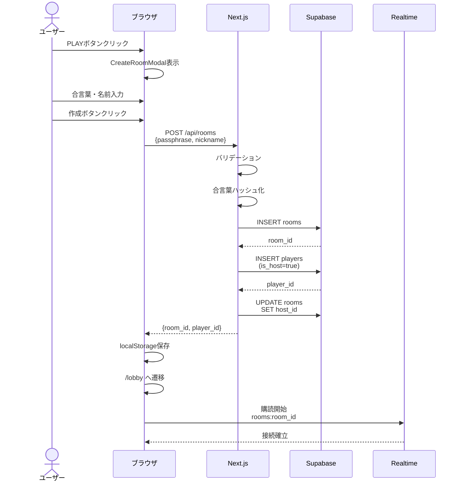
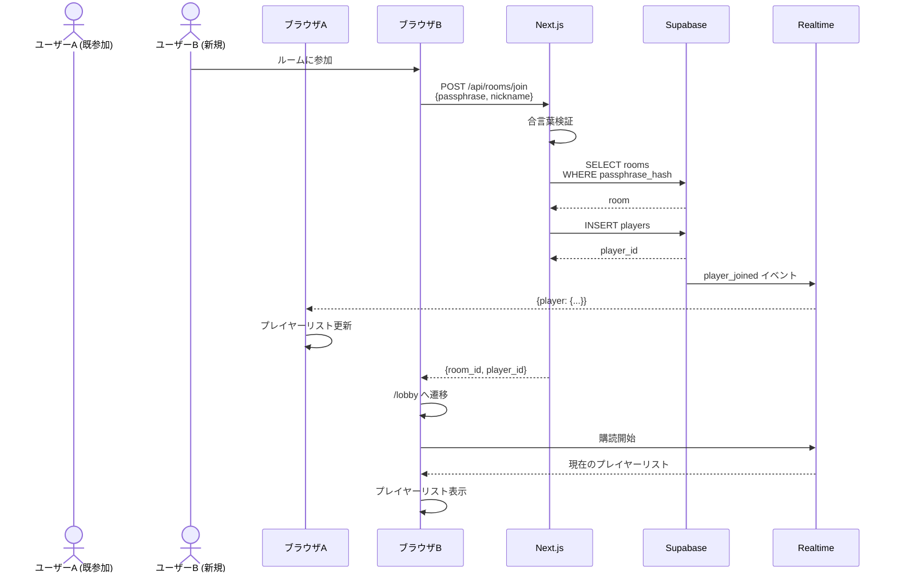
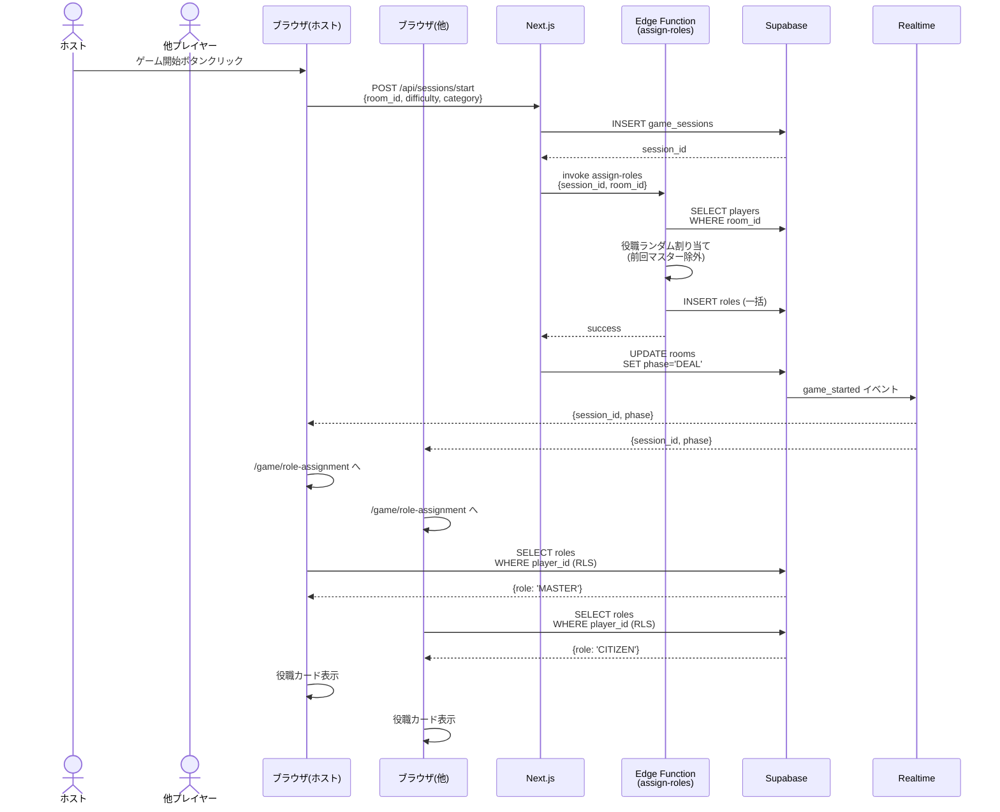
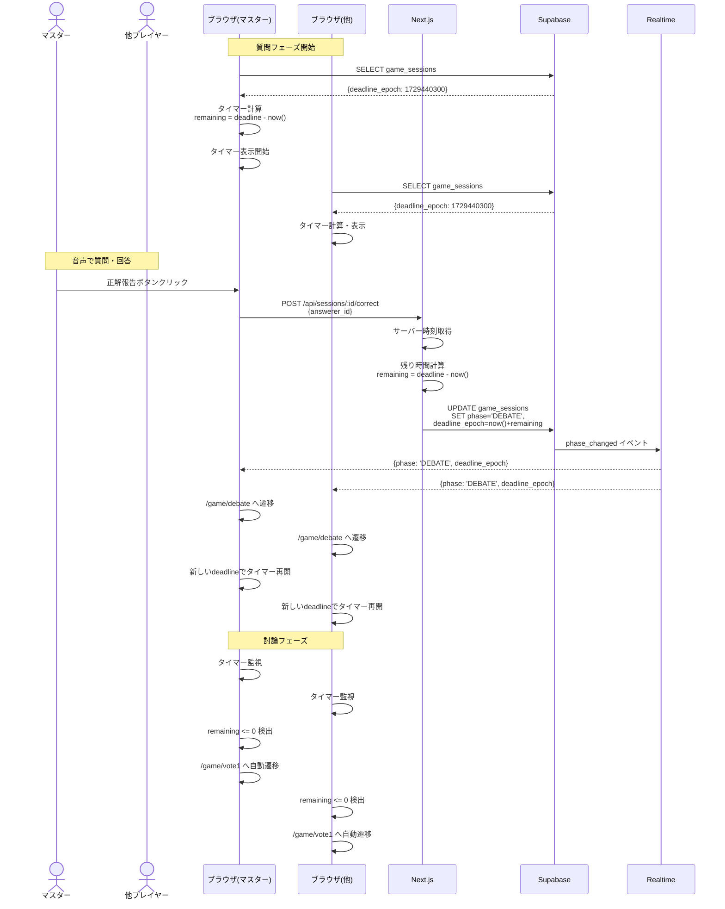
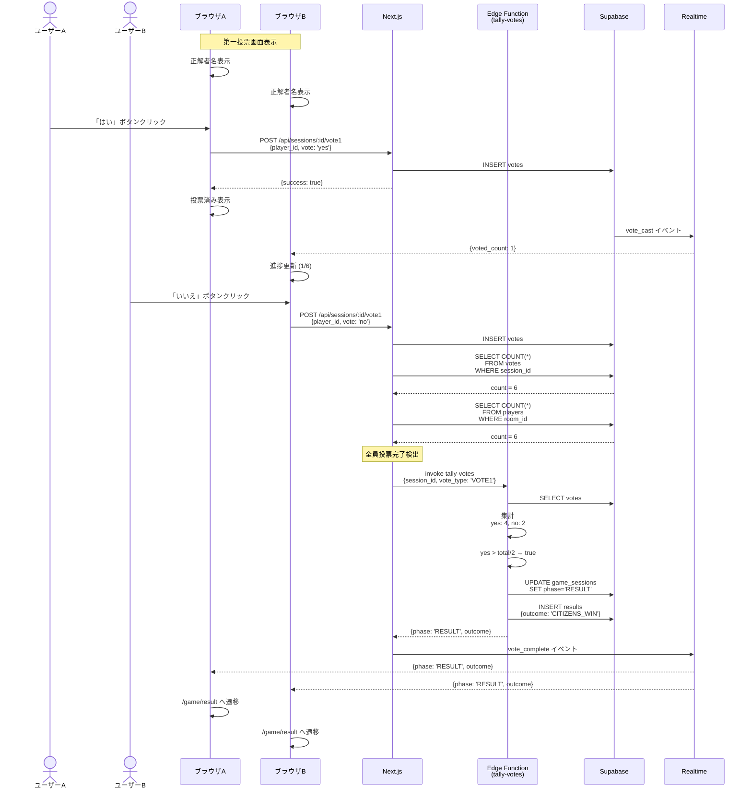
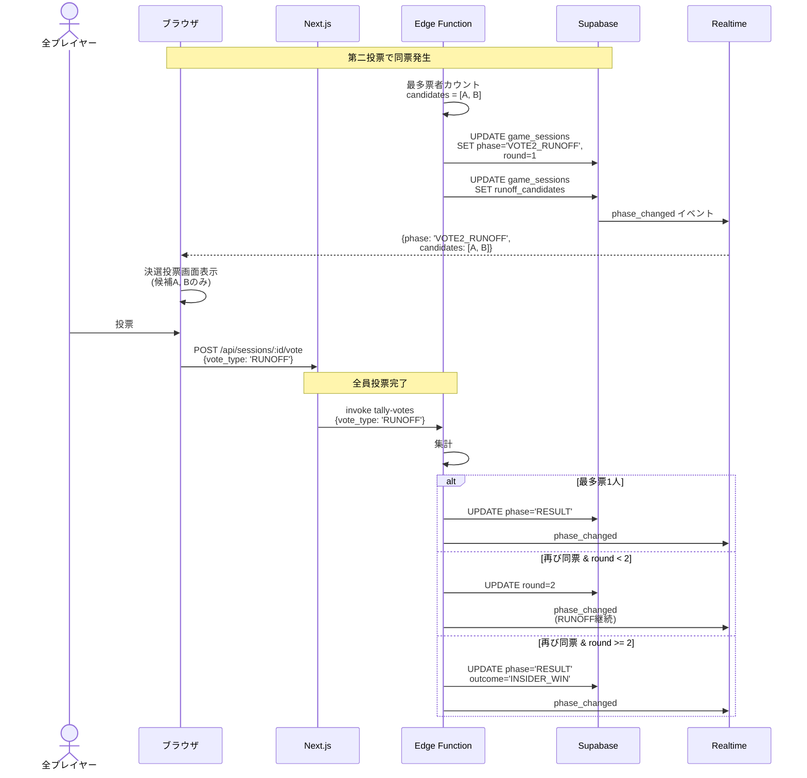
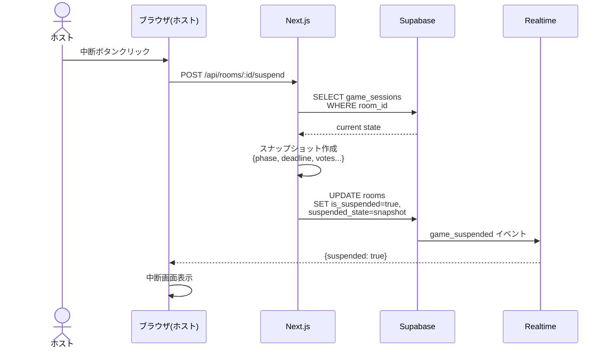
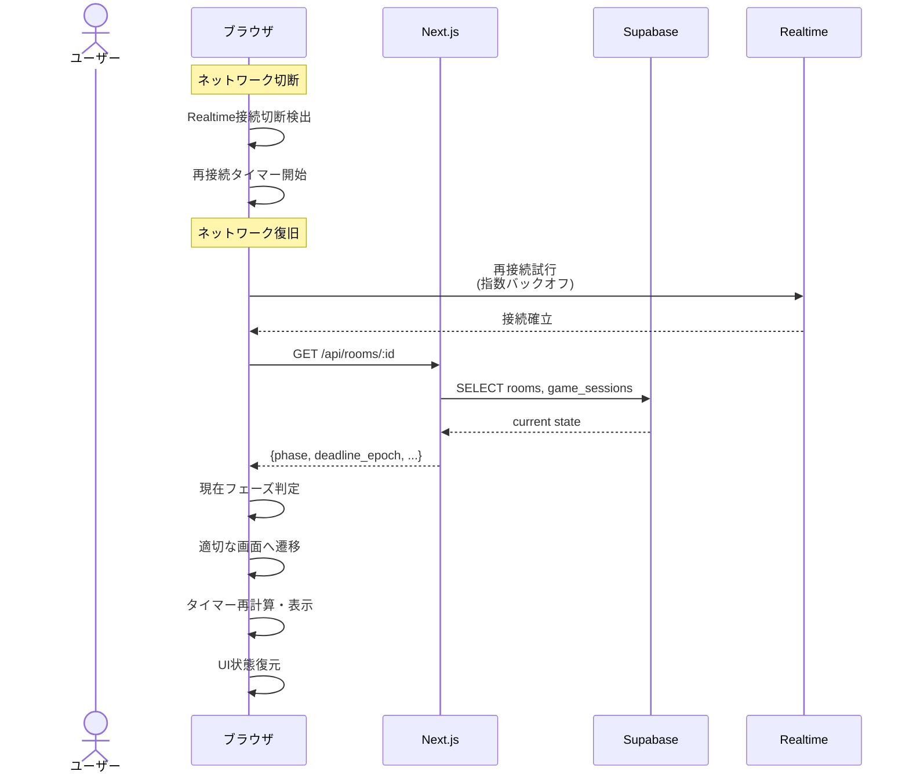
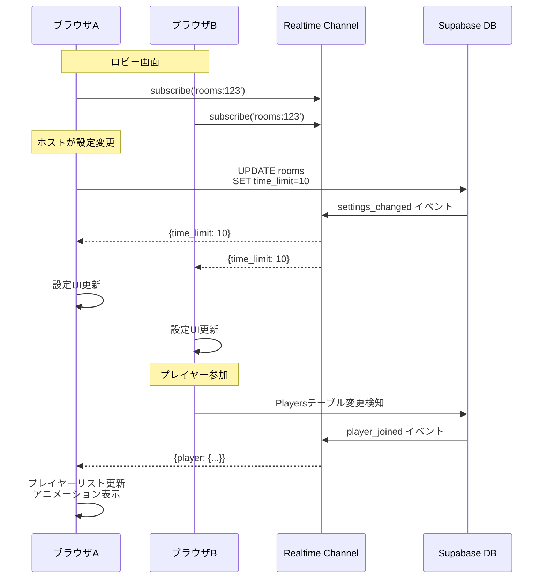
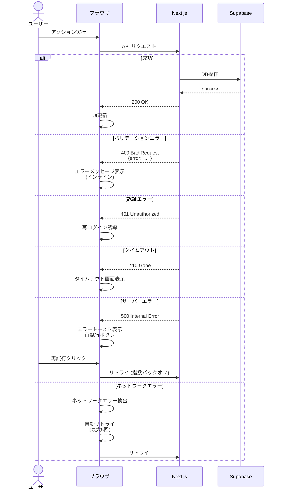

# インサイダーゲーム V2 - シーケンス図

## 1. ルーム作成・参加シーケンス

### 1.1 ルーム作成

### 1.2 ルーム参加

## 2. ゲーム開始シーケンス

## 3. 質問・討論フェーズシーケンス

## 4. 投票・集計シーケンス

### 4.1 第一投票

### 4.2 決選投票

## 5. 中断・再接続シーケンス

### 5.1 中断

### 5.2 再接続

## 6. Realtime同期シーケンス

## 7. エラーハンドリングシーケンス

