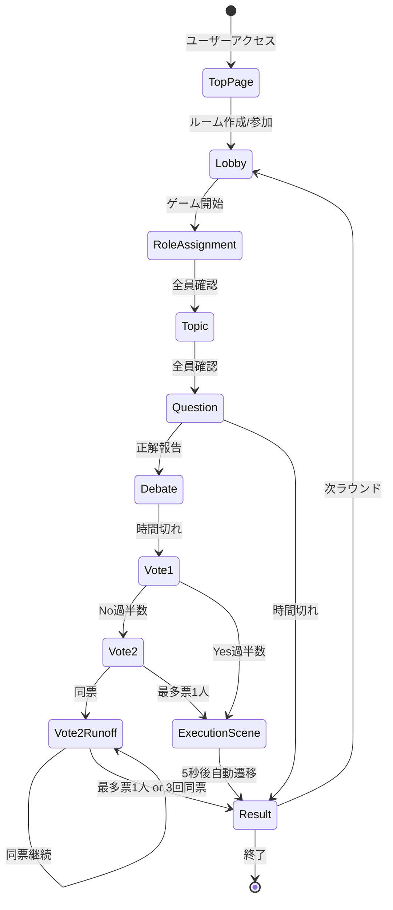
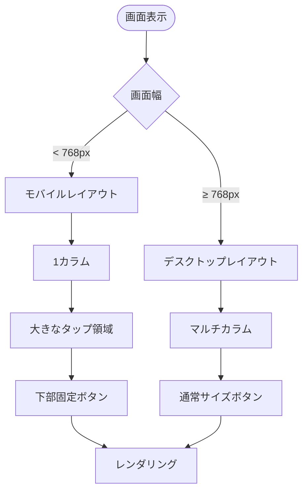

# インサイダーゲーム V2 - UIフローチャート

## 全体フロー

```mermaid
flowchart TD
    Start([ユーザーアクセス]) --> TopPage[トップページ]
    
    TopPage --> CreateRoom{ルーム作成?}
    TopPage --> JoinRoom{ルーム参加?}
    
    CreateRoom -->|合言葉+名前入力| CreateAPI[POST /api/rooms]
    JoinRoom -->|合言葉+名前入力| JoinAPI[POST /api/rooms/join]
    
    CreateAPI --> Lobby[ロビー画面]
    JoinAPI --> Lobby
    
    Lobby --> WaitPlayers{プレイヤー待機}
    WaitPlayers -->|3人未満| WaitPlayers
    WaitPlayers -->|3人以上 & 全員準備完了| HostStart{ホストがゲーム開始?}
    HostStart -->|No| WaitPlayers
    HostStart -->|Yes| StartGame[POST /api/sessions/start]
    
    StartGame --> RoleAssignment[役職配布フェーズ]
    RoleAssignment --> AllConfirmed{全員確認?}
    AllConfirmed -->|No| RoleAssignment
    AllConfirmed -->|Yes| TopicPhase[お題確認フェーズ]
    
    TopicPhase --> MasterInsider{マスター/インサイダー?}
    MasterInsider -->|Yes| ShowTopic[お題表示]
    MasterInsider -->|No| HideTopic[お題非表示]
    ShowTopic --> TopicConfirmed{全員確認?}
    HideTopic --> TopicConfirmed
    TopicConfirmed -->|No| TopicPhase
    TopicConfirmed -->|Yes| QuestionPhase[質問フェーズ]
    
    QuestionPhase --> Timer1{タイマー}
    Timer1 -->|残り時間あり| MasterCorrect{マスターが正解報告?}
    MasterCorrect -->|No| Timer1
    MasterCorrect -->|Yes| DebatePhase[討論フェーズ]
    Timer1 -->|時間切れ| AllLose[全員敗北]
    
    DebatePhase --> Timer2{タイマー}
    Timer2 -->|残り時間あり| Timer2
    Timer2 -->|時間切れ| Vote1Phase[第一投票フェーズ]
    
    Vote1Phase --> AllVoted1{全員投票?}
    AllVoted1 -->|No| Vote1Phase
    AllVoted1 -->|Yes| Tally1[集計]
    Tally1 --> YesMajority{Yes過半数?}
    YesMajority -->|No| Vote2Phase[第二投票フェーズ]
    YesMajority -->|Yes| RevealAnswerer[正解者の役職公開]
    RevealAnswerer --> CheckAnswererRole{インサイダー?}
    CheckAnswererRole -->|Yes| CitizensWin[庶民勝利]
    CheckAnswererRole -->|No| InsiderWin1[インサイダー勝利]
    
    Vote2Phase --> AllVoted2{全員投票?}
    AllVoted2 -->|No| Vote2Phase
    AllVoted2 -->|Yes| Tally2[集計]
    Tally2 --> SingleTop{最多票1人?}
    SingleTop -->|Yes| RevealCandidate[候補者の役職公開]
    SingleTop -->|No| RunoffCount{決選投票回数?}
    
    RunoffCount -->|1回目| Runoff1[決選投票1回目]
    RunoffCount -->|2回目| Runoff2[決選投票2回目]
    RunoffCount -->|3回目| InsiderEscape[インサイダー逃げ切り勝利]
    
    Runoff1 --> AllVotedR1{全員投票?}
    AllVotedR1 -->|No| Runoff1
    AllVotedR1 -->|Yes| TallyR1[集計]
    TallyR1 --> SingleTopR1{最多票1人?}
    SingleTopR1 -->|Yes| RevealCandidate
    SingleTopR1 -->|No| RunoffCount
    
    Runoff2 --> AllVotedR2{全員投票?}
    AllVotedR2 -->|No| Runoff2
    AllVotedR2 -->|Yes| TallyR2[集計]
    TallyR2 --> SingleTopR2{最多票1人?}
    SingleTopR2 -->|Yes| RevealCandidate
    SingleTopR2 -->|No| InsiderEscape
    
    RevealCandidate --> CheckCandidateRole{インサイダー?}
    CheckCandidateRole -->|Yes| CitizensWin
    CheckCandidateRole -->|No| InsiderWin2[インサイダー勝利]
    
    CitizensWin --> ResultPage[結果画面]
    InsiderWin1 --> ResultPage
    InsiderWin2 --> ResultPage
    InsiderEscape --> ResultPage
    AllLose --> ResultPage
    
    ResultPage --> NextRound{次のラウンド?}
    NextRound -->|Yes| Lobby
    NextRound -->|No| End([終了])
    
    style TopPage fill:#e1f5ff
    style Lobby fill:#e1f5ff
    style RoleAssignment fill:#fff3e0
    style TopicPhase fill:#fff3e0
    style QuestionPhase fill:#e8f5e9
    style DebatePhase fill:#e8f5e9
    style Vote1Phase fill:#fce4ec
    style Vote2Phase fill:#fce4ec
    style ResultPage fill:#f3e5f5
    style CitizensWin fill:#c8e6c9
    style InsiderWin1 fill:#ffcdd2
    style InsiderWin2 fill:#ffcdd2
    style InsiderEscape fill:#ffcdd2
    style AllLose fill:#b0bec5
```



## 詳細フロー：ルーム作成

```mermaid
flowchart TD
    Start([トップページ]) --> ClickCreate[PLAYボタンクリック]
    ClickCreate --> OpenModal[CreateRoomModal表示]
    OpenModal --> InputFields[合言葉・プレイヤー名入力]
    
    InputFields --> Validate{バリデーション}
    Validate -->|エラー| ShowError[エラーメッセージ表示]
    ShowError --> InputFields
    
    Validate -->|OK| ClickSubmit[作成ボタンクリック]
    ClickSubmit --> Loading[ローディング表示]
    Loading --> APICall[POST /api/rooms]
    
    APICall --> CheckResponse{レスポンス}
    CheckResponse -->|409: 合言葉重複| ShowError409[重複エラー表示]
    ShowError409 --> InputFields
    CheckResponse -->|500: サーバーエラー| ShowError500[サーバーエラー表示]
    ShowError500 --> InputFields
    
    CheckResponse -->|201: 成功| SaveRoomData[room_id, player_id保存]
    SaveRoomData --> Navigate[/lobby へ遷移]
    Navigate --> End([ロビー画面])
```

## 詳細フロー：ロビー

```mermaid
flowchart TD
    Start([ロビー画面表示]) --> InitRealtime[Realtime購読開始]
    InitRealtime --> FetchPlayers[GET /api/rooms/:id]
    FetchPlayers --> DisplayPlayers[プレイヤーリスト表示]
    
    DisplayPlayers --> ListenChanges{Realtimeイベント監視}
    
    ListenChanges -->|player_joined| AddPlayer[プレイヤー追加]
    AddPlayer --> UpdateList[リスト更新]
    UpdateList --> ListenChanges
    
    ListenChanges -->|player_left| RemovePlayer[プレイヤー削除]
    RemovePlayer --> UpdateList
    
    ListenChanges -->|settings_changed| UpdateSettings[設定更新]
    UpdateSettings --> ListenChanges
    
    ListenChanges -->|game_started| Navigate[/game/role-assignment へ遷移]
    
    DisplayPlayers --> IsHost{ホスト?}
    IsHost -->|Yes| ShowSettings[ゲーム設定表示]
    IsHost -->|No| WaitMessage[ホスト待機メッセージ]
    
    ShowSettings --> ChangeSettings[時間・カテゴリ変更]
    ChangeSettings --> BroadcastSettings[設定をRealtime配信]
    BroadcastSettings --> ShowSettings
    
    ShowSettings --> CheckReady{開始条件?}
    CheckReady -->|プレイヤー < 3| DisableButton[開始ボタン無効]
    CheckReady -->|未準備あり| DisableButton
    CheckReady -->|OK| EnableButton[開始ボタン有効]
    
    EnableButton --> ClickStart[開始ボタンクリック]
    ClickStart --> StartAPI[POST /api/sessions/start]
    StartAPI --> BroadcastStart[開始をRealtime配信]
    BroadcastStart --> Navigate
    
    Navigate --> End([役職配布画面])
```

## 詳細フロー：役職配布

```mermaid
flowchart TD
    Start([役職配布画面表示]) --> WaitAssignment[役職割り当て待機]
    WaitAssignment --> ReceiveRole[Realtimeで役職受信]
    ReceiveRole --> DisplayRole[役職カード表示]
    
    DisplayRole --> ShowIcon[役職アイコン]
    ShowIcon --> ShowName[役職名・説明]
    ShowName --> ConfirmButton[確認ボタン]
    
    ConfirmButton --> ClickConfirm[確認ボタンクリック]
    ClickConfirm --> UpdateConfirmed[confirmed = true 更新]
    UpdateConfirmed --> BroadcastConfirmed[Realtime配信]
    
    BroadcastConfirmed --> ListenConfirmed{全員確認済み?}
    ListenConfirmed -->|No| WaitOthers[他プレイヤー待機]
    WaitOthers --> ShowProgress[進捗表示: N/M]
    ShowProgress --> ListenConfirmed
    
    ListenConfirmed -->|Yes| AutoTransition[自動遷移]
    AutoTransition --> Navigate[/game/topic へ遷移]
    Navigate --> End([お題確認画面])
```

## 詳細フロー：投票

```mermaid
flowchart TD
    Start([投票画面表示]) --> CheckVoteType{投票タイプ}
    
    CheckVoteType -->|第一投票| ShowQuestion1[「正解者はインサイダー?」]
    ShowQuestion1 --> ShowAnswerer[正解者名表示]
    ShowAnswerer --> ShowButtons1[はい/いいえボタン]
    
    CheckVoteType -->|第二投票| ShowQuestion2[「誰がインサイダー?」]
    ShowQuestion2 --> ShowCandidates[候補者リスト表示]
    
    CheckVoteType -->|決選投票| ShowQuestion3[「誰がインサイダー?」]
    ShowQuestion3 --> ShowRunoffCandidates[同票候補者リスト]
    
    ShowButtons1 --> SelectVote1[選択]
    ShowCandidates --> SelectVote2[候補者選択]
    ShowRunoffCandidates --> SelectVote3[候補者選択]
    
    SelectVote1 --> SubmitVote[投票送信]
    SelectVote2 --> SubmitVote
    SelectVote3 --> SubmitVote
    
    SubmitVote --> PostVote[POST /api/sessions/:id/vote]
    PostVote --> ShowVoted[投票済み表示]
    ShowVoted --> WaitOthers[他プレイヤー待機]
    
    WaitOthers --> ListenVotes{全員投票済み?}
    ListenVotes -->|No| ShowProgress[進捗: N/M]
    ShowProgress --> ListenVotes
    
    ListenVotes -->|Yes| ReceiveResult[集計結果受信]
    ReceiveResult --> CheckNextPhase{次フェーズ}
    
    CheckNextPhase -->|VOTE2| NavigateVote2[/game/vote2 へ]
    CheckNextPhase -->|RUNOFF| NavigateRunoff[/game/vote2 再表示]
    CheckNextPhase -->|RESULT| NavigateResult[/game/result へ]
    
    NavigateVote2 --> End1([第二投票画面])
    NavigateRunoff --> End2([決選投票画面])
    NavigateResult --> End3([結果画面])
```

## 画面遷移まとめ



## モバイル対応フロー


