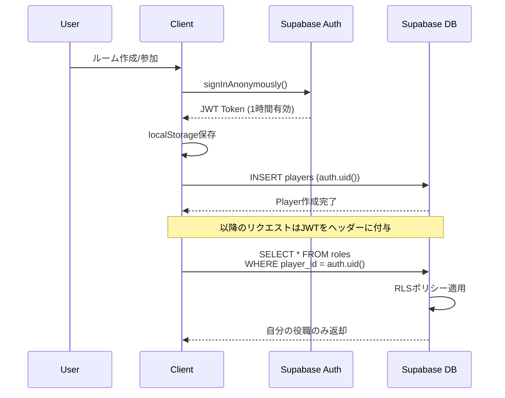
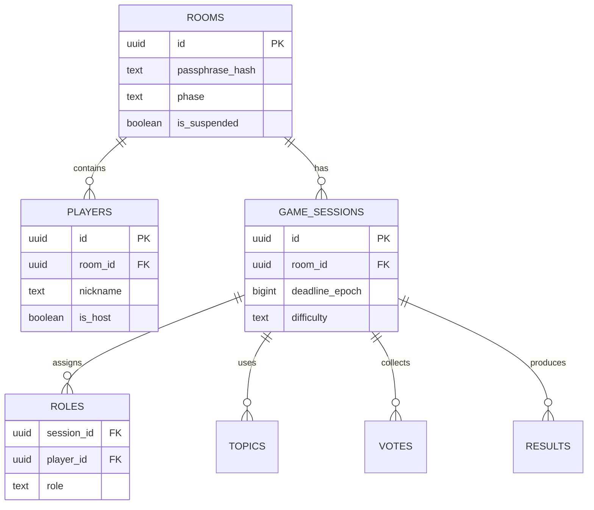

# 詳細要件定義書

プロジェクト名: インサイダーゲーム オンライン版 V2
バージョン: 2.0
最終更新: 2025-11-21
ステータス: 要件定義中

> **Note**: V1 は `archive/v1` ブランチおよび `v1.0.0` タグにアーカイブされています。
> V2 では技術スタックを更新し、UIプロトタイプに基づいた設計を行っています。

---

## ドキュメント管理

| 版数 | 日付 | 変更内容 | 作成者 |
|------|------|---------|--------|
| 1.0 | 2025-10-20 | 初版作成 | - |
| 2.0 | 2025-11-21 | V2へアップデート: Next.js 15, React 19, Tailwind CSS 4, UIプロトタイプ反映 | - |

---

## 目次

1. [プロジェクト概要](#1-プロジェクト概要)
2. [ビジネス要件](#2-ビジネス要件)
3. [ユーザー要件](#3-ユーザー要件)
4. [機能要件](#4-機能要件)
5. [非機能要件](#5-非機能要件)
6. [インテグレーション要件](#6-インテグレーション要件)
7. [技術選定とアーキテクチャ](#7-技術選定とアーキテクチャ)
8. [開発プロセス/スケジュール](#8-開発プロセススケジュール)
9. [リスクと課題](#9-リスクと課題)
10. [ランニング費用と運用方針](#10-ランニング費用と運用方針)
11. [変更管理](#11-変更管理)
12. [参考資料](#12-参考資料)

---

## 1. プロジェクト概要

### 1.1 プロジェクト名称
**インサイダーゲーム オンライン版**（Insider Game Online）

### 1.2 プロジェクトの目的

#### 解決する課題
1. **物理的距離の制約**: オフラインゲームのため、遠隔地の友人とプレイできない
2. **進行管理の負担**: 役職配布、タイマー管理、投票集計を手動で行う煩雑さ
3. **中断・再接続の脆弱性**: オンライン通話の通信トラブルでゲームが継続できない

#### 目標とする成果
- **短期目標（3ヶ月）**: MVP完成、30名同時接続可能、無料運用
- **中期目標（6ヶ月）**: 累計100名利用、フィードバック収集、機能改善
- **長期目標（1年）**: 安定運用、コミュニティ形成、拡張機能実装

#### ビジネスインパクト（仮定）
- **ユーザー獲得**: 口コミによる友人グループへの拡散（バイラル係数 ≥ 1.2想定）
- **コスト削減**: 無料運用による初期参入障壁の低減
- **将来収益化**: スコアシステム、カスタムお題、広告（将来検討）

### 1.3 プロジェクトスコープ

#### スコープ内
- ブラウザベースのオンライン対戦機能
- リアルタイム同期（役職配布、タイマー、投票）
- 中断・再開・再接続機能
- モバイル最適化（iPhone/Android）
- 3〜12人プレイ最適化

#### スコープ外（Phase 1では実装しない）
- ネイティブアプリ（iOS/Android）
- アプリ内音声通話（Discord等の外部ツール利用前提）
- ユーザーアカウント・プロフィール管理
- スコアシステム・ランキング
- 多言語対応（日本語のみ）

### 1.4 ステークホルダー

| ステークホルダー | 役割 | 期待値 |
|----------------|------|-------|
| エンドユーザー（プレイヤー） | ゲーム利用者 | 気軽に遊べる、安定動作、直感的UI |
| プロダクトオーナー | プロジェクト責任者 | MVP完成、技術検証成功、将来拡張可能 |
| 開発者 | 実装担当 | 明確な仕様、実装可能な技術選定 |
| 権利者（オリジナルゲーム） | 知的財産権保有者 | 非商用利用、ブランド保護 |

---

## 2. ビジネス要件

### 2.1 ビジネスモデル（仮定）

#### リーンキャンバス（MVP版）

| 項目 | 内容 |
|------|------|
| **課題** | 1. 遠隔地の友人とボードゲームをプレイできない<br>2. オンライン版の手動進行が煩雑<br>3. 通信トラブルでゲームが中断される |
| **顧客セグメント** | 1. オンラインで遊ぶ友人グループ（3-12人）<br>2. ボードゲーム愛好家<br>3. Discord/LINEで通話する社会人・学生 |
| **独自の価値提案** | 気軽に遊べるオンライン版インサイダーゲーム<br>- 自動進行（タイマー・投票）<br>- 中断・再接続対応<br>- 無料・アカウント不要 |
| **ソリューション** | 1. ブラウザベースリアルタイム同期<br>2. Supabase RealtimeによるWebSocket通信<br>3. 状態スナップショット保存 |
| **チャネル** | 1. 友人への口コミ（主要）<br>2. Twitter/Discord/Reddit投稿<br>3. ボードゲームコミュニティ |
| **収益の流れ** | 現時点なし（無料運用、将来的に広告・寄付検討） |
| **コスト構造** | 1. Supabase Free tier（無料）<br>2. Vercel Hobby plan（無料）<br>3. 開発工数のみ |
| **主要指標** | 1. DAU（Daily Active Users）<br>2. ルーム作成数/日<br>3. 平均プレイ時間 |
| **圧倒的な優位性** | 1. 技術的優位性（Realtime同期）<br>2. ユーザー体験（アカウント不要）<br>3. 無料運用 |

#### 7Powers分析（仮定）

| Power | 適用可能性 | 説明 |
|-------|----------|------|
| **ネットワーク効果** | 中 | 友人グループで広がるほど価値向上（限定的） |
| **規模の経済** | 低 | サーバーレス構成のため大規模化メリット小 |
| **スイッチングコスト** | 低 | アカウント不要のため移行容易 |
| **ブランド** | 低 | 新規プロジェクトのため未確立 |
| **カウンターポジション** | 中 | 既存サービスとの差別化（中断・再開機能） |
| **コーナーリソース** | 低 | 特許・独占技術なし |
| **プロセスパワー** | 中 | RLS秘匿管理、タイマー同期の技術実装 |

### 2.2 KPI/KGI

#### KGI（Key Goal Indicator）
- **6ヶ月後**: 累計ユーザー100名、月間アクティブルーム50件
- **1年後**: 累計ユーザー500名、月間アクティブルーム200件

#### KPI（Key Performance Indicator）

| カテゴリ | 指標 | 目標値（3ヶ月後） | 測定方法 |
|---------|------|-----------------|---------|
| **エンゲージメント** | DAU | 10名/日 | Supabase Analytics |
| **利用頻度** | ルーム作成数 | 5件/日 | Database集計 |
| **体験品質** | 完走率 | 80%以上 | (Result到達数 / ゲーム開始数) |
| **技術品質** | エラー率 | <5% | Vercel Runtime Logs |
| **パフォーマンス** | 平均レスポンスタイム | <500ms | Vercel Analytics |

### 2.3 成功基準

| 項目 | 基準 |
|------|------|
| **技術的成功** | 30名同時接続でレスポンス500ms以内 |
| **ユーザー体験** | Lighthouse Accessibilityスコア90以上 |
| **安定性** | 週次エラー率<5% |
| **完成度** | MVP全機能動作（10週間以内） |

---

## 3. ユーザー要件

### 3.1 ターゲットユーザー

#### プライマリユーザー（優先度: 高）
- **属性**: 20-40代、男女、社会人・学生
- **デバイス**: スマートフォン（iPhone/Android）、PC
- **利用シーン**: 友人との夜間オンライン交流（20-23時ピーク想定）
- **技術リテラシー**: 中程度（Discord/LINE利用可能レベル）

#### セカンダリユーザー（優先度: 中）
- **属性**: 企業の懇親会・チームビルディング担当者
- **利用シーン**: オンライン社内イベント
- **特記事項**: 10-15人プレイ希望（Phase 2で対応検討）

### 3.2 ペルソナ

#### ペルソナ1: 「リモート飲み会好きの田中さん」

| 項目 | 詳細 |
|------|------|
| **名前** | 田中 健太（28歳、男性） |
| **職業** | IT企業エンジニア |
| **家族構成** | 独身、一人暮らし |
| **趣味** | ボードゲーム、オンラインゲーム、Discord |
| **技術スキル** | 高（開発者） |
| **利用デバイス** | iPhone 14 Pro、MacBook Pro |
| **課題** | コロナ以降、友人と対面で会えなくなった |
| **ゴール** | 週1回、大学の友人6人とオンラインでボードゲームを楽しみたい |
| **行動パターン** | 金曜夜21時にDiscordで通話、同時にブラウザゲームプレイ |
| **期待値** | - アカウント登録不要<br>- スマホで片手操作<br>- 通信切れても復帰できる |

#### ペルソナ2: 「社内イベント企画の佐藤さん」

| 項目 | 詳細 |
|------|------|
| **名前** | 佐藤 美咲（32歳、女性） |
| **職業** | 人事部イベント企画担当 |
| **家族構成** | 既婚、子供なし |
| **趣味** | カフェ巡り、読書 |
| **技術スキル** | 中（Office、Zoom利用） |
| **利用デバイス** | iPhone 13、Windows PC |
| **課題** | リモートワークでチーム交流が減少 |
| **ゴール** | 月1回、部署10名でオンライン懇親会を開催したい |
| **行動パターン** | Zoom会議後に懇親会、気軽に遊べるゲーム探し |
| **期待値** | - 簡単にルーム作成<br>- 進行が自動化<br>- 事前準備不要 |

### 3.3 ユーザーストーリー

#### Epic 1: ルーム管理
- **US-001**: プレイヤーとして、合言葉を入力してルームを作成し、友人を招待したい（理由: Discord等で合言葉を共有するだけで開始できるから）
- **US-002**: プレイヤーとして、合言葉を入力して既存ルームに参加し、すぐにゲームに加わりたい
- **US-003**: ホストとして、参加者が3-12人揃ったら開始ボタンを押してゲームを開始したい

#### Epic 2: ゲームプレイ
- **US-004**: プレイヤーとして、自分の役職（マスター/インサイダー/庶民）を秘密裏に確認したい（理由: 他人に役職がバレるとゲームが成立しないから）
- **US-005**: マスターとして、お題を常に確認しながら質問に答えたい
- **US-006**: インサイダーとして、お題を一時的に確認し、庶民を装って質問したい
- **US-007**: プレイヤーとして、残り時間を大きく表示されたタイマーで確認したい（理由: スマホ画面でも見やすいから）
- **US-008**: マスターとして、正解が出たらボタンを押して討論フェーズに移りたい
- **US-009**: プレイヤーとして、正解者をインサイダーとして告発するか投票したい
- **US-010**: プレイヤーとして、候補者リストから1名を選んで投票したい

#### Epic 3: 中断・再接続
- **US-011**: ホストとして、トラブル時にゲームを中断し、後で再開したい（理由: メンバーの急用や通信トラブルに対応するため）
- **US-012**: プレイヤーとして、ネットワーク切断後に自動で再接続し、現在のフェーズに復帰したい

#### Epic 4: 結果・次ラウンド
- **US-013**: プレイヤーとして、結果画面で勝敗と全員の役職を確認したい（理由: 誰がインサイダーだったか明らかにするため）
- **US-014**: ホストとして、結果確認後に次のラウンドを開始したい（理由: 連続してプレイしたいから）

### 3.4 MVP定義

#### MVP機能（Phase 1-3で実装）
- [x] ルーム作成・参加（合言葉）
- [x] 役職配布（ランダム、前回マスター除外）
- [x] お題配信（難易度別、重複除外）
- [x] タイマー同期（質問5分、討論時間継承）
- [x] 投票システム（第一・第二投票、決選投票）
- [x] 結果表示（勝敗、全役職公開）
- [x] 中断・再開機能
- [x] 再接続機能
- [x] モバイル最適化

#### MVP除外機能（Phase 4以降）
- [ ] 質問ログ・順番支援
- [ ] 個人メモ機能
- [ ] スコアシステム・ランキング
- [ ] ルーム設定（タイマー時間変更）
- [ ] PWA対応
- [ ] 効果音・BGM
- [ ] ダークモード
- [ ] 多言語対応

---

## 4. 機能要件

### 4.1 機能一覧

| ID | 機能名 | 優先度 | 説明 | 関連US |
|----|--------|--------|------|--------|
| **FR-001** | **ルーム管理** | 高 | ルーム作成・参加・削除 | US-001, US-002, US-003 |
| FR-001-1 | ルーム作成 | 高 | 合言葉（最大20文字）でルーム作成 | US-001 |
| FR-001-2 | ルーム参加 | 高 | 合言葉入力で既存ルームに参加 | US-002 |
| FR-001-3 | ルーム自動削除 | 中 | 中断後24時間で自動削除 | - |
| **FR-002** | **役職配布** | 高 | マスター・インサイダー・庶民の割り当て | US-004 |
| FR-002-1 | ランダム役職割り当て | 高 | 前回マスター除外ロジック | US-004 |
| FR-002-2 | 役職秘匿表示 | 高 | RLSによる秘匿保証 | US-004 |
| **FR-003** | **お題配信** | 高 | 難易度別お題選択と配信 | US-005, US-006 |
| FR-003-1 | お題選択ロジック | 高 | 難易度フィルタ、重複除外 | US-005, US-006 |
| FR-003-2 | 役職別お題表示 | 高 | マスター常時、インサイダー10秒 | US-005, US-006 |
| **FR-004** | **タイマー管理** | 高 | サーバー同期タイマー | US-007 |
| FR-004-1 | 質問フェーズタイマー | 高 | 5分間（全難易度共通） | US-007 |
| FR-004-2 | 正解報告と時間継承 | 高 | 残り時間を討論に継承 | US-008 |
| FR-004-3 | 討論フェーズタイマー | 高 | 質問の残り時間 | US-008 |
| FR-004-4 | 討論フェーズ正解者表示 | 中 | タイマー下に「🎉 〇〇 さんが正解しました」と表示 | US-008 |
| FR-004-5 | 討論フェーズQ&A履歴 | 中 | 質問フェーズのチャット履歴をモーダルで表示（質問者名、質問内容、回答、時刻） | US-008 |
| **FR-005** | **投票システム** | 高 | 第一・第二投票、決選投票 | US-009, US-010 |
| FR-005-1 | 第一投票（告発投票） | 高 | Yes/No過半数判定 | US-009 |
| FR-005-2 | 第二投票（候補選択） | 高 | 候補から1名選択 | US-010 |
| FR-005-3 | 決選投票 | 高 | 同票時最大2回 | US-010 |
| FR-005-4 | 再投票（ホスト権限） | 中 | 第二投票で1回のみ | - |
| **FR-006** | **中断・再開** | 高 | ゲーム状態の保存・復元 | US-011 |
| FR-006-1 | 中断処理 | 高 | スナップショット保存 | US-011 |
| FR-006-2 | 再開処理 | 高 | メンバーチェック、状態復元 | US-011 |
| **FR-007** | **再接続** | 高 | ネットワーク切断からの復帰 | US-012 |
| FR-007-1 | 自動再接続 | 高 | 指数バックオフリトライ | US-012 |
| FR-007-2 | 状態復元 | 高 | 現在フェーズへ復帰 | US-012 |
| **FR-008** | **結果表示** | 高 | 勝敗・役職公開・次ラウンド | US-013, US-014 |
| FR-008-1 | 結果画面 | 高 | 勝敗表示、全役職公開 | US-013 |
| FR-008-2 | 次ラウンド | 中 | 状態リセット、履歴保持 | US-014 |

### 4.2 機能詳細仕様

#### FR-001-1: ルーム作成

**ユースケース**:
```
タイトル: ルームを作成する
アクター: プレイヤー（ホストになる）
事前条件: なし
事後条件: ルームが作成され、ホストとしてロビーに参加

正常系フロー:
1. ユーザーがトップページで「部屋を作る」ボタンをクリック
2. システムが合言葉入力モーダルを表示
3. ユーザーが合言葉（最大20文字）とニックネームを入力
4. ユーザーが「作成」ボタンをクリック
5. システムが合言葉の重複をチェック（DBクエリ）
6. システムが合言葉をArgon2idでハッシュ化
7. システムがroomsテーブルにレコード作成
8. システムが匿名認証でユーザーIDを発行
9. システムがplayersテーブルにホストレコード作成
10. システムがrooms.host_idを更新
11. システムがロビー画面にリダイレクト

例外系フロー:
E1. [ステップ3] 合言葉が2文字以下または11文字以上
    → エラーメッセージ表示「合言葉は最大20文字で入力してください」
E2. [ステップ5] 合言葉が既に存在
    → エラーメッセージ表示「この合言葉は既に使用されています」
E3. [ステップ8] 認証エラー
    → エラーメッセージ表示「認証に失敗しました。再試行してください」
```

**画面仕様**:
```
┌─────────────────────────────────┐
│  インサイダーゲーム オンライン    │
├─────────────────────────────────┤
│                                 │
│   [部屋を作る]  [部屋を探す]    │
│                                 │
└─────────────────────────────────┘

[部屋を作る] クリック後:
┌─────────────────────────────────┐
│      部屋を作る                  │
├─────────────────────────────────┤
│ 合言葉（最大20文字）:              │
│ [__________]                    │
│                                 │
│ ニックネーム:                    │
│ [__________]                    │
│                                 │
│     [キャンセル]  [作成]         │
└─────────────────────────────────┘
```

**API仕様**:
```typescript
POST /api/rooms

Request:
{
  "passphrase": "テスト部屋",
  "nickname": "プレイヤー1"
}

Response (201 Created):
{
  "room_id": "550e8400-e29b-41d4-a716-446655440000",
  "player_id": "660e8400-e29b-41d4-a716-446655440000",
  "is_host": true
}

Errors:
- 400: { "error": "Passphrase must be 3-20 characters" }
- 409: { "error": "Room with this passphrase already exists" }
- 500: { "error": "Internal server error" }
```

**バリデーション**:
```typescript
// 合言葉
- 必須
- 長さ: 最大20文字
- Unicode正規化: NFC
- 許可文字: すべてのUnicode文字（絵文字含む）

// ニックネーム
- 必須
- 長さ: 最大10文字
- 許可文字: a-zA-Z0-9ぁ-んァ-ヶー一-龯\s
- 禁止文字: <>&"'`
```

**セキュリティ要件**:
- 合言葉はArgon2id（memoryCost: 19456, timeCost: 2, parallelism: 1）でハッシュ化
- ハッシュ化後のみDB保存（平文保存禁止）
- レート制限: 同一IPから1分間に5回まで

---

#### FR-004-2: 正解報告と時間継承

**ユースケース**:
```
タイトル: 正解を報告して討論フェーズに移行する
アクター: マスター
事前条件:
  - 質問フェーズ中
  - タイマーが0秒になっていない
事後条件: 討論フェーズに移行、残り時間が継承される

正常系フロー:
1. マスターが「正解報告」ボタンをクリック
2. システムがサーバー時刻を取得
3. システムが締切epoch（deadline_epoch）と比較
4. サーバー時刻 ≤ 締切の場合、処理続行
5. システムが経過時間を計算: elapsed = now() - start_time
6. システムが残り時間を計算: remaining = 300 - elapsed
7. システムが討論締切を計算: debate_deadline = now() + remaining
8. システムがgame_sessionsテーブルを更新:
   - phase = 'DEBATE'
   - deadline_epoch = debate_deadline
   - answerer_id = 正解者ID
9. システムがRealtime経由で全クライアントに通知
10. 全クライアントが討論フェーズ画面に遷移
11. タイマーが新しいdeadline_epochから残り時間を計算開始

例外系フロー:
E1. [ステップ3] サーバー時刻 > 締切
    → エラー応答「時間切れです」（410 Gone）
    → クライアントはタイムアウト処理（全員敗北）へ
E2. [ステップ8] DB更新失敗
    → エラー応答「更新に失敗しました。再試行してください」（500）
```

**計算例**:
```
ケース1: 質問フェーズ開始から4分59秒で正解
  start_time = 1729440000
  now() = 1729440299 (4分59秒後)
  elapsed = 299秒
  remaining = 300 - 299 = 1秒
  debate_deadline = 1729440299 + 1 = 1729440300
  → 討論フェーズは1秒のみ

ケース2: 質問フェーズ開始から1分で正解
  start_time = 1729440000
  now() = 1729440060 (1分後)
  elapsed = 60秒
  remaining = 300 - 60 = 240秒
  debate_deadline = 1729440060 + 240 = 1729440300
  → 討論フェーズは4分
```

**API仕様**:
```typescript
POST /api/sessions/{session_id}/correct

Request:
{
  "answerer_id": "770e8400-e29b-41d4-a716-446655440000"
}

Response (200 OK):
{
  "phase": "DEBATE",
  "deadline_epoch": 1729440300,
  "debate_duration": 240
}

Errors:
- 403: { "error": "Only master can report correct answer" }
- 410: { "error": "Time has expired" }
- 500: { "error": "Internal server error" }
```

---

#### FR-005-3: 決選投票

**ユースケース**:
```
タイトル: 同票の場合に決選投票を行う
アクター: プレイヤー全員
事前条件: 第二投票で複数名が同票
事後条件: 決選投票で最多票者を決定、または3回同票でインサイダー勝利

正常系フロー（1回目決選）:
1. システムが第二投票の集計を完了
2. システムが最多得票者をカウント
3. 最多票が2名以上の場合、決選投票フェーズへ
4. システムがgame_sessionsを更新: phase = 'VOTE2_RUNOFF', round = 1
5. システムが同票者リストを抽出
6. システムがRealtime経由で全クライアントに通知:
   - phase: 'VOTE2_RUNOFF'
   - candidates: [候補A, 候補B]
   - round: 1
7. 全クライアントが決選投票画面に遷移
8. プレイヤーが同票候補の中から1名を選択
9. 全員投票完了後、システムが集計

正常系フロー（決選で決定）:
10. 決選投票で最多票が1名の場合
11. システムがその人の役職を取得
12. システムが勝敗を判定:
    - インサイダー → 庶民勝利
    - 庶民/マスター → インサイダー勝利
13. システムがresultsテーブルに保存
14. システムがphase = 'RESULT'に更新
15. 結果画面に遷移

例外系フロー（2回目決選）:
E1. [決選1回目] 再び同票
    → round = 2で決選投票繰り返し

E2. [決選2回目] 再び同票（3回目の同票）
    → システムがoutcome = 'INSIDER_WIN'に設定
    → 「インサイダー逃げ切り勝利」として結果画面へ
```

**集計例**:
```
第二投票結果（6人プレイ）:
  候補A: 2票
  候補B: 2票
  候補C: 2票
  → 3人同票、決選投票へ

決選投票1回目:
  候補A: 3票
  候補B: 2票
  候補C: 1票
  → 候補Aが最多票、役職公開へ

決選投票2回目も同票の場合:
  候補A: 3票
  候補B: 3票
  → 3回目の同票、インサイダー勝利
```

**ロジック図**:
```
第二投票集計
    ↓
最多票者カウント
    ↓
    ├─ 1人のみ → 役職公開 → 勝敗判定
    └─ 複数 → 決選投票（round = 1）
                ↓
          決選集計
                ↓
                ├─ 1人のみ → 役職公開 → 勝敗判定
                └─ 複数 → 決選投票（round = 2）
                            ↓
                      決選集計
                            ↓
                            ├─ 1人のみ → 役職公開 → 勝敗判定
                            └─ 複数 → インサイダー勝利
```

---

### 4.3 ユースケース図

```mermaid
graph TD
    Player[プレイヤー]
    Host[ホスト]
    Master[マスター]
    Insider[インサイダー]
    Citizen[庶民]

    Player --> |FR-001-2| JoinRoom[ルーム参加]
    Host --> |FR-001-1| CreateRoom[ルーム作成]
    Host --> |FR-008-2| NextRound[次ラウンド開始]
    Host --> |FR-006-1| Suspend[ゲーム中断]
    Host --> |FR-006-2| Resume[ゲーム再開]

    Player --> |FR-002-2| ViewRole[役職確認]
    Master --> |FR-003-2| ViewTopicAlways[お題常時表示]
    Insider --> |FR-003-2| ViewTopicTemp[お題一時表示]
    Citizen --> |FR-003-2| NoTopic[お題非表示]

    Master --> |FR-004-2| ReportCorrect[正解報告]
    Player --> |FR-004-1| ViewTimer[タイマー確認]

    Player --> |FR-005-1| Vote1[第一投票]
    Player --> |FR-005-2| Vote2[第二投票]
    Player --> |FR-005-3| Runoff[決選投票]

    Player --> |FR-007-1| Reconnect[再接続]
    Player --> |FR-008-1| ViewResult[結果確認]
```



---

## 5. 非機能要件

### 5.1 パフォーマンス要件

#### 5.1.1 レスポンスタイム

| 操作 | 目標値 | 測定条件 | 優先度 |
|------|-------|---------|--------|
| 画面遷移 | <500ms | P95 | 高 |
| Realtime通知反映 | <500ms | サーバー書き込み〜クライアント受信 | 高 |
| API応答 | <200ms | P95 | 高 |
| タイマー更新 | 100ms | クライアント側 | 中 |

**測定方法**:
- Vercel Analytics（Core Web Vitals）
- Supabase Dashboard（Database Performance）
- Playwright E2Eテスト（`page.waitForResponse`）

#### 5.1.2 スループット

| 指標 | 目標値 | 測定方法 |
|------|-------|---------|
| 同時接続数 | 30名 | Artillery負荷テスト |
| 同時ルーム数 | 5ルーム | 実測 |
| Realtime message/min | 300件 | Supabase Realtime Dashboard |

**スケーリング計画**:
- Phase 1（MVP）: Free tier（30名同時）
- Phase 2（成長期）: Pro tier移行（100名同時）
- Phase 3（拡大期）: Database読み取りレプリカ追加

#### 5.1.3 リソース使用量

| リソース | 制限値 | 監視方法 |
|---------|-------|---------|
| Supabase DB容量 | <500MB | Supabase Dashboard |
| Supabase帯域 | <2GB/月 | Supabase Dashboard |
| Vercel Functions実行時間 | <10秒/リクエスト | Vercel Analytics |

### 5.2 セキュリティ要件

#### 5.2.1 認証・認可

| 項目 | 要件 | 実装方法 |
|------|------|---------|
| 認証方式 | 匿名認証 | Supabase Anonymous Auth |
| セッション管理 | JWT、1時間有効期限 | Supabase Auth Helpers |
| 役職秘匿 | DB RLSポリシー | `player_id = auth.uid()` 条件 |
| お題秘匿 | DB RLSポリシー | `role IN ('MASTER', 'INSIDER')` 条件 |

**RLSポリシー例**:
```sql
-- 役職秘匿: 自分の役職のみ見える（結果フェーズは全員見える）
CREATE POLICY "role_secrecy" ON roles
  FOR SELECT
  USING (
    player_id = auth.uid() OR
    (SELECT phase FROM game_sessions WHERE id = session_id) = 'RESULT'
  );
```

#### 5.2.2 データ保護

| 項目 | 要件 | 実装方法 |
|------|------|---------|
| 合言葉ハッシュ化 | Argon2id | `@node-rs/argon2` |
| 通信暗号化 | HTTPS必須 | Vercel自動提供 |
| XSS対策 | 自動エスケープ | Next.js標準機能 |
| CSRF対策 | SameSite Cookie | Next.js標準機能 |
| SQLインジェクション対策 | Prepared Statements | Supabase ORM |

**ハッシュパラメータ**:
```typescript
const HASH_OPTIONS = {
  memoryCost: 19456, // 19MB
  timeCost: 2,
  parallelism: 1,
};
```

#### 5.2.3 入力検証

| 入力項目 | 検証ルール |
|---------|----------|
| 合言葉 | 最大20文字、Unicode NFC正規化 |
| ニックネーム | 最大10文字、英数字・ひらがな・カタカナ・漢字のみ |
| 難易度 | `Easy`, `Normal`, `Hard`のいずれか |
| 投票値 | `yes`, `no`またはUUID形式 |

**Zodスキーマ例**:
```typescript
const passphraseSchema = z.string()
  .max(20)
  .transform(s => s.normalize('NFC'));
```

### 5.3 可用性要件

#### 5.3.1 稼働率

| 項目 | 目標値 | 測定期間 |
|------|-------|---------|
| サービス稼働率 | 99.0% | 月次 |
| ダウンタイム許容 | <7.2時間/月 | 月次 |

**依存サービスSLA**:
- Supabase: 99.9%（公式SLA）
- Vercel: 99.99%（公式SLA）

#### 5.3.2 障害復旧

| 障害タイプ | RTO（目標復旧時間） | RPO（目標復旧時点） | 対策 |
|-----------|-------------------|-------------------|------|
| サーバー障害 | 即座 | 0分 | Supabase自動フェイルオーバー |
| DB障害 | 1時間 | 0分 | Supabase自動バックアップ |
| アプリケーション障害 | 5分 | 0分 | Vercelロールバックデプロイ |

#### 5.3.3 エラーハンドリング

| エラー種別 | 対応方法 |
|-----------|---------|
| ネットワークエラー | 自動リトライ（指数バックオフ、最大5回） |
| タイムアウト | 10秒でタイムアウト、エラートースト表示 |
| 認証エラー | 再ログイン誘導 |
| データベースエラー | エラートースト＋再試行ボタン |

### 5.4 ユーザビリティ要件

#### 5.4.1 アクセシビリティ（WCAG 2.1 AA準拠）

| 項目 | 基準 | 実装方法 |
|------|------|---------|
| コントラスト比 | 4.5:1以上 | カラーパレット設計 |
| キーボード操作 | 全機能操作可能 | tabindex、aria-label |
| スクリーンリーダー | 正しく読み上げ | semantic HTML、ARIA属性 |
| 色覚対応 | 色だけでなくアイコン・ラベル | 役職=アイコン、投票=大きなボタン |

**検証方法**:
- Lighthouse Accessibilityスコア90以上
- axe DevTools自動チェック
- 実機スクリーンリーダーテスト（VoiceOver、TalkBack）

#### 5.4.2 レスポンシブデザイン

| デバイス | 画面サイズ | 対応要件 |
|---------|-----------|---------|
| スマートフォン（縦） | 320px-430px | 片手操作、44pxタップ領域 |
| スマートフォン（横） | 568px-932px | 横レイアウト対応 |
| タブレット | 768px-1024px | 2カラムレイアウト |
| デスクトップ | 1280px- | 3カラムレイアウト、最大幅制限 |

**ブレークポイント**:
```css
/* Mobile First */
@media (min-width: 768px) { /* Tablet */ }
@media (min-width: 1024px) { /* Desktop */ }
```

#### 5.4.3 パフォーマンス体験（Core Web Vitals）

| 指標 | 目標値 | 測定方法 |
|------|-------|---------|
| LCP（Largest Contentful Paint） | <2.5秒 | Lighthouse |
| FID（First Input Delay） | <100ms | Lighthouse |
| CLS（Cumulative Layout Shift） | <0.1 | Lighthouse |

### 5.5 保守性要件

#### 5.5.1 コード品質

| 項目 | 基準 | ツール |
|------|------|-------|
| TypeScript strict mode | 有効 | tsconfig.json |
| ESLint | エラーゼロ | Next.js推奨設定 |
| Prettier | 自動フォーマット | .prettierrc |
| コンポーネントサイズ | <300行/ファイル | 手動レビュー |

#### 5.5.2 テスト

| テスト種別 | カバレッジ目標 | ツール |
|-----------|-------------|-------|
| 単体テスト | 60%以上 | Jest + Testing Library |
| E2Eテスト | 主要5シナリオ | Playwright |
| 負荷テスト | 30名同時接続 | Artillery |

**主要E2Eシナリオ**:
1. ルーム作成 → 参加 → ゲーム開始
2. 質問フェーズ → 正解報告 → 討論フェーズ
3. 第一投票 → 第二投票 → 結果表示
4. 決選投票（同票3回）→ インサイダー勝利
5. 中断 → 再開 → ゲーム続行

#### 5.5.3 ログ・監視

| 項目 | 実装方法 |
|------|---------|
| エラーログ | Vercel Runtime Logs（自動） |
| アクセスログ | Vercel Analytics |
| パフォーマンスログ | Vercel Web Vitals |
| カスタムイベント | Supabase Realtime（将来） |

### 5.6 互換性要件

#### 5.6.1 ブラウザ対応

| ブラウザ | バージョン | 優先度 |
|---------|-----------|--------|
| Chrome | 最新2バージョン | 高 |
| Safari（iOS） | 最新2バージョン | 高 |
| Firefox | 最新2バージョン | 中 |
| Edge | 最新2バージョン | 中 |
| IE | 非対応 | - |

#### 5.6.2 OS対応

| OS | バージョン | 優先度 |
|----|-----------|--------|
| iOS | 15以降 | 高 |
| Android | 10以降 | 高 |
| Windows | 10以降 | 中 |
| macOS | 11以降 | 中 |

---

## 6. インテグレーション要件

### 6.1 外部サービス連携

| サービス | 用途 | 接続方法 | 優先度 |
|---------|------|---------|--------|
| **Supabase** | Database + Realtime + Auth | REST API + WebSocket | 高 |
| **Vercel** | ホスティング + Edge Functions | Git連携自動デプロイ | 高 |
| **Discord/LINE（外部）** | 音声通話 | ユーザーが各自利用（アプリ連携なし） | 低 |

### 6.2 Supabase連携

#### 6.2.1 Database（PostgreSQL）

**接続情報**:
```typescript
const supabaseUrl = process.env.NEXT_PUBLIC_SUPABASE_URL;
const supabaseAnonKey = process.env.NEXT_PUBLIC_SUPABASE_ANON_KEY;

const supabase = createClient(supabaseUrl, supabaseAnonKey);
```

**主要API**:
```typescript
// SELECT
const { data, error } = await supabase
  .from('rooms')
  .select('*')
  .eq('passphrase_hash', hashedPassphrase)
  .single();

// INSERT
const { data, error } = await supabase
  .from('players')
  .insert({ room_id, nickname, is_host: true });

// UPDATE
const { data, error } = await supabase
  .from('game_sessions')
  .update({ phase: 'DEBATE', deadline_epoch: newDeadline })
  .eq('id', sessionId);
```

#### 6.2.2 Realtime（WebSocket）

**購読パターン**:
```typescript
const channel = supabase.channel(`room:${roomId}`)
  .on('postgres_changes', {
    event: 'UPDATE',
    schema: 'public',
    table: 'rooms',
    filter: `id=eq.${roomId}`,
  }, (payload) => {
    setPhase(payload.new.phase);
  })
  .on('postgres_changes', {
    event: 'INSERT',
    schema: 'public',
    table: 'players',
    filter: `room_id=eq.${roomId}`,
  }, (payload) => {
    addPlayer(payload.new);
  })
  .subscribe();
```

**レート制限**:
- Free tier: 500接続まで、2GB帯域/月
- Pro tier: 制限緩和（要確認）

#### 6.2.3 Edge Functions（Deno）

**関数一覧**:

| 関数名 | トリガー | 処理内容 |
|--------|---------|---------|
| `assign-roles` | ゲーム開始時 | 役職配布（ランダム選出） |
| `select-topic` | お題確認フェーズ | お題選択（難易度・重複除外） |
| `tally-votes` | 投票完了時 | 投票集計（過半数・決選判定） |
| `cleanup-suspended-rooms` | Cron (毎日3時) | 24時間以上中断のルーム削除 |

**呼び出し例**:
```typescript
const { data, error } = await supabase.functions.invoke('assign-roles', {
  body: { session_id, room_id },
});
```

### 6.3 認証フロー



### 6.4 データ連携仕様

#### 6.4.1 ルーム作成フロー

```typescript
// 1. クライアント → API Route
POST /api/rooms
Body: { passphrase, nickname }

// 2. API Route内処理
const hashedPassphrase = await hashPassphrase(passphrase);

// 3. Supabase Auth
const { data: { user } } = await supabase.auth.signInAnonymously();

// 4. Supabase DB (トランザクション)
BEGIN;
  INSERT INTO rooms (passphrase_hash) VALUES ($1) RETURNING id;
  INSERT INTO players (room_id, id, nickname, is_host) VALUES ($2, $3, $4, true);
  UPDATE rooms SET host_id = $3 WHERE id = $2;
COMMIT;

// 5. レスポンス
Response: { room_id, player_id, is_host }
```

#### 6.4.2 Realtime同期フロー

```typescript
// クライアント側
useEffect(() => {
  const channel = supabase.channel(`room:${roomId}`);

  // 購読開始
  channel
    .on('postgres_changes', {
      event: 'UPDATE',
      schema: 'public',
      table: 'rooms',
    }, handleRoomUpdate)
    .subscribe();

  return () => {
    channel.unsubscribe();
  };
}, [roomId]);

// サーバー側（自動）
UPDATE rooms SET phase = 'DEBATE' WHERE id = $1;
-- ↑ この更新が自動的にRealtimeでブロードキャスト
```

### 6.5 API仕様概要

**BASE URL**: `https://insider-game.vercel.app/api`

| Endpoint | Method | 説明 | 認証 |
|----------|--------|------|------|
| `/rooms` | POST | ルーム作成 | 不要 |
| `/rooms/join` | POST | ルーム参加 | 不要 |
| `/rooms/{id}` | GET | ルーム情報取得 | 必要 |
| `/rooms/{id}/suspend` | POST | ゲーム中断 | 必要（ホスト） |
| `/rooms/{id}/resume` | POST | ゲーム再開 | 必要（ホスト） |
| `/sessions/start` | POST | ゲーム開始 | 必要（ホスト） |
| `/sessions/{id}/correct` | POST | 正解報告 | 必要（マスター） |
| `/sessions/{id}/vote1` | POST | 第一投票 | 必要 |
| `/sessions/{id}/vote2` | POST | 第二投票 | 必要 |
| `/sessions/{id}/next-round` | POST | 次ラウンド開始 | 必要（ホスト） |

---

## 7. 技術選定とアーキテクチャ

### 7.1 技術スタック詳細

#### 7.1.1 フロントエンド

| 技術 | バージョン | 選定理由 | 代替案 | 決定者 |
|------|-----------|---------|--------|--------|
| **Next.js** | 15.x (App Router) | - React Server Components対応<br/>- Vercel最適化<br/>- ゼロコンフィグ | Vite + React | PO承認 |
| **React** | 19.x | - 最新機能対応<br/>- パフォーマンス向上 | - | PO承認 |
| **TypeScript** | 5.x | - 型安全性<br/>- 開発体験向上 | JavaScript | PO承認 |
| **Tailwind CSS** | 4.x | - ユーティリティファースト<br/>- モバイル最適化容易 | MUI | PO承認 |
| **Radix UI** | 1.x | - アクセシビリティ標準<br/>- Headlessコンポーネント | Headless UI | PO承認 |

#### 7.1.2 バックエンド

| 技術 | プラン | 選定理由 | 代替案 | 決定者 |
|------|-------|---------|--------|--------|
| **Supabase** | Free → Pro | - PostgreSQL + Realtime統合<br/>- RLS標準対応<br/>- 無料枠充実 | Firebase | PO承認 |
| **PostgreSQL** | 15.x | - Supabase標準<br/>- JSONB対応<br/>- トランザクション | MongoDB | PO承認 |
| **Edge Functions** | Deno runtime | - サーバーレス<br/>- グローバルエッジ配信 | AWS Lambda | PO承認 |

#### 7.1.3 インフラ

| 技術 | プラン | 選定理由 | 代替案 | 決定者 |
|------|-------|---------|--------|--------|
| **Vercel** | Hobby (無料) | - Next.js最適化<br/>- 自動HTTPS<br/>- Edge Runtime | Netlify | PO承認 |
| **GitHub** | Free | - バージョン管理<br/>- CI/CD統合 | GitLab | PO承認 |

### 7.2 システムアーキテクチャ

#### 7.2.1 論理アーキテクチャ

```
┌─────────────────────────────────────────────────────┐
│                  Presentation Layer                  │
│  ┌──────────────────────────────────────────────┐   │
│  │  Next.js 15 (App Router)                     │   │
│  │  - Server Components                         │   │
│  │  - Client Components (React 19)              │   │
│  └──────────────────────────────────────────────┘   │
└──────────────────┬──────────────────────────────────┘
                   │
┌──────────────────┴──────────────────────────────────┐
│                 Application Layer                    │
│  ┌──────────────────────────────────────────────┐   │
│  │  API Routes (Next.js)                        │   │
│  │  - REST API                                  │   │
│  │  - Request validation (Zod)                  │   │
│  └──────────────────────────────────────────────┘   │
└──────────────────┬──────────────────────────────────┘
                   │
┌──────────────────┴──────────────────────────────────┐
│                   Data Layer                         │
│  ┌──────────────┐  ┌──────────────┐  ┌──────────┐  │
│  │ PostgreSQL   │  │  Realtime    │  │   Edge   │  │
│  │   + RLS      │  │  (WebSocket) │  │ Functions│  │
│  └──────────────┘  └──────────────┘  └──────────┘  │
└─────────────────────────────────────────────────────┘
```

#### 7.2.2 デプロイアーキテクチャ

```
GitHub Repository
      ↓ (push to main)
Vercel Build
      ↓
  Production Deploy
      ↓
┌─────────────────────────────────┐
│  Vercel Edge Network            │
│  ┌───────────────────────────┐  │
│  │  Next.js App              │  │
│  │  - SSR/SSG                │  │
│  │  - API Routes             │  │
│  └───────────────────────────┘  │
└─────────┬───────────────────────┘
          │ WebSocket + HTTPS
          ↓
┌─────────────────────────────────┐
│  Supabase Platform              │
│  ┌─────────┐  ┌──────────────┐  │
│  │PostgreSQL│  │   Realtime   │  │
│  └─────────┘  └──────────────┘  │
└─────────────────────────────────┘
```

### 7.3 データアーキテクチャ

#### 7.3.1 データモデル（主要エンティティ）



#### 7.3.2 データフロー（例: 投票処理）

```
1. クライアント: POST /api/sessions/{id}/vote2
   ↓
2. API Route: バリデーション（Zod）
   ↓
3. Supabase: INSERT INTO votes
   ↓
4. Realtime: Broadcast 'vote_recorded'
   ↓
5. 他クライアント: 画面更新（投票済み表示）
   ↓
6. 全員投票完了検知 → Edge Function呼び出し
   ↓
7. Edge Function: 集計処理
   ↓
8. Supabase: UPDATE game_sessions SET phase='RESULT'
   ↓
9. Realtime: Broadcast 'phase_change'
   ↓
10. 全クライアント: 結果画面に遷移
```

### 7.4 セキュリティアーキテクチャ

#### 7.4.1 多層防御

```
┌─────────────────────────────────────┐
│  Layer 1: Transport Security        │
│  - HTTPS (TLS 1.3)                  │
│  - HSTS Header                      │
└──────────────┬──────────────────────┘
               ↓
┌──────────────┴──────────────────────┐
│  Layer 2: Application Security      │
│  - Input Validation (Zod)           │
│  - XSS Protection (Next.js)         │
│  - CSRF Protection (SameSite)       │
└──────────────┬──────────────────────┘
               ↓
┌──────────────┴──────────────────────┐
│  Layer 3: Database Security         │
│  - Row Level Security (RLS)         │
│  - Prepared Statements              │
│  - Argon2id Hashing                 │
└──────────────┬──────────────────────┘
               ↓
┌──────────────┴──────────────────────┐
│  Layer 4: Infrastructure Security   │
│  - Vercel Security Headers          │
│  - Supabase Network Isolation       │
└─────────────────────────────────────┘
```

#### 7.4.2 RLS（Row Level Security）実装

```sql
-- 例: 役職秘匿ポリシー
CREATE POLICY "role_secrecy" ON roles
  FOR SELECT
  USING (
    -- 自分の役職のみ見える
    player_id = auth.uid()
    OR
    -- 結果フェーズは全員見える
    (SELECT phase FROM game_sessions WHERE id = session_id) = 'RESULT'
  );
```

---

## 8. 開発プロセス/スケジュール

### 8.1 開発手法

**アジャイル開発（スクラム変形）**:
- スプリント期間: 1週間
- スプリントレビュー: 毎週金曜
- レトロスペクティブ: 各フェーズ終了時

**開発フロー**:
```
要件定義 → 設計 → 実装 → テスト → デプロイ → レビュー
    ↑_______________________________________________|
                    （フィードバックループ）
```

### 8.2 開発スケジュール

#### Phase 1: 基盤構築（Week 1-3）

**Week 1**: 環境構築・DB設計
- **成果物**: Next.jsプロジェクト、Supabase Local環境、全テーブル作成、お題データ投入
- **担当**: 開発者
- **完了基準**: `npm run dev`でローカルサーバー起動、DB接続成功

**Week 2**: ルーム管理・認証
- **成果物**: トップページ、ルーム作成API、ルーム参加API、ロビー画面
- **担当**: 開発者
- **完了基準**: ルーム作成・参加が動作、ロビーで参加者一覧表示

**Week 3**: Realtime統合・状態管理設計
- **成果物**: Realtime購読実装、React状態管理、入退室リアルタイム反映
- **担当**: 開発者
- **完了基準**: 複数ブラウザで入退室がリアルタイム反映

#### Phase 2: ゲームコア機能（Week 4-7）

**Week 4**: 役職配布・お題配信
- **成果物**: `assign-roles` Edge Function、役職配布画面、お題確認画面
- **担当**: 開発者
- **完了基準**: RLSにより他人の役職・お題が見えない

**Week 5**: タイマー・質問フェーズ
- **成果物**: タイマーコンポーネント、質問フェーズ画面、正解報告API
- **担当**: 開発者
- **完了基準**: タイマーが複数クライアントで±1秒以内に同期

**Week 6**: 討論・投票フェーズ
- **成果物**: 討論フェーズ画面、第一投票画面、第二投票画面
- **担当**: 開発者
- **完了基準**: 投票が正しく集計される

**Week 7**: 投票集計・結果表示
- **成果物**: `tally-votes` Edge Function、結果画面、次ラウンド機能
- **担当**: 開発者
- **完了基準**: 決選投票が最大2回動作、結果画面で勝敗表示

#### Phase 3: 運用強化・UX向上（Week 8-10）

**Week 8**: 中断・再開機能
- **成果物**: 中断API、再開API、24時間自動削除Cron
- **担当**: 開発者
- **完了基準**: 中断・再開が正常動作、タイマー再計算成功

**Week 9**: 再接続・エラーハンドリング
- **成果物**: 再接続フック、エラートースト、マスター/インサイダー離脱処理
- **担当**: 開発者
- **完了基準**: ネットワーク切断から自動復帰、重要プレイヤー離脱で中断

**Week 10**: モバイル最適化・テスト
- **成果物**: レスポンシブCSS、Lighthouse Accessibilityスコア90、E2Eテスト5シナリオ
- **担当**: 開発者
- **完了基準**: モバイル実機で快適操作、全E2Eテスト合格

### 8.3 マイルストーン

| マイルストーン | 完了予定 | 主要成果物 | 承認者 |
|--------------|---------|-----------|--------|
| **M1: 基盤完成** | Week 3 | ルーム管理、Realtime同期 | PO |
| **M2: ゲーム動作** | Week 7 | 全フェーズ実装、投票集計 | PO |
| **M3: MVP完成** | Week 10 | 中断・再開、モバイル最適化 | PO |
| **M4: 本番リリース** | Week 11 | 本番環境デプロイ | PO |

### 8.4 リソース計画

| 役割 | 人数 | 工数（週） | 備考 |
|------|------|-----------|------|
| プロダクトオーナー | 1名 | 2時間/週 | 要件確認、レビュー |
| 開発者 | 1名 | 40時間/週 | フルタイム想定 |
| テスター | 1名 | 5時間/週 | Week 10のみ |

**総工数**: 約400時間（10週間 × 40時間）

---

## 9. リスクと課題

### 9.1 技術的リスク

| ID | リスク | 影響度 | 発生確率 | 対策 | 責任者 |
|----|-------|-------|---------|------|--------|
| **R-T001** | Supabase Realtimeレイテンシ | 高 | 中 | 事前検証、Socket.io代替準備 | 開発者 |
| **R-T002** | RLSポリシー設計ミス | 高 | 中 | E2Eテスト徹底、セキュリティレビュー | 開発者 |
| **R-T003** | タイマー同期ズレ | 中 | 低 | epoch差分計算、サーバー依存減 | 開発者 |
| **R-T004** | タイマー同期ズレ | 中 | 低 | epoch差分計算、サーバー依存減 | 開発者 |

**詳細対策（R-T001）**:
1. Week 1でRealtimeレイテンシ測定（目標<500ms）
2. 500ms超過が頻発する場合、Week 2でSocket.io移行判断
3. 緩和策: クライアント側epoch差分計算（サーバー依存減）

**詳細対策（R-T002）**:
1. Week 4でRLSポリシー専用E2Eテスト作成
2. ブラウザDevToolsで他プレイヤーデータ取得試行（セキュリティテスト）
3. Phase 3完了後に外部セキュリティレビュー（Optional）

### 9.2 ビジネス的リスク

| ID | リスク | 影響度 | 発生確率 | 対策 | 責任者 |
|----|-------|-------|---------|------|--------|
| **R-B001** | ユーザー獲得困難 | 中 | 中 | ベータテスト、SNS告知 | PO |
| **R-B002** | 著作権リスク | 高 | 低 | 抽象的デザイン、非商用明記 | PO |

**詳細対策（R-B001）**:
1. Week 10でベータテスター5名募集（友人グループ）
2. Twitter/Discord/Redditで告知（#インサイダーゲーム）
3. フィードバック収集フォーム作成（Googleフォーム）

**詳細対策（R-B002）**:
1. オリジナルゲームの名称・ロゴ・公式画像は使用しない
2. 抽象的なアイコン（!、目、?）を自作
3. README.mdに「非公式ファンプロジェクト」と明記

### 9.3 運用的リスク

| ID | リスク | 影響度 | 発生確率 | 対策 | 責任者 |
|----|-------|-------|---------|------|--------|
| **R-O001** | スパム・荒らし | 中 | 中 | レート制限、自動削除 | 開発者 |
| **R-O002** | サーバーコスト超過 | 低 | 低 | 使用量監視、Pro tier移行計画 | PO |
| **R-O003** | バグ・障害対応 | 中 | 中 | ログ記録、ロールバック準備 | 開発者 |

**詳細対策（R-O001）**:
1. レート制限: 同一IPから1分に5ルームまで
2. 24時間後のルーム自動削除（Week 8実装）
3. ニックネームNGワードフィルタ（Phase 4で検討）

**詳細対策（R-O002）**:
1. Supabase Dashboardで週次使用量確認
2. 80%到達でアラート通知（Supabase Email Alerts）
3. Pro tier移行判断基準: 100名同時接続

### 9.4 法的・コンプライアンスリスク

| ID | リスク | 影響度 | 発生確率 | 対策 | 責任者 |
|----|-------|-------|---------|------|--------|
| **R-C001** | 個人情報保護 | 中 | 低 | 最小化収集、自動削除 | PO |

**詳細対策（R-C001）**:
1. 個人情報を極力収集しない（ニックネームのみ）
2. HTTPS必須、Argon2idハッシュ化
3. 24時間後の自動削除（プライバシー保護）

### 9.5 リスク管理プロセス

**週次リスクレビュー**:
- 毎週金曜のスプリントレビュー時に実施
- 新規リスク追加、既存リスク状況更新
- 高リスク項目は即座にPOエスカレーション

**リスクマトリクス**:
```
影響度
高 │ R-T001, R-T002, R-B002
   │
中 │ R-T003, R-T004, R-B001, R-O001, R-O003, R-C001
   │
低 │ R-O002
   └───────────────────────────
      低      中      高
          発生確率
```

---

## 10. ランニング費用と運用方針

### 10.1 インフラコスト見積もり

#### 10.1.1 Phase 1（MVP、30名同時接続想定）

| サービス | プラン | 月額費用 | 備考 |
|---------|-------|---------|------|
| **Supabase** | Free tier | $0 | - 500MB DB<br/>- 2GB帯域/月<br/>- 50,000 MAU |
| **Vercel** | Hobby plan | $0 | - 100GB帯域/月<br/>- Serverless Functions |
| **GitHub** | Free | $0 | - パブリックリポジトリ |
| **ドメイン** | (オプション) | $10-15/年 | Vercel提供ドメイン無料 |
| **合計** | - | **$0/月** | ドメイン除く |

#### 10.1.2 Phase 2（成長期、100名同時接続想定）

| サービス | プラン | 月額費用 | 備考 |
|---------|-------|---------|------|
| **Supabase** | Pro tier | $25 | - 8GB DB<br/>- 50GB帯域/月<br/>- 100,000 MAU |
| **Vercel** | Hobby plan | $0 | 引き続き無料枠内 |
| **GitHub** | Free | $0 | - |
| **ドメイン** | - | $1.25/月 | 年$15換算 |
| **合計** | - | **$26.25/月** | |

#### 10.1.3 Phase 3（拡大期、500名同時接続想定）

| サービス | プラン | 月額費用 | 備考 |
|---------|-------|---------|------|
| **Supabase** | Pro tier + Add-ons | $50 | - 読み取りレプリカ追加<br/>- 帯域追加 |
| **Vercel** | Pro plan | $20 | - 1TB帯域<br/>- チーム機能 |
| **GitHub** | Free | $0 | - |
| **ドメイン** | - | $1.25/月 | - |
| **監視ツール** | (オプション) | $10 | Sentry等 |
| **合計** | - | **$81.25/月** | |

### 10.2 コスト最適化戦略

| 戦略 | 実装時期 | 削減額 | 方法 |
|------|---------|-------|------|
| DB容量最適化 | Phase 1 | - | 24時間自動削除、インデックス最適化 |
| 帯域削減 | Phase 1 | - | Realtime購読スコープ最小化 |
| CDN活用 | Phase 2 | $5-10/月 | 静的アセットキャッシュ |
| 読み取りレプリカ | Phase 3 | - | 読み取り負荷分散 |

### 10.3 運用体制

#### 10.3.1 Phase 1（MVP期）

| 役割 | 担当者 | 稼働時間 | 主要業務 |
|------|-------|---------|---------|
| プロダクトオーナー | 1名 | 5時間/週 | - 要件管理<br/>- フィードバック収集 |
| 開発者 | 1名 | 40時間/週 | - 開発<br/>- バグ修正<br/>- デプロイ |
| 運用担当 | (兼務) | 2時間/週 | - ログ監視<br/>- エラー対応 |

#### 10.3.2 Phase 2（成長期）

| 役割 | 担当者 | 稼働時間 | 主要業務 |
|------|-------|---------|---------|
| プロダクトオーナー | 1名 | 10時間/週 | - 機能拡張計画<br/>- ユーザーサポート |
| 開発者 | 1-2名 | 40-80時間/週 | - 機能追加<br/>- パフォーマンス改善 |
| 運用担当 | 1名 | 10時間/週 | - 24時間監視<br/>- インシデント対応 |

### 10.4 監視・アラート方針

#### 10.4.1 監視項目

| カテゴリ | 指標 | 閾値 | アラート方法 |
|---------|------|------|------------|
| **可用性** | エラー率 | >5% | Vercel Slack通知 |
| **パフォーマンス** | レスポンスタイム | >1秒（P95） | Vercel Slack通知 |
| **リソース** | Supabase DB容量 | >80% | Supabase Email |
| **リソース** | Supabase帯域 | >80% | Supabase Email |
| **セキュリティ** | 不正アクセス試行 | >10回/分 | Vercel Slack通知 |

#### 10.4.2 インシデント対応フロー

```
1. アラート検知
   ↓
2. 重要度判定（Critical/High/Medium/Low）
   ↓
3. Critical/High → 即座にPOエスカレーション
   ↓
4. 原因調査（Vercel Runtime Logs、Supabase Logs）
   ↓
5. 応急対応（ロールバック、スケールアップ）
   ↓
6. 恒久対策実施
   ↓
7. ポストモーテム作成
```

### 10.5 バックアップ・災害復旧

#### 10.5.1 バックアップ戦略

| 対象 | 頻度 | 保持期間 | 方法 |
|------|------|---------|------|
| PostgreSQL | 日次 | 7日間 | Supabase自動バックアップ |
| コードベース | リアルタイム | 無期限 | GitHub |
| 設定ファイル | 変更時 | 無期限 | GitHub（.env除く） |

#### 10.5.2 災害復旧計画（DR）

| 災害シナリオ | RTO | RPO | 復旧手順 |
|------------|-----|-----|---------|
| DB障害 | 1時間 | 0分 | Supabase自動復旧 |
| アプリ障害 | 5分 | 0分 | Vercelロールバックデプロイ |
| リージョン障害 | 4時間 | 24時間 | Supabaseリージョン切替 |

**復旧手順書**: `docs/operations/disaster_recovery.md`（Phase 3で作成）

### 10.6 スケーリング計画

| ユーザー数 | 対応時期 | 対策 |
|-----------|---------|------|
| 30名 | Phase 1 | Free tier維持 |
| 100名 | Phase 2 | - Supabase Pro tier移行<br/>- CDN導入 |
| 500名 | Phase 3 | - Supabase読み取りレプリカ<br/>- Vercel Pro plan |
| 1,000名+ | Phase 4 | - 専用DBインスタンス<br/>- マイクロサービス化検討 |

---

## 11. 変更管理

### 11.1 変更管理プロセス

#### 11.1.1 変更リクエストフロー

```
1. 変更提案（ユーザー、PO、開発者）
   ↓
2. 変更影響分析（開発者）
   - 工数見積もり
   - リスク評価
   - 優先度判定
   ↓
3. 変更承認会議（PO）
   - 承認/却下/保留
   ↓
4. 変更実装（開発者）
   - ブランチ作成
   - コード変更
   - テスト
   ↓
5. 変更レビュー（PO）
   - 動作確認
   - 受け入れテスト
   ↓
6. 本番デプロイ
   ↓
7. 変更ログ記録
```

#### 11.1.2 変更優先度

| 優先度 | 定義 | 対応期限 | 例 |
|--------|------|---------|-----|
| **Critical** | サービス停止、セキュリティ脆弱性 | 24時間以内 | RLS脆弱性、本番障害 |
| **High** | 主要機能不具合 | 1週間以内 | 投票集計バグ、タイマーズレ |
| **Medium** | 軽微な不具合、UX改善 | 2週間以内 | UI調整、エラーメッセージ改善 |
| **Low** | 機能追加、リファクタリング | 次スプリント | 新機能、コード最適化 |

### 11.2 バージョン管理

**セマンティックバージョニング**: `MAJOR.MINOR.PATCH`

- **MAJOR**: 破壊的変更（API仕様変更、DB移行必須）
- **MINOR**: 後方互換性のある機能追加
- **PATCH**: バグ修正

**例**:
- `1.0.0`: 初回リリース（Week 11）
- `1.1.0`: スコアシステム追加（Phase 4）
- `1.1.1`: 投票バグ修正

### 11.3 リリースノート

**テンプレート**:
```markdown
# Release v1.0.0

リリース日: 2025-10-20

## 新機能
- ルーム作成・参加機能
- リアルタイム同期
- 中断・再開機能

## 改善
- モバイルUI最適化
- タイマー精度向上

## バグ修正
- 投票集計の同票処理
- 再接続時の状態復元

## 既知の問題
- Safari一部バージョンでRealtime接続不安定
```

### 11.4 ドキュメント更新

| ドキュメント | 更新タイミング | 責任者 |
|------------|-------------|--------|
| 要件定義書 | 要件変更時 | PO |
| 技術仕様書 | 設計変更時 | 開発者 |
| API仕様書 | API変更時 | 開発者 |
| ユーザーマニュアル | UI変更時 | PO |
| README.md | 随時 | 開発者 |

---

## 12. 参考資料

### 12.1 内部ドキュメント

| ドキュメント名 | パス | 説明 |
|--------------|------|------|
| システム要件定義書 | `docs/output/system_requirements.md` | 本書の元資料 |
| 技術仕様書 | `docs/output/technical_specification.md` | 技術詳細 |
| データベース設計書 | `docs/output/database_design.md` | DB設計詳細 |
| 開発ロードマップ | `docs/output/development_roadmap.md` | 開発計画詳細 |
| アプリ概要 | `docs/インサイダー_オンライン対戦アプリ概要（実装図ベース）.md` | プロダクト概要 |
| 実装図一覧 | `docs/20251019_インサイダー実装図一覧.md` | フロー・シーケンス図 |

### 12.2 外部リファレンス

#### 技術ドキュメント

| 技術 | URL |
|------|-----|
| Next.js 15 | https://nextjs.org/docs |
| React 19 | https://react.dev |
| Supabase | https://supabase.com/docs |
| Tailwind CSS 4 | https://tailwindcss.com/docs |
| Radix UI | https://www.radix-ui.com/primitives/docs/overview/introduction |
| PostgreSQL 15 | https://www.postgresql.org/docs/15/ |

#### ベストプラクティス

| タイトル | URL | 参照箇所 |
|---------|-----|---------|
| Supabase Realtime Best Practices | https://supabase.com/docs/guides/realtime | 6. インテグレーション要件 |
| Next.js App Router Patterns | https://nextjs.org/docs/app/building-your-application | 7. 技術選定 |
| WCAG 2.1 Guidelines | https://www.w3.org/WAI/WCAG21/quickref/ | 5.4 ユーザビリティ |
| PostgreSQL RLS Performance | https://supabase.com/docs/guides/database/postgres/row-level-security | 5.2 セキュリティ |

### 12.3 参考プロジェクト

| プロジェクト名 | 参考ポイント |
|--------------|------------|
| Agar.io | リアルタイム同期、WebSocket |
| Among Us (Web版) | 役職秘匿管理、投票システム |
| Jackbox Games | ブラウザベースマルチプレイ |

### 12.4 関連規格・標準

| 規格・標準 | バージョン | 適用箇所 |
|-----------|-----------|---------|
| WCAG | 2.1 Level AA | アクセシビリティ |
| RFC 7519 | - | JWT認証 |
| OWASP Top 10 | 2021 | セキュリティ |
| Semantic Versioning | 2.0.0 | バージョン管理 |

---

## 承認

| 役割 | 氏名 | 承認日 | 署名 |
|------|------|-------|------|
| プロダクトオーナー | - | - | - |
| テックリード | - | - | - |
| セキュリティレビュアー | - | - | - |

---

**次のステップ**: 本詳細要件定義書の承認後、Phase 1（Week 1）の開発着手を推奨します。

**改訂履歴**:
- v1.0 (2025-10-20): 初版作成
