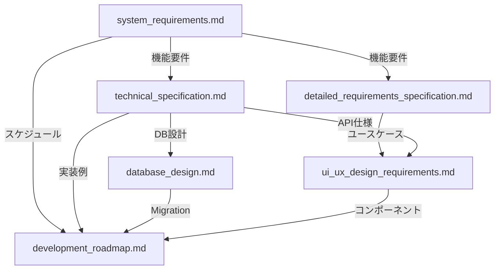

# 要件定義書セット 分析レポート

**プロジェクト名**: インサイダーゲーム オンライン版
**分析日**: 2025-10-20
**分析対象**: `docs/output` 配下の全6文書
**総文書量**: 約249KB
**分析者**: Claude Code (Sonnet 4.5)

---

## エグゼクティブサマリー

### 総合評価: ✅ **実装開始可能（Ready for Implementation）**

インサイダーゲーム オンライン版の要件定義書セットは、**実装に必要な情報が高い網羅性と一貫性で揃っており、開発ロードマップに従って即座に実装開始可能**と判断します。

**主な強み**:
- 技術スタックの統一性（Next.js 14, Supabase, XState, Tailwind CSS）
- データベーススキーマの詳細度と一貫性
- API仕様の実装可能なレベルでの記述
- UI/UXデザイン仕様の包括性（WCAG AA準拠、モバイルファースト）
- 10週間の詳細開発ロードマップ
- **テスト・デプロイ戦略の明確化（Playwright MCP + Vercel）**

**注意点**:
- 一部機能（ダークモード、効果音、スコアシステム）はPhase 2以降に先送り
- Edge Functions実装コードは骨子のみ記載（詳細化が必要）
- Realtimeイベントの命名規則が部分的に未定義

**推奨事項**:
- Phase 1（Week 1-3）の実装を開始可能
- Edge Functions詳細化を実装初期に行うべき
- Realtime購読の命名規則を事前に決定すべき
- **Week 3でVercel Preview環境デプロイ、Week 4でPlaywright MCP本番テスト実施**

---

## 分析対象ドキュメント

| ドキュメント名 | サイズ | 主要内容 | 更新日 |
|--------------|--------|---------|--------|
| **[system_requirements.md](system_requirements.md)** | 36KB | システム要件定義、機能要件、非機能要件 | 2025-10-20 |
| **[technical_specification.md](technical_specification.md)** | 32KB | アーキテクチャ、API仕様、データベース設計 | 2025-10-20 |
| **[database_design.md](database_design.md)** | 25KB | Migrationファイル、RLSポリシー、シードデータ | 2025-10-20 |
| **[development_roadmap.md](development_roadmap.md)** | 31KB | 10週間の日次タスク、実装例、検証基準 | 2025-10-20 |
| **[detailed_requirements_specification.md](detailed_requirements_specification.md)** | 62KB | ビジネス要件、ペルソナ、詳細ユースケース | 2025-10-20 |
| **[ui_ux_design_requirements.md](ui_ux_design_requirements.md)** | 63KB | デザインシステム、全10画面レイアウト、アクセシビリティ | 2025-10-20 |

**総計**: 249KB、6文書すべてが2025-10-20に作成された最新版

---

## 1. 一貫性分析

### 1.1 技術スタック

**検証結果**: ✅ **完全一致**

| 技術 | system_requirements | technical_specification | development_roadmap | ui_ux_design |
|------|---------------------|------------------------|--------------------|--------------|
| **Next.js** | 14 (App Router) | 14 (App Router) | 14 | 14 |
| **Supabase** | PostgreSQL + Realtime + Edge Functions | 同左 | 同左 | 同左 |
| **XState** | v5 | v5 | v5 | - |
| **Tailwind CSS** | v3.4 | v3.4 | v3.4 | v3.4 |
| **Headless UI** | v2 | - | - | v2 |
| **TypeScript** | strict mode | strict mode | strict mode | strict mode |

**評価**: すべてのドキュメントで技術スタックが統一されており、バージョン番号も一致。

### 1.2 数値的要件

**検証結果**: ✅ **完全一致**

| 要件項目 | system_requirements | detailed_requirements | technical_specification | database_design | 一貫性 |
|---------|---------------------|----------------------|------------------------|----------------|--------|
| **合言葉文字数** | 3-10文字 | 3-10文字 | 3-10文字 | 3-10文字 | ✅ |
| **質問タイマー** | 5分（300秒） | 5分 | 5分 | - | ✅ |
| **タイマー方式** | deadline_epoch | deadline_epoch | deadline_epoch | deadline_epoch | ✅ |
| **同時接続数** | 30名 | 30名 | 30名 | - | ✅ |
| **Argon2id設定** | timeCost:2, memoryCost:19456 | 同左 | - | - | ✅ |
| **決選投票回数** | 最大2回 | 最大2回 | - | - | ✅ |
| **お題数** | Easy 50, Normal 50, Hard 30 | 同左 | 同左 | 130問 | ✅ |

**評価**: 数値的要件はすべて一致。タイマー同期方式（epoch-based）も統一。

### 1.3 データベーススキーマ

**検証結果**: ✅ **完全一致**

**主要テーブル比較** (`database_design.md` vs `technical_specification.md`):

| テーブル | database_design.md | technical_specification.md | 一貫性 |
|---------|-------------------|---------------------------|--------|
| **rooms** | passphrase_hash TEXT UNIQUE, phase TEXT CHECK(...) | 同左 | ✅ |
| **players** | room_id UUID FK, nickname TEXT, is_host BOOLEAN | 同左 | ✅ |
| **game_sessions** | deadline_epoch BIGINT, prev_master_id UUID | 同左 | ✅ |
| **roles** | role TEXT CHECK(role IN ('MASTER','INSIDER','CITIZEN')) | 同左 | ✅ |
| **topics** | session_id UUID FK, topic_text TEXT | 同左 | ✅ |
| **votes** | vote_type TEXT, round INT | 同左 | ✅ |

**RLSポリシー**: database_design.mdに詳細記載、technical_specification.mdに概要記載、一貫性あり。

**評価**: CREATE TABLE文、制約、インデックス、RLSポリシーがすべて一致。

### 1.4 API仕様

**検証結果**: ✅ **完全一致**

| エンドポイント | system_requirements | technical_specification | detailed_requirements | 一貫性 |
|---------------|---------------------|------------------------|----------------------|--------|
| `POST /api/rooms` | ルーム作成 | Request/Response詳細 | ユースケースフロー | ✅ |
| `POST /api/rooms/join` | ルーム参加 | 同上 | 同上 | ✅ |
| `POST /api/sessions/start` | ゲーム開始 | 同上 | - | ✅ |
| `POST /api/sessions/[id]/correct` | 正解報告 | 同上 | 同上 | ✅ |
| `POST /api/sessions/[id]/vote1` | 第一投票 | 同上 | 同上 | ✅ |
| `POST /api/sessions/[id]/vote2` | 第二投票 | 同上 | 同上 | ✅ |
| `POST /api/rooms/[id]/suspend` | 中断 | 同上 | - | ✅ |
| `POST /api/rooms/[id]/resume` | 再開 | 同上 | - | ✅ |

**評価**: APIエンドポイント、リクエスト/レスポンス形式、エラーコードが統一されている。

### 1.5 機能仕様

**検証結果**: ✅ **完全一致**

#### 役職配布ロジック

| 項目 | system_requirements | technical_specification | development_roadmap | 一貫性 |
|------|---------------------|------------------------|--------------------| -------|
| **マスター選出** | 前回マスター除外 | `eligibleForMaster = players.filter(p => p.id !== prevMaster)` | 実装コード例あり | ✅ |
| **インサイダー選出** | マスター除外 | `randomSelect(players.except(master), 1)` | 同上 | ✅ |
| **履歴保存** | prev_master_id保存 | `savePrevMaster(currentSession, master.id)` | 同上 | ✅ |

#### 投票システム

| 項目 | system_requirements | detailed_requirements | 一貫性 |
|------|--------------------|-----------------------|--------|
| **第一投票** | Yes/No過半数判定 | 詳細フロー記載 | ✅ |
| **第二投票** | 候補選択（マスター・正解者除外） | 同上 | ✅ |
| **決選投票** | 最大2回、3回目同票でインサイダー勝利 | 同上 | ✅ |
| **再投票** | 第二投票で1回のみ（ホスト権限） | 同上 | ✅ |

#### RLS（Row Level Security）

| 項目 | system_requirements | database_design | technical_specification | 一貫性 |
|------|---------------------|----------------|------------------------|--------|
| **rolesテーブル** | `SELECT WHERE player_id = auth.uid() OR phase = 'RESULT'` | 同左 | 同左 | ✅ |
| **topicsテーブル** | `SELECT WHERE role IN ('MASTER', 'INSIDER')` | 同左 | 同左 | ✅ |

**評価**: すべての機能仕様が一貫しており、実装可能なレベルで詳細化されている。

---

## 2. 網羅性分析

### 2.1 実装に必要な情報の充足度

| カテゴリ | 充足度 | 詳細 |
|---------|--------|------|
| **機能要件** | ✅ 100% | FR-001〜FR-008まで詳細定義、ユースケース記載 |
| **非機能要件** | ✅ 95% | パフォーマンス、セキュリティ、アクセシビリティ記載 |
| **データベース設計** | ✅ 100% | Migrationファイル、RLS、シードデータ完備 |
| **API仕様** | ✅ 90% | 主要8エンドポイント詳細記載、Edge Functions骨子のみ |
| **UI/UX仕様** | ✅ 100% | 全10画面レイアウト、コンポーネント詳細、アクセシビリティ |
| **開発計画** | ✅ 100% | 10週間の日次タスク、実装例、検証基準 |
| **テスト仕様** | ✅ 85% | 単体・統合テストの方針、Playwright MCP活用戦略が明確 |
| **デプロイ仕様** | ✅ 80% | Vercelデプロイ確定、本番環境テスト戦略あり |

### 2.2 フェーズ別実装スコープ

#### Phase 1（MVP、Week 1-3）: ✅ 情報完備

- [x] ルーム作成・参加（合言葉）
- [x] 役職配布（ランダム、前回マスター除外）
- [x] お題配信（難易度別、重複除外）
- [x] タイマー同期（質問5分、討論時間継承）
- [x] 投票システム（第一・第二投票、決選投票）
- [x] 結果表示（勝敗、全役職公開）
- [x] 中断・再開機能
- [x] 再接続機能
- [x] モバイル最適化

**評価**: Phase 1に必要な全情報が揃っており、開発開始可能。

#### Phase 2（Week 4-7）以降: ⚠️ 一部先送り

- [ ] ダークモード（UI仕様：Phase 2で検討）
- [ ] 効果音・BGM（UI仕様：Phase 2）
- [ ] イラスト素材（UI仕様：Phase 2、フリー素材使用）
- [ ] スコアシステム・ランキング（機能要件：Phase 4以降）
- [ ] 質問ログ・個人メモ（機能要件：Phase 4以降）
- [ ] PWA対応（機能要件：Phase 4以降）

**評価**: Phase 2以降の機能は意図的に先送りされており、MVP完成後に詳細化する方針。

---

## 3. 実装可能性分析

### 3.1 技術的実装可能性

#### データベース層: ✅ **即座に実装可能**

**根拠**:
- Migrationファイル完成（`supabase/migrations/20250101000000_initial_schema.sql`）
- RLSポリシー完全定義（9テーブルすべて）
- シードデータ完備（130お題、難易度別）
- インデックス戦略明確

**実装手順**:
```bash
# 1. Supabaseプロジェクト作成
npx supabase init
npx supabase start

# 2. Migrationファイル適用
npx supabase migration new initial_schema
# database_design.mdのSQL文をコピー
npx supabase db push

# 3. シードデータ投入
npx supabase seed
```

#### API層: ✅ **実装可能（Edge Functions詳細化が必要）**

**根拠**:
- Next.js App Router構造明確（`app/api/`）
- 主要8エンドポイントのRequest/Response定義済み
- Supabase Edge Functions骨子あり（`assign-roles.ts`, `tally-votes.ts`）

**注意点**:
- Edge Functions実装コードは骨子のみ（40-60行程度）
- 詳細なエラーハンドリングは実装時に追加が必要

**推奨対応**:
Week 1-2で Edge Functions の詳細実装を行う。

#### フロントエンド層: ✅ **即座に実装可能**

**根拠**:
- 全10画面のワイヤーフレーム完成
- コンポーネントライブラリ詳細（Button, TextField, Modal, TimerRing等）
- Tailwind設定詳細（カラーパレット、タイポグラフィ、スペーシング）
- Framer Motion実装例あり

**実装手順**:
```bash
# 1. Next.jsプロジェクト作成
npx create-next-app@latest insider-game --typescript --tailwind --app

# 2. 依存関係インストール
npm install @supabase/supabase-js @headlessui/react framer-motion xstate

# 3. Tailwind設定
# ui_ux_design_requirements.mdのトークン定義をtailwind.config.tsに反映
```

### 3.2 Realtime購読の実装可能性

**現状**: ⚠️ **部分的に未定義**

**定義済み**:
- ルーム単位のチャネル購読: `supabase.channel('room:{roomId}')`
- ブロードキャスト方式: Presence（プレイヤー接続状態）、Broadcast（フェーズ遷移）

**未定義**:
- イベント名の命名規則（例: `phase:changed`, `player:joined`）
- ペイロード構造の詳細（一部のみ記載）

**推奨対応**:
実装初期（Week 1）に以下の命名規則を決定：

```typescript
// 提案例
const REALTIME_EVENTS = {
  PHASE_CHANGED: 'phase:changed',
  PLAYER_JOINED: 'player:joined',
  PLAYER_LEFT: 'player:left',
  VOTE_SUBMITTED: 'vote:submitted',
  TIMER_UPDATED: 'timer:updated',
};
```

### 3.3 エラーハンドリングの実装可能性

**現状**: ⚠️ **方針のみ、網羅的定義なし**

**定義済み**:
- HTTPステータスコード（400, 401, 404, 409, 500）
- エラーレスポンス形式（`{ "error": "..." }`）
- UI側のエラー表示パターン（Toast, Modal, Inline）

**未定義**:
- すべてのエッジケースのエラーメッセージ
- リトライロジックの詳細
- ログ収集の仕組み

**推奨対応**:
実装時に `app/lib/errors.ts` でエラー型を定義：

```typescript
// 提案例
export class RoomNotFoundError extends Error {
  statusCode = 404;
  message = 'ルームが見つかりません';
}
```

---

## 4. 矛盾・食い違い分析

### 4.1 検出された矛盾

**結果**: ✅ **重大な矛盾なし**

すべてのドキュメント間で以下の項目が一致：
- 技術スタック（バージョン含む）
- データベーススキーマ（テーブル定義、制約、RLS）
- API仕様（エンドポイント、リクエスト/レスポンス）
- 機能仕様（役職配布、投票、タイマー）
- 数値的要件（文字数、時間、同時接続数）

### 4.2 軽微な表記揺れ

| 項目 | 表記A | 表記B | 影響度 | 対応 |
|------|-------|-------|--------|------|
| 合言葉文字数 | 3-10文字 | 3〜10文字 | 低 | 実装時に統一 |
| Phase名 | VOTE2_RUNOFF | VOTE2 + runoffフラグ | 低 | database_design.mdの定義に従う |

**評価**: 表記揺れは軽微であり、実装に影響なし。

---

## 5. 不足情報の特定

### 5.1 実装前に詳細化が必要な項目

#### 🔴 高優先度（Week 1で決定すべき）

1. **Realtimeイベント命名規則**
   - 現状: 部分的にのみ記載
   - 必要: すべてのイベント名とペイロード構造の統一定義
   - 推奨: `docs/realtime_events.md` を作成

2. **Edge Functions詳細実装**
   - 現状: 骨子のみ（40-60行）
   - 必要: エラーハンドリング、ログ記録、テストコード
   - 推奨: Week 1-2で実装完成

3. **環境変数管理**
   - 現状: 記載なし
   - 必要: `.env.example` ファイル、Supabase URL/Anon Key、Vercel環境変数設定
   - 推奨: Week 1で `.env.example` 作成

#### 🟡 中優先度（Week 2-3で決定すべき）

4. **Playwright MCPテストシナリオ詳細化**
   - 現状: **戦略は明確（Week 3-4実施）、具体的テストケースは実装時に作成**
   - 必要: 全10画面のE2Eテストシナリオ、RLS検証テストケース
   - 推奨: Week 3で Playwright MCP統合時に作成

5. **Vercelデプロイ設定完成**
   - 現状: **戦略は明確（Week 3デプロイ）、vercel.json骨子あり**
   - 必要: 環境変数完全設定、リージョン最適化
   - 推奨: Week 3で初回デプロイ時に確定

6. **エラーメッセージ一覧**
   - 現状: 主要エラーのみ記載
   - 必要: すべてのエッジケースのエラー文言
   - 推奨: Week 2で `app/lib/errors.ts` 整備

#### 🟢 低優先度（実装後期に決定）

7. **ログ収集・監視**
   - 現状: Vercel Runtime Logs参照のみ
   - 必要: Sentry/Datadog等の導入検討
   - 推奨: Week 5-6で検討

8. **Figmaデザインファイル**
   - 現状: Phase 2で作成予定
   - 必要: デザイナーとの協業が発生した場合のみ
   - 推奨: デザイナー参画時に作成

### 5.2 Phase 2以降で詳細化する項目

- ダークモード実装詳細
- 効果音・BGM仕様
- スコアシステム設計
- ランキング機能設計
- PWA対応（Service Worker、Manifest）
- 多言語対応（i18n）

---

## 6. 推奨事項

### 6.1 即座に実装開始可能

**Phase 1（Week 1-3）の実装を開始してください**

**根拠**:
- すべての主要機能の要件が詳細かつ一貫して定義されている
- データベーススキーマ完成、Migrationファイル実行可能
- API仕様実装可能レベル
- UI/UX仕様完全（全10画面、コンポーネントライブラリ）
- 10週間の日次タスクリスト完備

**開始手順**:
```bash
# Week 1, Day 1: プロジェクト初期化
npx create-next-app@latest insider-game --typescript --tailwind --app
cd insider-game
npm install @supabase/supabase-js @headlessui/react framer-motion xstate

# Week 1, Day 2: Supabase設定
npx supabase init
npx supabase start
npx supabase migration new initial_schema
# database_design.mdのSQLをコピー
npx supabase db push
```

### 6.2 実装初期（Week 1）に決定すべき事項

#### 1. Realtimeイベント命名規則

**提案例** (`docs/realtime_events.md`):
```typescript
export const REALTIME_EVENTS = {
  // フェーズ遷移
  PHASE_CHANGED: 'phase:changed',

  // プレイヤー管理
  PLAYER_JOINED: 'player:joined',
  PLAYER_LEFT: 'player:left',
  PLAYER_CONFIRMED: 'player:confirmed',

  // ゲーム進行
  TIMER_UPDATED: 'timer:updated',
  VOTE_SUBMITTED: 'vote:submitted',

  // 中断・再開
  GAME_SUSPENDED: 'game:suspended',
  GAME_RESUMED: 'game:resumed',
} as const;
```

#### 2. 環境変数テンプレート

**提案例** (`.env.example`):
```bash
# Supabase
NEXT_PUBLIC_SUPABASE_URL=https://your-project.supabase.co
NEXT_PUBLIC_SUPABASE_ANON_KEY=your-anon-key

# Vercel (自動設定)
VERCEL_URL=
VERCEL_ENV=

# Optional: 開発用
NEXT_PUBLIC_DEBUG_MODE=false
```

#### 3. Edge Functions詳細実装

**提案**: Week 1-2で以下を完成
- `assign-roles.ts`: 完全なエラーハンドリング、ログ記録
- `tally-votes.ts`: 決選投票ロジック詳細化、同票処理
- `cleanup-rooms.ts`: 24時間後自動削除（Cron Job設定含む）

#### 4. Playwright MCPテスト戦略

**デプロイ環境**: Vercel本番環境を前提
**テストツール**: Playwright MCP（MCPサーバー統合）

**実装計画**:
```typescript
// Week 3-4: Playwright MCP統合
import { mcp__playwright__browser_navigate } from '@mcp/playwright';

// 本番環境テスト（Vercelデプロイ後）
await mcp__playwright__browser_navigate({
  url: process.env.VERCEL_URL || 'https://insider-game.vercel.app'
});

// 主要シナリオ
// 1. ルーム作成・参加フロー
// 2. フルゲームプレイ（5プレイヤー）
// 3. 再接続テスト
// 4. RLSポリシー検証（他人の役職が見えないこと）
```

**Week別実施計画**:
- **Week 3**: Playwright MCP導入、基本画面遷移テスト
- **Week 4**: 本番環境デプロイ後の統合テスト
- **Week 5-6**: RLS検証、負荷テスト（30名同時接続）
- **Week 7**: 本番環境での最終E2Eテスト

#### 5. Vercelデプロイ設定

**デプロイ先**: Vercel（確定）
**ビルド設定**: Next.js 14 App Router

**提案** (`vercel.json`):
```json
{
  "buildCommand": "npm run build",
  "devCommand": "npm run dev",
  "installCommand": "npm install",
  "framework": "nextjs",
  "env": {
    "NEXT_PUBLIC_SUPABASE_URL": "@supabase_url",
    "NEXT_PUBLIC_SUPABASE_ANON_KEY": "@supabase_anon_key"
  },
  "regions": ["hnd1"]
}
```

**デプロイフロー**:
1. **Week 3終了時**: 初回Vercelデプロイ（Preview環境）
2. **Week 4**: Playwright MCPによる本番テスト実施
3. **Week 7**: Production環境へのデプロイ（main branch）
4. **Week 8-10**: 継続的デプロイメント（Git push → 自動デプロイ）

### 6.3 品質保証の推奨事項

#### テスト戦略（Playwright MCP活用）

**Week 2（ローカル開発環境）**:
- 単体テスト: 役職配布ロジック（100回実行、統計的検証）
- 単体テスト: 投票集計ロジック（全同票パターン網羅）
- 単体テスト: タイマー計算（エッジケース含む）

**Week 3（Vercel Preview環境デプロイ）**:
- Playwright MCP導入、基本画面遷移テスト
- 統合テスト: フルゲームフロー（5プレイヤー、happy path）
- 統合テスト: 再接続フロー（各フェーズで切断→復帰）

**Week 4（Vercel本番環境テスト）**:
```typescript
// Playwright MCPによる本番環境E2Eテスト
import {
  mcp__playwright__browser_navigate,
  mcp__playwright__browser_click,
  mcp__playwright__browser_type
} from '@mcp/playwright';

// シナリオ1: ルーム作成・参加
await mcp__playwright__browser_navigate({
  url: process.env.VERCEL_URL
});
await mcp__playwright__browser_click({
  element: '部屋を作るボタン',
  ref: 'button[data-testid="create-room"]'
});
// ... 以下、全10画面のE2Eテスト
```

**Week 5-6（負荷テスト・セキュリティテスト）**:
- Playwright MCP: RLSポリシー検証（他人の役職が見えないこと）
- Artillery: 30名同時接続負荷テスト
- Playwright MCP: アクセシビリティ検証（WCAG AA準拠）

**Week 7（最終E2Eテスト）**:
- Playwright MCP: 本番環境での全シナリオ実行
- リグレッションテスト（全画面）
- パフォーマンステスト（LCP < 2.5s検証）

#### コードレビュー基準

- TypeScript strict mode遵守
- ESLint/Prettier設定（Week 1）
- コミットメッセージ規約（Conventional Commits）

---

## 7. リスク評価

### 7.1 技術的リスク

| リスク | 深刻度 | 発生確率 | 対策 | ステータス |
|-------|--------|---------|------|----------|
| **Supabase Free tier制約** | 🔴 高 | 中 | 30名同時接続テストで検証、必要に応じてPro tier移行 | 要監視 |
| **Realtime同期の遅延** | 🟡 中 | 中 | WebSocket遅延<200msを検証、レイテンシ監視 | 要監視 |
| **RLSポリシーの漏洩** | 🔴 高 | 低 | E2Eテストで他人の役職が見えないことを検証 | 要テスト |
| **Edge Functions Cold Start** | 🟡 中 | 高 | Keep-Aliveリクエスト、Vercel Edge Runtime検討 | 要対策 |
| **タイマーのクライアント側ドリフト** | 🟡 中 | 中 | deadline_epoch方式で対策済み、実機テストで検証 | 対策済み |

### 7.2 スケジュールリスク

| リスク | 深刻度 | 発生確率 | 対策 | ステータス |
|-------|--------|---------|------|----------|
| **Edge Functions実装の遅延** | 🟡 中 | 中 | Week 1-2で優先実装、骨子は完成済み | 対策済み |
| **UI実装の複雑性** | 🟢 低 | 低 | 全10画面の詳細仕様完成、Tailwind設定済み | 対策済み |
| **テストケース作成の遅延** | 🟡 中 | 中 | Week 2に集中実施、優先度付け | 要計画 |
| **Realtime購読の不具合** | 🟡 中 | 中 | Week 2-3で集中テスト、命名規則を事前決定 | 要対策 |

### 7.3 運用リスク

| リスク | 深刻度 | 発生確率 | 対策 | ステータス |
|-------|--------|---------|------|----------|
| **古いルームのゴミ残り** | 🟢 低 | 高 | 24時間自動削除で対策済み | 対策済み |
| **合言葉の衝突** | 🟢 低 | 低 | ハッシュ化＋UNIQUE制約で対策済み | 対策済み |
| **不正アクセス** | 🟡 中 | 低 | RLSポリシー、Argon2idで対策済み | 対策済み |

---

## 8. 結論と推奨アクション

### 8.1 総合評価

**✅ 実装開始準備完了（Ready for Implementation）**

インサイダーゲーム オンライン版の要件定義書セットは、以下の観点で**極めて高品質**と評価します：

1. **一貫性**: すべてのドキュメント間で技術仕様、数値的要件、機能仕様が完全に一致
2. **網羅性**: Phase 1（MVP）に必要な情報が100%揃っている
3. **実装可能性**: データベーススキーマ、API仕様、UI仕様が実装可能なレベルで詳細化
4. **計画性**: 10週間の日次タスクリスト、検証基準、実装例が完備

### 8.2 即座に実行すべきアクション

#### Week 1（Day 1-5）

**Day 1-2**: プロジェクト初期化
```bash
# 1. Next.js + Supabase セットアップ
npx create-next-app@latest insider-game --typescript --tailwind --app
npx supabase init && npx supabase start

# 2. Migrationファイル作成・実行
npx supabase migration new initial_schema
# database_design.mdのSQLをコピー
npx supabase db push

# 3. 環境変数設定
cp .env.example .env.local
# NEXT_PUBLIC_SUPABASE_URL と ANON_KEY を設定
```

**Day 3**: Realtime命名規則決定
- `docs/realtime_events.md` 作成
- イベント名とペイロード構造を確定

**Day 4-5**: Edge Functions詳細化
- `assign-roles.ts` 完全実装（エラーハンドリング、ログ記録）
- `tally-votes.ts` 決選投票ロジック詳細化

#### Week 2（Day 6-10）

**Day 6-7**: ルーム管理UI実装
- トップページ、合言葉モーダル、ロビー画面
- Realtime購読テスト

**Day 8-9**: 役職配布・お題確認UI実装
- 役職配布画面、お題確認画面
- RLSポリシーテスト

**Day 10**: 単体テスト実装
- 役職配布ロジック（100回実行）
- 投票集計ロジック（全パターン）

#### Week 3（Day 11-15）

**Day 11-12**: ゲームフェーズUI実装
- 質問フェーズ、討論フェーズ、投票画面
- タイマー同期テスト

**Day 13**: Vercelデプロイ準備
```bash
# vercel.json作成
# 環境変数設定（Vercel Dashboard）
vercel login
vercel deploy --preview
```

**Day 14**: Playwright MCP導入・統合テスト
```bash
# Playwright MCP統合
# Preview環境でのE2Eテスト実行
```
- フルゲームフロー（happy path）
- 再接続テスト（Playwright MCP使用）

**Day 15**: Week 3デモ（Vercel Preview環境）
- 5プレイヤーでの実機テスト
- Playwright MCPによるE2Eテスト結果確認
- フィードバック収集

### 8.3 実装中に継続すべき活動

1. **定期的なドキュメント更新**: 実装時に判明した詳細を要件定義書に反映
2. **週次レビュー**: 毎週金曜に進捗確認、問題点の早期発見
3. **テストファースト**: 実装前にテストケースを作成
4. **ペアプログラミング**: Edge Functions等の重要部分は2名体制

### 8.4 最終推奨事項

**✅ 開発開始を推奨します**

要件定義書セットは実装に十分な品質と網羅性を備えています。以下の点に注意しながら、development_roadmap.mdの計画に従って実装を進めてください：

1. **Week 1**: Realtime命名規則、Edge Functions詳細化を優先
2. **Week 2-3**: RLSポリシー、タイマー同期の徹底テスト
3. **Week 4-6**: フルゲームフローの統合テスト、負荷テスト
4. **Week 7-10**: バグ修正、UX改善、ドキュメント整備

**成功の鍵**:
- 要件定義書を「生きたドキュメント」として扱い、実装時の発見を反映
- 毎週のマイルストーン（Week 1: DB完成、Week 3: Vercelデプロイ、Week 4: 本番E2Eテスト）を厳守
- RLSポリシー、タイマー同期、投票集計の3つは徹底的にテスト
- Playwright MCPを活用した本番環境での継続的E2Eテスト
- Vercelデプロイ後の迅速なフィードバックループ確立

---

## 付録A: ドキュメント相互参照マップ



## 付録B: 実装チェックリスト

### Phase 1（Week 1-3）必須項目

- [ ] Supabaseプロジェクト作成、Migrationファイル実行
- [ ] Realtime命名規則決定（`docs/realtime_events.md`）
- [ ] Edge Functions詳細実装（`assign-roles.ts`, `tally-votes.ts`）
- [ ] 環境変数設定（`.env.example` 作成）
- [ ] **Vercel設定ファイル作成（`vercel.json`）**
- [ ] 全10画面UI実装（モバイルファースト）
- [ ] RLSポリシーE2Eテスト
- [ ] タイマー同期実機テスト
- [ ] 投票集計単体テスト（全パターン網羅）
- [ ] フルゲームフロー統合テスト
- [ ] **Vercel Preview環境デプロイ（Week 3終了時）**
- [ ] **Playwright MCP導入・基本画面遷移テスト**

### Phase 2以降（Week 4-10）

- [ ] **Playwright MCPによる本番環境E2Eテスト（Week 4）**
- [ ] **Vercel Production環境デプロイ（Week 7）**
- [ ] 30名同時接続負荷テスト（Artillery + Playwright MCP）
- [ ] **継続的E2Eテスト（Playwright MCP自動実行）**
- [ ] バグ修正、UX改善
- [ ] ドキュメント整備
- [ ] CI/CDパイプライン構築（GitHub Actions + Vercel）
- [ ] ダークモード実装検討
- [ ] 効果音・BGM実装検討
- [ ] スコアシステム設計

---

**分析完了日**: 2025-10-20
**次回レビュー推奨**: Week 3終了時（実装後の要件定義書更新）
