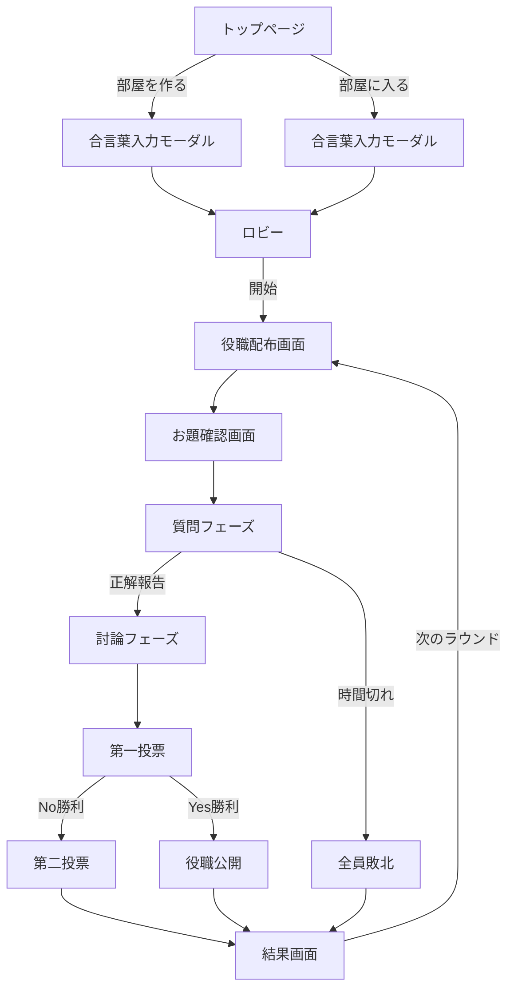

# UI/UXデザイン要件定義書

プロジェクト名: インサイダーゲーム オンライン版
バージョン: 1.0
最終更新: 2025-10-20
ステータス: 承認待ち

---

## ドキュメント管理

| 版数 | 日付 | 変更内容 | 作成者 | 承認者 |
|------|------|---------|--------|--------|
| 1.0 | 2025-10-20 | 初版作成 | - | - |

### 目的と適用範囲

本ドキュメントは、インサイダーゲーム オンライン版のすべての視覚的要素およびインタラクション要件を定義します。対象範囲はMVP v1であり、Next.js 14 + Tailwind CSS + Headless UIを使用したモバイルファーストWebアプリケーション（主にiPhone 13/14 Safari/Chrome、ビューポート幅 ≥ 414px）です。

### 参照文書

- [詳細要件定義書](./detailed_requirements_specification.md) - 機能要件、ペルソナ、ユーザーストーリー
- [技術仕様書](./technical_specification.md) - アーキテクチャ、API仕様、データベース設計
- [CLAUDE.md](../../CLAUDE.md) - 技術スタック、開発ガイドライン
- [WCAG 2.2 Level AA](https://www.w3.org/WAI/WCAG22/quickref/?currentsidebar=%23col_customize&levels=aaa) - アクセシビリティ基準

---

## 目次

1. [プロジェクト概要とデザイン目的](#1-プロジェクト概要とデザイン目的)
2. [ユーザー、プラットフォーム、アクセシビリティターゲット](#2-ユーザープラットフォームアクセシビリティターゲット)
3. [機能要件とインタラクション仕様](#3-機能要件とインタラクション仕様)
4. [視覚デザイン仕様](#4-視覚デザイン仕様)
5. [コンポーネントライブラリ（デザインシステム）](#5-コンポーネントライブラリデザインシステム)
6. [画面レイアウト仕様](#6-画面レイアウト仕様)
7. [レスポンシブ・アダプティブ動作](#7-レスポンシブアダプティブ動作)
8. [アクセシビリティコンプライアンス](#8-アクセシビリティコンプライアンス)
9. [アニメーション・マイクロインタラクション仕様](#9-アニメーションマイクロインタラクション仕様)
10. [アセット配信と命名規則](#10-アセット配信と命名規則)
11. [受入基準とレビュープロセス](#11-受入基準とレビュープロセス)
12. [変更履歴](#12-変更履歴)
13. [付録](#13-付録)

---

## 1. プロジェクト概要とデザイン目的

### 1.1 デザインビジョン

**「シンプル、直感的、アクセシブル」**

インサイダーゲームのデザインは、以下の3つの原則に基づきます：

1. **シンプル**: 情報過多を避け、必要な情報だけを適切なタイミングで表示
2. **直感的**: ゲーム初心者でも迷わず操作できるUI
3. **アクセシブル**: 色覚多様性、スクリーンリーダー、片手操作に配慮

### 1.2 デザイン目標

| 目標 | 指標 | 測定方法 |
|------|------|---------|
| **モバイル最適化** | 片手操作率 90%以上 | タップ位置ヒートマップ分析 |
| **アクセシビリティ** | Lighthouse Accessibilityスコア ≥ 90 | 自動化テスト |
| **視認性** | 最小コントラスト比 4.5:1 | Figma Stark Plugin検証 |
| **応答性** | タップからビジュアルフィードバック ≤ 100ms | Performance API計測 |

### 1.3 ブランドアイデンティティ

#### 色の象徴
- **レッド (#E50012)**: ゲームの緊張感、インサイダーの秘密
- **ブラック (#111827)**: 信頼性、プロフェッショナル
- **ホワイト (#FFFFFF)**: クリーンさ、シンプルさ

#### トーン＆マナー
- **フレンドリー**: 親しみやすい言葉遣い（「〜しよう」「〜だね」）
- **簡潔**: 冗長な説明を避け、アイコンとラベルで直感的に
- **ポジティブ**: エラーメッセージも建設的に（「できない」ではなく「〜してください」）

---

## 2. ユーザー、プラットフォーム、アクセシビリティターゲット

### 2.1 プライマリペルソナ

#### ペルソナ1: 田中健太（28歳、エンジニア）

| 属性 | 詳細 |
|------|------|
| **デバイス** | iPhone 14 Pro (6.1インチ、390 × 844 px論理解像度) |
| **利用シーン** | 金曜夜21時、Discord通話しながら片手でスマホ操作 |
| **技術リテラシー** | 高（開発者） |
| **デザイン期待値** | - アカウント登録なし<br>- ダークモード対応（Phase 2）<br>- スムーズなアニメーション |
| **ペインポイント** | - 小さいタップ領域でミスタップ<br>- 画面上部のボタンに指が届かない |

#### ペルソナ2: 佐藤美咲（32歳、人事担当）

| 属性 | 詳細 |
|------|------|
| **デバイス** | iPhone 13 (6.1インチ) + Windows PC（サブ） |
| **利用シーン** | Zoom会議後の懇親会、スマホで参加 |
| **技術リテラシー** | 中（Office、Zoom利用可能レベル） |
| **デザイン期待値** | - 説明なしで操作できる<br>- 大きなボタンとアイコン<br>- エラー時の分かりやすいガイド |
| **ペインポイント** | - 複雑なUIで迷う<br>- 専門用語が分からない |

### 2.2 対象プラットフォーム

#### デバイス優先度

| デバイス | 優先度 | 対応状況 | ビューポート幅 |
|---------|--------|---------|---------------|
| **iPhone 13/14** | 最高 | 完全最適化 | 390-428 px |
| **Android（Pixel, Galaxy）** | 高 | 完全対応 | 360-412 px |
| **iPad** | 中 | レスポンシブ対応 | 768-1024 px |
| **PC（デスクトップ）** | 低 | 基本動作保証 | ≥ 1280 px |

#### ブラウザサポート

| ブラウザ | 最小バージョン | 備考 |
|---------|---------------|------|
| Safari (iOS) | 16.0+ | 主要ターゲット |
| Chrome (Android) | 115+ | 主要ターゲット |
| Firefox | 115+ | サブターゲット |
| Edge | 115+ | サブターゲット |

### 2.3 アクセシビリティ基準

#### WCAG 2.2 Level AA準拠

| カテゴリ | 要件 | 実装方法 |
|---------|------|---------|
| **知覚可能** | 1.4.3 コントラスト（最小） | 4.5:1以上（テキスト）、3:1以上（UI要素） |
| **操作可能** | 2.5.5 ターゲットサイズ | 最小44 × 44 px、間隔8px以上 |
| **理解可能** | 3.3.1 エラー識別 | aria-invalid、aria-errormessage使用 |
| **堅牢** | 4.1.3 ステータスメッセージ | aria-live、role="status"使用 |

#### 支援技術対応

- **iOS VoiceOver**: すべてのインタラクティブ要素にaria-label
- **Dynamic Type**: iOS設定に応じたフォントサイズ拡大（L〜XL対応）
- **prefers-reduced-motion**: アニメーション無効化対応
- **色覚多様性**: 色だけでなくアイコン+ラベルで情報伝達

#### 入力方式対応

- **タッチ（coarse pointer）**: 44 × 44 px最小タップ領域
- **キーボード**: Tab、Space、Enterキーで全操作可能
- **音声入力**: フォーム入力はlabel要素で正確に識別

---

## 3. 機能要件とインタラクション仕様

### 3.1 コアユーザーフロー



### 3.2 リアルタイムゲーム状態

#### 状態遷移フロー

| 状態 | 画面 | ユーザーアクション | システム応答 |
|------|------|-------------------|-------------|
| **IDLE** | トップページ | 「部屋を作る」タップ | 合言葉入力モーダル表示 |
| **LOBBY** | ロビー画面 | 「開始」ボタンタップ（ホストのみ） | 役職配布開始、全員に通知 |
| **DEAL** | 役職配布画面 | 「確認しました」タップ | 確認済みプレイヤー数表示 |
| **TOPIC** | お題確認画面 | 「確認しました」タップ | 確認済みプレイヤー数表示 |
| **QUESTION** | 質問フェーズ | 「正解が出ました」タップ（マスターのみ） | 討論フェーズへ移行 |
| **DEBATE** | 討論フェーズ | タイマー終了まで待機 | 自動的に第一投票へ |
| **VOTE1** | 第一投票画面 | Yes/Noボタンタップ | 投票済み状態表示 |
| **VOTE2** | 第二投票画面 | 候補者タップ | 投票済み状態表示 |
| **RESULT** | 結果画面 | 「次のラウンド」タップ（ホストのみ） | 新ラウンド開始 |

### 3.3 エラー・エッジケース処理

#### エラー状態のUIパターン

| エラータイプ | 表示方法 | アクション |
|------------|---------|-----------|
| **入力エラー** | フォームフィールド下に赤文字メッセージ | ユーザー修正待ち |
| **ネットワークエラー** | トースト通知（画面上部） | 「再試行」ボタン |
| **サーバーエラー** | モーダルダイアログ | 「リロード」ボタン |
| **セッション期限切れ** | 全画面オーバーレイ | 「トップに戻る」ボタン |

#### 再接続フロー

```
1. WebSocket切断検知
2. トースト表示「接続が切れました。再接続中...」
3. 指数バックオフリトライ（1秒、2秒、4秒）
4. 再接続成功 → 現在フェーズのUIを復元
5. 3回失敗 → エラーモーダル「接続できません。ページをリロードしてください」
```

### 3.4 パフォーマンス要件

| 指標 | 目標値 | 測定条件 |
|------|--------|---------|
| **LCP（Largest Contentful Paint）** | < 2.5秒 | 4G通信、Lighthouse Mobile |
| **TTI（Time to Interactive）** | < 3秒 | 同上 |
| **FPS（Frames Per Second）** | 60 fps | アニメーション実行時 |
| **WebSocket遅延** | < 200ms | サーバーまでのRTT含む |

---

## 4. 視覚デザイン仕様

### 4.1 カラーパレット

#### プライマリカラー

| 色名 | Hex | RGB | HSL | Tailwind Token | 用途 |
|------|-----|-----|-----|---------------|------|
| **Game Red** | `#E50012` | `rgb(229, 0, 18)` | `hsl(355, 100%, 45%)` | `primary` | ブランドカラー、重要ボタン、インサイダー |
| **Black** | `#111827` | `rgb(17, 24, 39)` | `hsl(221, 39%, 11%)` | `gray-900` | メインテキスト、背景 |
| **White** | `#FFFFFF` | `rgb(255, 255, 255)` | `hsl(0, 0%, 100%)` | `white` | 背景、カード |

#### セカンダリカラー

| 色名 | Hex | RGB | Tailwind Token | 用途 |
|------|-----|-----|---------------|------|
| **Gray 50** | `#F9FAFB` | `rgb(249, 250, 251)` | `gray-50` | 背景（サブ） |
| **Gray 200** | `#E5E7EB` | `rgb(229, 231, 235)` | `gray-200` | ボーダー |
| **Gray 400** | `#9CA3AF` | `rgb(156, 163, 175)` | `gray-400` | 非アクティブアイコン |
| **Gray 600** | `#4B5563` | `rgb(75, 85, 99)` | `gray-600` | サブテキスト |

#### ステータスカラー

| 色名 | Hex | Tailwind Token | 用途 |
|------|-----|---------------|------|
| **Success Green** | `#10B981` | `green-500` | 成功メッセージ、庶民勝利 |
| **Warning Yellow** | `#F59E0B` | `yellow-500` | 注意喚起 |
| **Error Red** | `#EF4444` | `red-500` | エラーメッセージ |
| **Info Blue** | `#3B82F6` | `blue-500` | 情報表示 |

#### 役職専用カラー

| 役職 | Hex | Tailwind Token | アイコン |
|------|-----|---------------|---------|
| **マスター** | `#3B82F6` | `blue-500` | `!` |
| **インサイダー** | `#E50012` | `primary` | `👁` |
| **庶民** | `#10B981` | `green-500` | `?` |

#### コントラスト比検証

| 組み合わせ | 比率 | WCAG AA適合 |
|----------|------|------------|
| Game Red (#E50012) on White | 5.1:1 | ✅ 合格 |
| Black (#111827) on White | 16.1:1 | ✅ 合格 |
| Gray 600 (#4B5563) on White | 7.1:1 | ✅ 合格 |
| Blue 500 (#3B82F6) on White | 4.6:1 | ✅ 合格 |

### 4.2 タイポグラフィ

#### フォントファミリー

```css
font-family: 'Inter', -apple-system, BlinkMacSystemFont,
             'Hiragino Sans', 'Hiragino Kaku Gothic ProN',
             'Yu Gothic', 'Meiryo', sans-serif;
```

- **Latin**: Inter Variable（Google Fonts）
- **Japanese**: システムフォント（Hiragino Sans、游ゴシック、メイリオ）
- **Fallback**: -apple-system、BlinkMacSystemFont

#### タイプスケール（4-pt Grid）

| スタイル名 | フォントサイズ | 行高 | 字間 | Tailwind Class | 用途 |
|----------|-------------|------|------|---------------|------|
| **Heading 1** | 32px | 40px | -0.02em | `text-[32px] leading-[40px] tracking-tight` | ページタイトル |
| **Heading 2** | 24px | 32px | -0.01em | `text-2xl leading-8 tracking-tight` | セクションタイトル |
| **Heading 3** | 20px | 28px | normal | `text-xl leading-7` | カードタイトル |
| **Body Large** | 18px | 28px | normal | `text-lg leading-7` | 重要テキスト |
| **Body** | 16px | 24px | normal | `text-base leading-6` | 通常テキスト |
| **Body Small** | 14px | 20px | normal | `text-sm leading-5` | サブテキスト |
| **Caption** | 12px | 16px | normal | `text-xs leading-4` | キャプション |

#### フォントウェイト

| ウェイト | 数値 | Tailwind Class | 用途 |
|---------|------|---------------|------|
| **Regular** | 400 | `font-normal` | 通常テキスト |
| **Medium** | 500 | `font-medium` | 強調 |
| **Semibold** | 600 | `font-semibold` | サブ見出し |
| **Bold** | 700 | `font-bold` | 見出し、ボタン |

#### レスポンシブタイポグラフィ

```tsx
// モバイル → デスクトップでフォントサイズを拡大
<h1 className="text-2xl md:text-3xl lg:text-4xl">
  インサイダーゲーム
</h1>
```

### 4.3 アイコノグラフィ

#### アイコンライブラリ

**Heroicons v2** (outline style)
- サイズ: 24px × 24px bounding box
- ストローク幅: 1.5px
- 形式: SVG（SVGR componentize）

#### 役職アイコン

| 役職 | アイコン | Unicode | カラー | 備考 |
|------|---------|---------|--------|------|
| **マスター** | `!` | U+0021 | Blue 500 | 円形背景 |
| **インサイダー** | `👁` | U+1F441 | Primary Red | 目のアイコン |
| **庶民** | `?` | U+003F | Green 500 | 円形背景 |

#### システムアイコン

| 用途 | Heroicon名 | サイズ | カラー |
|------|----------|--------|--------|
| **メニュー** | `Bars3Icon` | 24px | Gray 600 |
| **閉じる** | `XMarkIcon` | 24px | Gray 600 |
| **設定** | `Cog6ToothIcon` | 24px | Gray 600 |
| **ユーザー** | `UserIcon` | 24px | Gray 600 |
| **時計** | `ClockIcon` | 24px | Gray 900 |
| **チェック** | `CheckIcon` | 24px | Green 500 |
| **エラー** | `ExclamationTriangleIcon` | 24px | Red 500 |
| **情報** | `InformationCircleIcon` | 24px | Blue 500 |

#### アイコン使用ガイドライン

```tsx
// アクセシビリティ: aria-label必須
<UserIcon className="w-6 h-6 text-gray-600" aria-label="ユーザー" />

// 装飾的なアイコン: aria-hidden
<CheckIcon className="w-5 h-5" aria-hidden="true" />
<span className="ml-2">投票完了</span>
```

### 4.4 イラスト・ブランド要素

#### キービジュアル

- **ゲームロゴ**: テキストベース（「インサイダーゲーム」）、アイコンなし
- **背景パターン**: なし（シンプル重視）
- **イラスト**: Phase 2で検討（フリー素材使用）

#### グラフィックスタイル

- **幾何学的**: 円形、角丸長方形（8px radius）
- **フラットデザイン**: シャドウは最小限（sm、md のみ）
- **グラデーション**: 使用しない（Phase 1）

---

## 5. コンポーネントライブラリ（デザインシステム）

### 5.1 デザイントークン（Atomic Tokens）

#### Spacing（4-pt Grid）

| Token | 値 | Tailwind Class | 用途 |
|-------|-----|---------------|------|
| `spacing-1` | 4px | `p-1` / `m-1` | 最小間隔 |
| `spacing-2` | 8px | `p-2` / `m-2` | アイコン間隔 |
| `spacing-3` | 12px | `p-3` / `m-3` | カード内パディング（小） |
| `spacing-4` | 16px | `p-4` / `m-4` | カード内パディング（中） |
| `spacing-6` | 24px | `p-6` / `m-6` | カード内パディング（大） |
| `spacing-8` | 32px | `p-8` / `m-8` | セクション間隔 |
| `spacing-12` | 48px | `p-12` / `m-12` | ページ間隔 |

#### Border Radius

| Token | 値 | Tailwind Class | 用途 |
|-------|-----|---------------|------|
| `radius-sm` | 4px | `rounded` | インプットフィールド |
| `radius-md` | 8px | `rounded-lg` | カード、ボタン |
| `radius-lg` | 16px | `rounded-2xl` | モーダル |
| `radius-full` | 9999px | `rounded-full` | 円形アイコン背景、pill button |

#### Shadows

| Token | 値 | Tailwind Class | 用途 |
|-------|-----|---------------|------|
| `shadow-sm` | `0 1px 2px rgba(0,0,0,0.05)` | `shadow-sm` | カード（静止） |
| `shadow-md` | `0 4px 6px rgba(0,0,0,0.1)` | `shadow-md` | カード（hover） |
| `shadow-lg` | `0 10px 15px rgba(0,0,0,0.1)` | `shadow-lg` | モーダル |

### 5.2 プリミティブコンポーネント

#### Button

**アナトミー**:
```tsx
<button className="relative inline-flex items-center justify-center">
  <Icon /> {/* optional */}
  <span>Label</span>
</button>
```

**バリアント**:

| バリアント | Tailwind Classes | 用途 |
|----------|-----------------|------|
| **Primary** | `bg-primary text-white hover:bg-red-700 active:bg-red-800 disabled:bg-gray-300` | 主要アクション |
| **Secondary** | `bg-gray-200 text-gray-900 hover:bg-gray-300 active:bg-gray-400` | 副次アクション |
| **Outline** | `border-2 border-gray-300 text-gray-900 hover:bg-gray-50` | 補助アクション |
| **Ghost** | `text-gray-600 hover:bg-gray-100` | 軽微なアクション |

**サイズ**:

| サイズ | 高さ | パディング | Tailwind Classes | 用途 |
|------|------|----------|-----------------|------|
| **Small** | 36px | 12px 16px | `h-9 px-4 text-sm` | 補助ボタン |
| **Medium** | 44px | 12px 24px | `h-11 px-6 text-base` | 標準ボタン |
| **Large** | 52px | 16px 32px | `h-13 px-8 text-lg` | 主要ボタン |

**状態**:
- **Default**: 通常状態
- **Hover**: `hover:` プレフィックス（PCのみ、タッチデバイスでは無効）
- **Active**: `active:` プレフィックス（タップ時の視覚フィードバック）
- **Disabled**: `disabled:` プレフィックス + `cursor-not-allowed`
- **Focus-visible**: `focus-visible:ring-2 focus-visible:ring-primary focus-visible:ring-offset-2`

**ARIA属性**:
```tsx
<button
  type="button"
  disabled={isLoading}
  aria-busy={isLoading}
  aria-label="ルームを作成"
>
  {isLoading ? <Spinner /> : '作成'}
</button>
```

#### TextField

**アナトミー**:
```tsx
<div className="relative">
  <label htmlFor="nickname" className="block text-sm font-medium text-gray-700">
    ニックネーム
  </label>
  <input
    id="nickname"
    type="text"
    className="mt-1 block w-full rounded-lg border-gray-300"
    aria-invalid={hasError}
    aria-errormessage={hasError ? "nickname-error" : undefined}
  />
  {hasError && (
    <p id="nickname-error" className="mt-1 text-sm text-red-500">
      3文字以上で入力してください
    </p>
  )}
</div>
```

**サイズ**: 高さ 44px（タップ領域確保）

**状態**:
- **Default**: `border-gray-300 focus:border-primary focus:ring-primary`
- **Error**: `border-red-500 focus:border-red-500 focus:ring-red-500`
- **Disabled**: `bg-gray-100 text-gray-500 cursor-not-allowed`

#### IconButton

**アナトミー**:
```tsx
<button className="inline-flex items-center justify-center w-11 h-11 rounded-full">
  <Icon className="w-6 h-6" aria-hidden="true" />
  <span className="sr-only">閉じる</span>
</button>
```

**サイズ**: 44 × 44 px（最小タップ領域）

#### Modal (Headless UI Dialog)

**アナトミー**:
```tsx
<Dialog open={isOpen} onClose={onClose}>
  <Dialog.Overlay className="fixed inset-0 bg-black/30" />
  <div className="fixed inset-0 flex items-center justify-center p-4">
    <Dialog.Panel className="bg-white rounded-2xl shadow-lg p-6 max-w-sm w-full">
      <Dialog.Title className="text-xl font-bold">タイトル</Dialog.Title>
      <Dialog.Description className="mt-2 text-sm text-gray-600">
        説明文
      </Dialog.Description>
      {/* Content */}
      <div className="mt-4 flex gap-2">
        <Button variant="secondary" onClick={onClose}>キャンセル</Button>
        <Button variant="primary" onClick={onConfirm}>確定</Button>
      </div>
    </Dialog.Panel>
  </div>
</Dialog>
```

**アクセシビリティ**:
- Headless UIが自動的に `role="dialog"`, `aria-modal="true"` を付与
- フォーカストラップ（モーダル内にフォーカスを閉じ込める）
- Escキーで閉じる

#### Toast (通知)

**アナトミー**:
```tsx
<div className="fixed top-4 right-4 max-w-sm bg-white rounded-lg shadow-lg p-4 border-l-4 border-green-500">
  <div className="flex items-start">
    <CheckIcon className="w-5 h-5 text-green-500 mt-0.5" aria-hidden="true" />
    <div className="ml-3">
      <p className="text-sm font-medium text-gray-900">成功</p>
      <p className="mt-1 text-sm text-gray-600">ルームを作成しました</p>
    </div>
    <button className="ml-auto" onClick={onDismiss}>
      <XMarkIcon className="w-5 h-5 text-gray-400" aria-label="閉じる" />
    </button>
  </div>
</div>
```

**タイプ別スタイル**:
- **Success**: `border-green-500` + `CheckIcon`
- **Error**: `border-red-500` + `ExclamationTriangleIcon`
- **Info**: `border-blue-500` + `InformationCircleIcon`
- **Warning**: `border-yellow-500` + `ExclamationTriangleIcon`

**自動消去**: 5秒後にフェードアウト（`aria-live="polite"`）

### 5.3 構成済みゲームコンポーネント

#### PlayerChip（プレイヤーカード）

**用途**: ロビー、投票画面でのプレイヤー表示

**アナトミー**:
```tsx
<div className="flex items-center gap-3 p-3 bg-white rounded-lg shadow-sm">
  {/* 役職アイコン（役職公開時のみ） */}
  {role && (
    <div className={cn(
      "w-8 h-8 rounded-full flex items-center justify-center",
      roleColors[role]
    )}>
      <span className="text-sm font-bold">{roleIcons[role]}</span>
    </div>
  )}
  {/* ニックネーム */}
  <span className="text-base font-medium text-gray-900">{nickname}</span>
  {/* ホストバッジ */}
  {isHost && (
    <span className="ml-auto text-xs font-semibold text-primary">HOST</span>
  )}
  {/* 接続状態 */}
  <div className={cn(
    "w-2 h-2 rounded-full",
    isConnected ? "bg-green-500" : "bg-gray-300"
  )} />
</div>
```

#### RoomCodeCard（合言葉カード）

**用途**: ロビー画面で合言葉表示

**アナトミー**:
```tsx
<div className="bg-gray-50 rounded-lg p-4 border-2 border-dashed border-gray-300">
  <p className="text-xs text-gray-600 mb-1">合言葉</p>
  <p className="text-2xl font-bold text-gray-900 font-mono">{passphrase}</p>
  <button className="mt-2 text-sm text-primary font-medium">
    <ClipboardIcon className="w-4 h-4 inline mr-1" />
    コピー
  </button>
</div>
```

#### TimerRing（タイマー）

**用途**: 質問・討論フェーズのカウントダウン

**アナトミー**:
```tsx
<div className="relative w-48 h-48">
  {/* SVG円形プログレスバー */}
  <svg className="transform -rotate-90" viewBox="0 0 100 100">
    {/* 背景円 */}
    <circle cx="50" cy="50" r="45" fill="none" stroke="#E5E7EB" strokeWidth="8" />
    {/* プログレス円 */}
    <circle
      cx="50" cy="50" r="45"
      fill="none"
      stroke="#E50012"
      strokeWidth="8"
      strokeDasharray={circumference}
      strokeDashoffset={offset}
      className="transition-all duration-1000 ease-linear"
    />
  </svg>
  {/* 中央テキスト */}
  <div className="absolute inset-0 flex flex-col items-center justify-center">
    <p className="text-4xl font-bold text-gray-900">{formatTime(remaining)}</p>
    <p className="text-sm text-gray-600 mt-1">{phaseLabel}</p>
  </div>
</div>
```

**時間フォーマット**:
- `5:00` → `4:59` → ... → `0:10` → `0:09` → ... → `0:00`
- 10秒以下: テキスト色を `text-red-500` に変更

#### VoteCard（投票カード）

**用途**: 第一投票、第二投票

**アナトミー（第一投票）**:
```tsx
<div className="space-y-4">
  <h2 className="text-xl font-bold text-center">
    {answererName} さんをインサイダーだと思いますか？
  </h2>
  <div className="grid grid-cols-2 gap-4">
    <button
      onClick={() => onVote('yes')}
      className="h-24 bg-red-500 text-white text-2xl font-bold rounded-lg"
    >
      はい
    </button>
    <button
      onClick={() => onVote('no')}
      className="h-24 bg-gray-500 text-white text-2xl font-bold rounded-lg"
    >
      いいえ
    </button>
  </div>
</div>
```

**アナトミー（第二投票）**:
```tsx
<div className="space-y-4">
  <h2 className="text-xl font-bold text-center">
    インサイダーだと思う人を選んでください
  </h2>
  <div className="grid grid-cols-1 gap-3">
    {candidates.map(player => (
      <button
        key={player.id}
        onClick={() => onVote(player.id)}
        className="p-4 bg-white border-2 border-gray-300 rounded-lg text-left hover:border-primary"
      >
        <span className="text-base font-medium">{player.nickname}</span>
      </button>
    ))}
  </div>
</div>
```

#### ScoreBoard（スコアボード）

**用途**: 結果画面（Phase 2で実装）

**アナトミー**:
```tsx
<div className="bg-white rounded-lg shadow-md p-6">
  <h2 className="text-xl font-bold mb-4">結果</h2>
  <div className="space-y-3">
    {players.map(player => (
      <div key={player.id} className="flex items-center justify-between">
        <div className="flex items-center gap-2">
          <RoleBadge role={player.role} />
          <span className="text-base font-medium">{player.nickname}</span>
        </div>
        <span className="text-2xl font-bold">{player.score}</span>
      </div>
    ))}
  </div>
</div>
```

### 5.4 コード/デザインパリティルール

1. **命名規則統一**: Figmaレイヤー名 = React component prop名
2. **Auto Layout → Flexbox**: Figmaのauto layoutはTailwind `flex` / `grid` に対応
3. **トークン化**: すべての色・スペーシングはTailwind config経由
4. **状態管理**: Figmaバリアント = React component state props

---

## 6. 画面レイアウト仕様

### 6.1 画面一覧

| 画面ID | 画面名 | 説明 | 優先度 |
|-------|--------|------|--------|
| **SCR-01** | トップページ | ルーム作成・参加の入り口 | 高 |
| **SCR-02** | 合言葉入力モーダル | ルーム作成/参加用 | 高 |
| **SCR-03** | ロビー画面 | プレイヤー集合、開始待機 | 高 |
| **SCR-04** | 役職配布画面 | 自分の役職確認 | 高 |
| **SCR-05** | お題確認画面 | マスター/インサイダーのみ | 高 |
| **SCR-06** | 質問フェーズ | タイマー、正解報告ボタン | 高 |
| **SCR-07** | 討論フェーズ | タイマー、議論時間 | 高 |
| **SCR-08** | 第一投票画面 | Yes/No投票 | 高 |
| **SCR-09** | 第二投票画面 | 候補者選択 | 高 |
| **SCR-10** | 結果画面 | 勝敗、役職公開、次ラウンド | 高 |

### 6.2 画面レイアウト詳細

#### SCR-01: トップページ

**ブレークポイント**: min-414px (モバイル)

**構成**:
```
┌─────────────────────────────┐
│  [Logo Area]                │ ← 上部48px padding
│  インサイダーゲーム           │
│  オンライン版                │
├─────────────────────────────┤
│                             │
│  [Hero Image/Illust]        │ ← Phase 2で追加
│        (optional)           │
│                             │
├─────────────────────────────┤
│  [Action Buttons]           │
│  ┌─────────────────────┐    │
│  │  部屋を作る          │    │ ← Primary Button (h-52px)
│  └─────────────────────┘    │
│                             │
│  ┌─────────────────────┐    │
│  │  部屋に入る          │    │ ← Secondary Button
│  └─────────────────────┘    │
│                             │
│  ┌─────────────────────┐    │
│  │  遊び方              │    │ ← Ghost Button
│  └─────────────────────┘    │
└─────────────────────────────┘
  ↑ 下部 Safe Area Inset 考慮
```

**Safe Area対応**:
```tsx
<div className="min-h-screen flex flex-col justify-between px-6 py-12 pb-[calc(3rem+env(safe-area-inset-bottom))]">
  {/* Content */}
</div>
```

**キーコンポーネント**:
- Logo: `text-3xl font-bold text-center`
- Primary Button: `h-13 bg-primary text-white text-lg`
- Secondary Button: `h-13 bg-gray-200 text-gray-900 text-lg`

#### SCR-02: 合言葉入力モーダル

**構成**:
```tsx
<Dialog.Panel className="bg-white rounded-2xl shadow-lg p-6 max-w-sm w-full">
  <Dialog.Title className="text-xl font-bold">
    {mode === 'create' ? 'ルームを作る' : 'ルームに入る'}
  </Dialog.Title>

  {/* 合言葉フィールド */}
  <div className="mt-4">
    <label htmlFor="passphrase" className="block text-sm font-medium text-gray-700">
      合言葉（3〜10文字）
    </label>
    <input
      id="passphrase"
      type="text"
      maxLength={10}
      className="mt-1 block w-full h-11 rounded-lg border-gray-300"
    />
    <p className="mt-1 text-xs text-gray-500">
      日本語・英数字が使えます
    </p>
  </div>

  {/* ニックネームフィールド */}
  <div className="mt-4">
    <label htmlFor="nickname" className="block text-sm font-medium text-gray-700">
      ニックネーム
    </label>
    <input
      id="nickname"
      type="text"
      maxLength={20}
      className="mt-1 block w-full h-11 rounded-lg border-gray-300"
    />
  </div>

  {/* アクションボタン */}
  <div className="mt-6 flex gap-3">
    <Button variant="secondary" onClick={onClose} className="flex-1">
      キャンセル
    </Button>
    <Button variant="primary" onClick={onSubmit} className="flex-1">
      {mode === 'create' ? '作成' : '参加'}
    </Button>
  </div>
</Dialog.Panel>
```

**バリデーション表示**:
- エラー時: フィールド下に `text-sm text-red-500` でメッセージ
- 入力中: 文字数カウンター `{length}/10`

#### SCR-03: ロビー画面

**構成**:
```
┌─────────────────────────────┐
│ [Header]                    │
│ インサイダーゲーム            │
│ 合言葉: テスト部屋 [copy]    │
├─────────────────────────────┤
│ [Player List]               │
│ ┌─────────────────────────┐ │
│ │ 👤 プレイヤー1  HOST ●  │ │
│ └─────────────────────────┘ │
│ ┌─────────────────────────┐ │
│ │ 👤 プレイヤー2       ●  │ │
│ └─────────────────────────┘ │
│ ┌─────────────────────────┐ │
│ │ 👤 プレイヤー3       ○  │ │ ← 切断中
│ └─────────────────────────┘ │
│                             │
│ 3 / 8 人                    │
├─────────────────────────────┤
│ [Action Area]               │
│ ┌─────────────────────────┐ │
│ │  ゲームを開始する        │ │ ← ホストのみ表示
│ └─────────────────────────┘ │
│                             │
│ ┌─────────────────────────┐ │
│ │  ルームから退出          │ │ ← Secondary
│ └─────────────────────────┘ │
└─────────────────────────────┘
```

**リアルタイム更新**:
- プレイヤー参加/退出時に即座に反映
- 接続状態（●緑: 接続中、○灰: 切断中）をリアルタイム表示

#### SCR-04: 役職配布画面

**構成**:
```
┌─────────────────────────────┐
│                             │
│  [Role Card - Center]       │
│  ┌─────────────────────┐    │
│  │                     │    │
│  │     [Role Icon]     │    │ ← 役職アイコン（大）
│  │        👁          │    │
│  │                     │    │
│  │   インサイダー       │    │ ← 役職名
│  │                     │    │
│  │ あなたはインサイダー │    │
│  │ です。お題を当てて  │    │ ← 説明文
│  │ 正体を隠しましょう   │    │
│  │                     │    │
│  └─────────────────────┘    │
│                             │
│  ┌─────────────────────┐    │
│  │  確認しました        │    │ ← Primary Button
│  └─────────────────────┘    │
│                             │
│  確認済み: 1 / 6            │ ← リアルタイム更新
└─────────────────────────────┘
```

**役職別スタイル**:
- **マスター**: Blue 500背景、`!` アイコン
- **インサイダー**: Primary Red背景、`👁` アイコン
- **庶民**: Green 500背景、`?` アイコン

**アニメーション**:
- カード登場: `opacity-0 scale-90 → opacity-100 scale-100` (400ms)

#### SCR-05: お題確認画面

**構成（マスター）**:
```
┌─────────────────────────────┐
│  [Topic Card]               │
│  ┌─────────────────────┐    │
│  │                     │    │
│  │    お題             │    │
│  │                     │    │
│  │    りんご           │    │ ← 大きく表示
│  │                     │    │
│  │  難易度: Easy       │    │
│  │                     │    │
│  └─────────────────────┘    │
│                             │
│  質問に答えて、庶民が        │
│  お題を当てられるように      │
│  誘導してください            │
│                             │
│  ┌─────────────────────┐    │
│  │  確認しました        │    │
│  └─────────────────────┘    │
│                             │
│  確認済み: 2 / 6            │
└─────────────────────────────┘
```

**構成（インサイダー）**:
```
┌─────────────────────────────┐
│  [Topic Card - 10sec only]  │
│  ┌─────────────────────┐    │
│  │                     │    │
│  │    お題             │    │
│  │                     │    │
│  │    りんご    ⏱ 7   │    │ ← カウントダウン
│  │                     │    │
│  │  難易度: Easy       │    │
│  │                     │    │
│  └─────────────────────┘    │
│                             │
│  10秒後に自動的に消えます    │
│  覚えておいてください        │
│                             │
│  ┌─────────────────────┐    │
│  │  確認しました        │    │ ← 10秒後自動的に有効化
│  └─────────────────────┘    │
└─────────────────────────────┘
```

**構成（庶民）**:
```
┌─────────────────────────────┐
│                             │
│  あなたは庶民です            │
│                             │
│  質問フェーズでマスターに    │
│  質問して、お題を当てましょう │
│                             │
│  ┌─────────────────────┐    │
│  │  確認しました        │    │
│  └─────────────────────┘    │
│                             │
│  確認済み: 2 / 6            │
└─────────────────────────────┘
```

#### SCR-06: 質問フェーズ

**構成**:
```
┌─────────────────────────────┐
│  [Header]                   │
│  質問フェーズ                │
├─────────────────────────────┤
│  [Timer Ring - Center]      │
│      ┌───────────┐           │
│      │    4:32   │           │ ← 大きなタイマー
│      │           │           │
│      └───────────┘           │
│                             │
│  [Topic Card - Master Only] │
│  ┌─────────────────────┐    │
│  │  お題: りんご        │    │ ← マスターのみ常時表示
│  └─────────────────────┘    │
│                             │
│  [Action Button - Master]   │
│  ┌─────────────────────┐    │
│  │  正解が出ました      │    │ ← マスターのみ表示
│  └─────────────────────┘    │
│                             │
│  質問と回答はDiscordで       │
│  行ってください              │
└─────────────────────────────┘
```

**状態表示**:
- タイマー10秒以下: 数字が `text-red-500` に変化
- 時間切れ: 自動的に「全員敗北」画面へ

#### SCR-07: 討論フェーズ

**構成**:
```
┌─────────────────────────────┐
│  [Header]                   │
│  討論フェーズ                │
├─────────────────────────────┤
│  [Timer Ring - Center]      │
│      ┌───────────┐           │
│      │    2:15   │           │
│      │           │           │
│      └───────────┘           │
│                             │
│  インサイダーを探し出して    │
│  議論してください            │
│                             │
│  時間終了後、投票に進みます   │
└─────────────────────────────┘
```

**自動遷移**:
- タイマー終了後、自動的に第一投票画面へ

#### SCR-08: 第一投票画面

**構成**:
```
┌─────────────────────────────┐
│  [Header]                   │
│  第一投票                    │
├─────────────────────────────┤
│  [Question]                 │
│  プレイヤー1 さんを          │
│  インサイダーだと思いますか？ │
│                             │
│  [Vote Buttons]             │
│  ┌──────────┐ ┌──────────┐  │
│  │          │ │          │  │
│  │  はい    │ │ いいえ   │  │ ← 大きなボタン
│  │          │ │          │  │
│  └──────────┘ └──────────┘  │
│                             │
│  投票済み: 3 / 6            │ ← リアルタイム更新
└─────────────────────────────┘
```

**投票後の状態**:
```
┌─────────────────────────────┐
│  投票しました                │
│  ✅ あなたの投票: はい       │
│                             │
│  他のプレイヤーの投票待ちです │
│                             │
│  投票済み: 4 / 6            │
└─────────────────────────────┘
```

#### SCR-09: 第二投票画面

**構成**:
```
┌─────────────────────────────┐
│  [Header]                   │
│  第二投票                    │
├─────────────────────────────┤
│  [Question]                 │
│  インサイダーだと思う人を    │
│  選んでください              │
│                             │
│  [Candidate List]           │
│  ┌─────────────────────┐    │
│  │ プレイヤー2          │    │
│  └─────────────────────┘    │
│  ┌─────────────────────┐    │
│  │ プレイヤー3          │    │
│  └─────────────────────┘    │
│  ┌─────────────────────┐    │
│  │ プレイヤー4          │    │
│  └─────────────────────┘    │
│  ┌─────────────────────┐    │
│  │ プレイヤー5          │    │
│  └─────────────────────┘    │
│                             │
│  投票済み: 2 / 6            │
│                             │
│  [Revote Button - Host]     │
│  再投票する（1回のみ）       │ ← ホストのみ表示
└─────────────────────────────┘
```

**同票時の決選投票**:
```
┌─────────────────────────────┐
│  決選投票（1回目）           │
│                             │
│  同票のため、以下から        │
│  選んでください              │
│                             │
│  ┌─────────────────────┐    │
│  │ プレイヤー2  (2票)   │    │
│  └─────────────────────┘    │
│  ┌─────────────────────┐    │
│  │ プレイヤー3  (2票)   │    │
│  └─────────────────────┘    │
│                             │
│  投票済み: 1 / 6            │
└─────────────────────────────┘
```

#### SCR-10: 結果画面

**構成（庶民勝利）**:
```
┌─────────────────────────────┐
│  [Result Banner]            │
│  🎉 庶民の勝利！            │
│                             │
│  インサイダーを              │
│  見破りました                │
├─────────────────────────────┤
│  [Role Reveal]              │
│  ┌─────────────────────┐    │
│  │ 👤 プレイヤー1       │    │
│  │    マスター  !      │    │
│  └─────────────────────┘    │
│  ┌─────────────────────┐    │
│  │ 👤 プレイヤー2       │    │
│  │    インサイダー 👁  │    │
│  └─────────────────────┘    │
│  ┌─────────────────────┐    │
│  │ 👤 プレイヤー3       │    │
│  │    庶民  ?          │    │
│  └─────────────────────┘    │
│  ... (他のプレイヤー)        │
├─────────────────────────────┤
│  [Actions - Host Only]      │
│  ┌─────────────────────┐    │
│  │  次のラウンド        │    │
│  └─────────────────────┘    │
│  ┌─────────────────────┐    │
│  │  ルームから退出      │    │
│  └─────────────────────┘    │
└─────────────────────────────┘
```

**構成（インサイダー勝利）**:
```
┌─────────────────────────────┐
│  😈 インサイダーの勝利！     │
│                             │
│  正体を隠し切りました        │
├─────────────────────────────┤
│  [Role Reveal]              │
│  ... (同上)                 │
└─────────────────────────────┘
```

**構成（全員敗北）**:
```
┌─────────────────────────────┐
│  😢 全員敗北                │
│                             │
│  時間内にお題を               │
│  当てられませんでした         │
├─────────────────────────────┤
│  [Role Reveal]              │
│  ... (同上)                 │
└─────────────────────────────┘
```

### 6.3 グリッドシステム

#### モバイル（414px〜640px）

- 単一カラムレイアウト
- 左右パディング: 24px (`px-6`)
- カード間隔: 16px (`space-y-4`)

#### タブレット（640px〜1024px）

- 12カラムグリッド（Tailwind `grid-cols-12`）
- 左右パディング: 32px (`px-8`)
- カード間隔: 24px (`space-y-6`)

#### デスクトップ（1024px〜）

- 最大幅: 1280px (`max-w-7xl`)
- 中央揃え (`mx-auto`)
- 左右パディング: 48px (`px-12`)

---

## 7. レスポンシブ・アダプティブ動作

### 7.1 ブレークポイント戦略

**Tailwind CSS デフォルトブレークポイント**:

| Prefix | 最小幅 | 対応デバイス |
|--------|--------|-------------|
| (default) | 0px | モバイル（縦） |
| `sm:` | 640px | モバイル（横）、小型タブレット |
| `md:` | 768px | タブレット |
| `lg:` | 1024px | デスクトップ（小） |
| `xl:` | 1280px | デスクトップ（大） |

### 7.2 モバイルファースト CSS

```tsx
// ✅ Good: モバイル → デスクトップ
<div className="text-base md:text-lg lg:text-xl">

// ❌ Bad: デスクトップ → モバイル（非推奨）
<div className="text-xl lg:text-base">
```

### 7.3 横向き（Landscape）対応

```tsx
// 横向き時にレイアウト変更
<div className="flex flex-col landscape:flex-row">
  <aside className="w-full landscape:w-64">
    {/* サイドバー */}
  </aside>
  <main className="flex-1">
    {/* メインコンテンツ */}
  </main>
</div>
```

### 7.4 Safe Area対応（iPhone）

```css
/* tailwind.config.ts */
module.exports = {
  theme: {
    extend: {
      padding: {
        'safe-top': 'env(safe-area-inset-top)',
        'safe-bottom': 'env(safe-area-inset-bottom)',
      },
    },
  },
};
```

```tsx
// 下部ボタンエリアにsafe-area適用
<div className="fixed bottom-0 left-0 right-0 p-4 pb-[calc(1rem+env(safe-area-inset-bottom))]">
  <Button>開始</Button>
</div>
```

### 7.5 Progressive Hydration

```tsx
// WebGLコンフェッティなど重い処理はクライアントサイドのみ
import dynamic from 'next/dynamic';

const Confetti = dynamic(() => import('./Confetti'), {
  ssr: false, // サーバーサイドレンダリング無効
  loading: () => <p>Loading...</p>,
});
```

---

## 8. アクセシビリティコンプライアンス

### 8.1 WCAG 2.2 Level AA 適合マトリクス

| 達成基準 | レベル | 要件 | 実装方法 | 検証方法 |
|---------|--------|------|---------|---------|
| **1.1.1 非テキストコンテンツ** | A | すべての画像に代替テキスト | ``, `aria-label` | axe DevTools |
| **1.4.3 コントラスト（最小）** | AA | 4.5:1（テキスト）、3:1（UI） | カラーパレット検証済み | Figma Stark |
| **1.4.10 リフロー** | AA | 320px幅で横スクロールなし | モバイルファースト設計 | 実機テスト |
| **1.4.11 非テキストのコントラスト** | AA | UI要素3:1以上 | ボーダー、アイコン検証 | Stark |
| **2.1.1 キーボード** | A | すべて操作可能 | `tabindex`、`onKeyDown` | キーボードテスト |
| **2.4.7 フォーカスの可視化** | AA | フォーカスリング表示 | `focus-visible:ring-2` | 手動テスト |
| **2.5.5 ターゲットサイズ** | AAA | 44 × 44 px最小 | すべてのボタン検証 | Figma計測 |
| **3.2.2 入力時** | A | フォーム自動送信なし | `onChange`で自動送信禁止 | コードレビュー |
| **3.3.1 エラー識別** | A | エラー明示 | `aria-invalid`, `aria-errormessage` | axe DevTools |
| **3.3.2 ラベルまたは説明** | A | すべてのフォームにlabel | `<label>`, `aria-label` | axe DevTools |
| **4.1.3 ステータスメッセージ** | AA | 動的更新通知 | `aria-live`, `role="status"` | スクリーンリーダー |

### 8.2 キーボード操作一覧

| 画面 | 操作 | キー | 動作 |
|------|------|------|------|
| **トップページ** | ボタンフォーカス | `Tab` | 順番にフォーカス移動 |
| | ボタン実行 | `Space` / `Enter` | モーダルを開く |
| **モーダル** | 閉じる | `Esc` | モーダルを閉じる |
| | フォーム送信 | `Enter` | フォーム送信 |
| **投票画面** | 候補選択 | `↑` `↓` | 候補間移動 |
| | 投票実行 | `Space` / `Enter` | 投票確定 |

### 8.3 スクリーンリーダー対応

#### VoiceOver読み上げ順序

```tsx
// ロビー画面の例
<div role="region" aria-labelledby="lobby-title">
  <h1 id="lobby-title">ロビー</h1>
  <div role="status" aria-live="polite">
    {playerCount}人が参加しています
  </div>
  <ul aria-label="参加者一覧">
    {players.map(player => (
      <li key={player.id}>
        <span>{player.nickname}</span>
        {player.isHost && <span className="sr-only">ホスト</span>}
        <span className="sr-only">
          {player.isConnected ? '接続中' : '切断中'}
        </span>
      </li>
    ))}
  </ul>
</div>
```

#### 動的コンテンツの通知

```tsx
// トースト通知
<div role="alert" aria-live="assertive">
  ルームを作成しました
</div>

// プレイヤー参加通知（ポライト）
<div role="status" aria-live="polite">
  {newPlayerName}さんが参加しました
</div>
```

### 8.4 Motion設定対応

```tsx
// prefers-reduced-motion対応
<div className="transition-transform duration-300 motion-reduce:transition-none">
  {/* アニメーションコンテンツ */}
</div>
```

```css
/* tailwind.config.ts でカスタム */
module.exports = {
  theme: {
    extend: {
      transitionDuration: {
        '0': '0ms', // motion-reduce時に使用
      },
    },
  },
};
```

### 8.5 色覚多様性対応

#### カラーブラインドセーフパレット

| 役職 | 通常表示 | 色覚多様性対応 |
|------|---------|---------------|
| **マスター** | Blue 500 | Blue + `!` アイコン |
| **インサイダー** | Red 500 | Red + `👁` アイコン |
| **庶民** | Green 500 | Green + `?` アイコン |

**ポイント**: 色だけでなく、アイコン+ラベルで役職を識別可能

#### Protanopia（1型色覚）シミュレーション検証

- Figma Stark Pluginで検証
- すべての色の組み合わせでコントラスト比 ≥ 4.5:1 を確認

---

## 9. アニメーション・マイクロインタラクション仕様

### 9.1 タイミング曲線トークン

| Token | Tailwind Class | CSS値 | 用途 |
|-------|---------------|-------|------|
| **ease-out-quint** | `ease-out` | `cubic-bezier(0.23, 1, 0.32, 1)` | ページ遷移、モーダル登場 |
| **ease-in-out** | `ease-in-out` | `cubic-bezier(0.42, 0, 0.58, 1)` | ホバー、アクティブ状態 |
| **linear** | `linear` | `linear` | タイマーリング、プログレスバー |

### 9.2 デュレーション

| デュレーション | ミリ秒 | Tailwind Class | 用途 |
|-------------|--------|---------------|------|
| **Instant** | 100ms | `duration-100` | タップフィードバック |
| **Fast** | 200ms | `duration-200` | ホバー、フォーカス |
| **Normal** | 300ms | `duration-300` | ページ遷移 |
| **Slow** | 400ms | `duration-400` | モーダル、カード登場 |
| **Timer** | 1000ms | `duration-1000` | タイマーリングのみ |

### 9.3 イベント → アニメーションマッピング

| イベント | アニメーション | 実装方法 |
|---------|--------------|---------|
| **プレイヤー参加** | PlayerChipがスライドイン（下から） | `translate-y-4 opacity-0 → translate-y-0 opacity-100` |
| **役職配布** | カードがフリップ | `rotateY(90deg) → rotateY(0deg)` |
| **投票完了** | チェックマークがバウンス | `scale-0 → scale-110 → scale-100` |
| **タイマー終了** | リングが赤色に変化 | `stroke: primary → red-500` (1000ms) |
| **エラー** | フィールドがシェイク | `translate-x-0 → translate-x-2 → translate-x-0` (200ms) |

### 9.4 Framer Motion仕様

#### ページ遷移

```tsx
import { motion } from 'framer-motion';

const pageVariants = {
  initial: { opacity: 0, y: 20 },
  animate: { opacity: 1, y: 0 },
  exit: { opacity: 0, y: -20 },
};

<motion.div
  variants={pageVariants}
  initial="initial"
  animate="animate"
  exit="exit"
  transition={{ duration: 0.3, ease: 'easeOut' }}
>
  {/* Page Content */}
</motion.div>
```

#### カードフリップ（役職配布）

```tsx
const cardVariants = {
  hidden: { rotateY: 90, opacity: 0 },
  visible: { rotateY: 0, opacity: 1 },
};

<motion.div
  variants={cardVariants}
  initial="hidden"
  animate="visible"
  transition={{ duration: 0.4, ease: 'easeOut' }}
  style={{ transformStyle: 'preserve-3d' }}
>
  {/* Role Card */}
</motion.div>
```

#### プレイヤー参加アニメーション

```tsx
const playerChipVariants = {
  hidden: { y: 16, opacity: 0 },
  visible: { y: 0, opacity: 1 },
};

<motion.div
  variants={playerChipVariants}
  initial="hidden"
  animate="visible"
  transition={{ duration: 0.2, ease: 'easeOut' }}
>
  <PlayerChip {...player} />
</motion.div>
```

### 9.5 CSS vs JSアニメーション判断基準

| 条件 | 実装方法 | 理由 |
|------|---------|------|
| 単純なホバー/フォーカス | CSS (`hover:`, `focus:`) | パフォーマンス最適 |
| ページ遷移 | Framer Motion | 複雑な制御が必要 |
| タイマーリング | CSS (`transition`) + React state | 中断可能性が必要 |
| リスト項目の登場 | Framer Motion (`staggerChildren`) | 連鎖アニメーション |

### 9.6 パフォーマンス最適化

#### GPU加速プロパティのみ使用

```tsx
// ✅ Good: transform, opacity のみ
<div className="transition-transform duration-300">

// ❌ Bad: width, height, margin などはリフロー発生
<div className="transition-all duration-300">
```

#### will-change の使用

```tsx
// アニメーション開始前にブラウザに通知
<div className="will-change-transform">
  {/* Heavy Animation Content */}
</div>
```

---

## 10. アセット配信と命名規則

### 10.1 ディレクトリ構造

```
/public
├── icons/           # SVGアイコン
│   ├── 16/         # 16pxサイズ
│   ├── 24/         # 24pxサイズ（標準）
│   └── 32/         # 32pxサイズ
├── images/         # 画像（フリー素材）
│   ├── og-image.png
│   └── favicon/
│       ├── favicon-16x16.png
│       ├── favicon-32x32.png
│       └── apple-touch-icon.png
└── audio/          # 効果音（Phase 2）
    ├── vote.mp3
    └── timer-end.mp3
```

### 10.2 ファイル命名規則

| アセットタイプ | 命名規則 | 例 |
|-------------|---------|-----|
| **SVGアイコン** | `{name}.svg` | `check.svg`, `user.svg` |
| **画像** | `{description}-{size}.{ext}` | `og-image-1200x630.png` |
| **音声** | `{event-name}.mp3` | `vote.mp3`, `timer-end.mp3` |

### 10.3 Tailwind Pluginによるトークン生成

```javascript
// scripts/design-tokens.js
const fs = require('fs');

const tokens = {
  colors: {
    primary: '#E50012',
    'gray-50': '#F9FAFB',
    // ... 他のカラー
  },
  spacing: {
    1: '4px',
    2: '8px',
    // ... 他のスペーシング
  },
};

fs.writeFileSync(
  './design-tokens.json',
  JSON.stringify(tokens, null, 2)
);
```

```typescript
// tailwind.config.ts
import tokens from './design-tokens.json';

export default {
  theme: {
    extend: {
      colors: tokens.colors,
      spacing: tokens.spacing,
    },
  },
};
```

### 10.4 画像最適化

| 画像タイプ | フォーマット | 最大サイズ | 圧縮 |
|----------|-----------|----------|------|
| **OGP画像** | PNG | 1200 × 630 px | TinyPNG |
| **Favicon** | PNG | 512 × 512 px | TinyPNG |
| **イラスト** | WebP | ≤ 100 KB | Squoosh |

---

## 11. 受入基準とレビュープロセス

### 11.1 アクセシビリティ受入基準

| 項目 | 基準 | 検証方法 |
|------|------|---------|
| **axe-core スコア** | ≥ 95 | axe DevTools |
| **Lighthouse Accessibility** | ≥ 90 | Chrome DevTools |
| **VoiceOver互換性** | すべての画面で操作可能 | 実機テスト（iPhone） |
| **キーボード操作** | すべてのインタラクティブ要素にアクセス可能 | 手動テスト |

### 11.2 ビジュアル回帰テスト

**Chromatic（推奨）**:
- 各画面のスナップショット
- ≤ 1px差異許容
- ブレークポイント別テスト（414px, 768px, 1280px）

```bash
# Chromaticセットアップ
npm install --save-dev chromatic

# スナップショット実行
npx chromatic --project-token=<token>
```

### 11.3 ステークホルダー承認チェックリスト

| 承認項目 | 担当者 | ステータス |
|---------|--------|----------|
| **カラーパレット** | デザイナー | ☐ |
| **タイポグラフィ** | デザイナー | ☐ |
| **画面レイアウト（全10画面）** | プロダクトオーナー | ☐ |
| **アクセシビリティ検証結果** | QA | ☐ |
| **アニメーション仕様** | デザイナー | ☐ |
| **レスポンシブ動作** | エンジニア | ☐ |

### 11.4 デザインレビュー観点

1. **一貫性**: すべての画面で同じパターンを使用しているか
2. **アクセシビリティ**: 色、コントラスト、タップ領域が基準を満たすか
3. **モバイル最適化**: 片手操作、大きなタップ領域、読みやすいフォントサイズ
4. **パフォーマンス**: 不要なアニメーション、重い画像がないか
5. **ブランド整合性**: カラー、トーンが統一されているか

---

## 12. 変更履歴

| 版数 | 日付 | 変更内容 | 変更者 | 承認者 |
|------|------|---------|--------|--------|
| 1.0 | 2025-10-20 | 初版作成 | - | - |

---

## 13. 付録

### 13.1 用語集

| 用語 | 定義 |
|------|------|
| **Safe Area** | デバイスのノッチやホームインジケーターを避けた表示領域 |
| **Tap Target** | タップ可能な領域（最小44 × 44 px推奨） |
| **Dynamic Type** | iOSの設定でフォントサイズを拡大する機能 |
| **ARIA** | Accessible Rich Internet Applications（アクセシビリティ属性） |
| **VoiceOver** | iOSのスクリーンリーダー |
| **Progressive Hydration** | クライアントサイドでのみJSを実行する最適化手法 |

### 13.2 カラーブラインドセーフパレット検証

**Protanopia（1型色覚）**:
- ✅ Primary Red (#E50012) vs White: 5.1:1
- ✅ Blue 500 (#3B82F6) vs White: 4.6:1
- ✅ Green 500 (#10B981) vs White: 3.8:1（UIコンポーネント3:1基準を満たす）

**Deuteranopia（2型色覚）**:
- ✅ すべての色で基準を満たす

**Tritanopia（3型色覚）**:
- ✅ すべての色で基準を満たす

### 13.3 サードパーティライブラリライセンス

| ライブラリ | ライセンス | 用途 |
|----------|----------|------|
| **Heroicons** | MIT | アイコン |
| **Tailwind CSS** | MIT | CSSフレームワーク |
| **Headless UI** | MIT | アクセシブルコンポーネント |
| **Framer Motion** | MIT | アニメーション |
| **Inter Font** | OFL 1.1 | Webフォント |

### 13.4 Figmaページリスト

**Figmaプロジェクト**: `insider-game-design`（Phase 2で作成）

| ページ名 | 内容 | 状態 |
|---------|------|------|
| **00_Design System** | カラー、タイポグラフィ、コンポーネント | 未作成 |
| **01_Screens - Mobile** | 全10画面（414px） | 未作成 |
| **02_Screens - Tablet** | 主要画面（768px） | 未作成 |
| **03_Screens - Desktop** | 主要画面（1280px） | 未作成 |
| **04_Components** | 再利用可能コンポーネントライブラリ | 未作成 |
| **05_Accessibility** | コントラスト検証、カラーブラインド検証 | 未作成 |

---

**ドキュメント終了**

このデザイン要件定義書は、インサイダーゲーム オンライン版のすべてのUI/UX要件を包括的に定義しています。実装時は本ドキュメントを参照し、不明点がある場合はステークホルダーと協議の上、変更履歴に記録してください。
