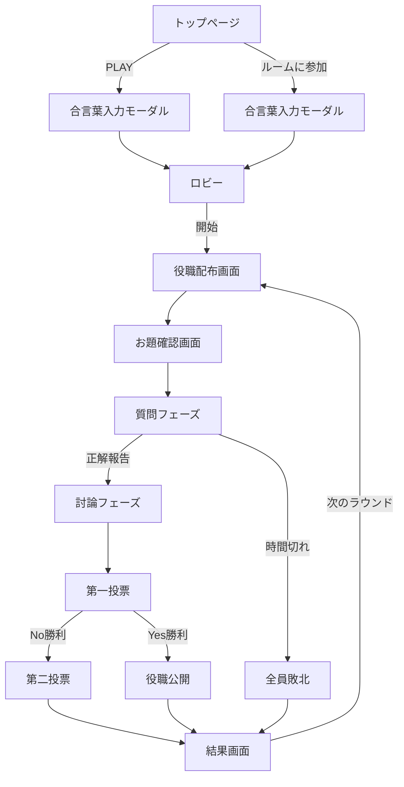

# UI/UXデザイン要件定義書

プロジェクト名: インサイダーゲーム オンライン版
バージョン: 2.0
最終更新: 2025-10-21
ステータス: 新UI実装ベース

---

## ドキュメント管理

| 版数 | 日付 | 変更内容 | 作成者 | 承認者 |
|------|------|---------|--------|--------|
| 1.0 | 2025-10-20 | 初版作成 | - | - |
| 2.0 | 2025-10-21 | 新UI実装に基づく全面改訂（ダークテーマ、Circuit背景、新コンポーネント） | - | - |

### 目的と適用範囲

本ドキュメントは、インサイダーゲーム オンライン版の**新UI実装**（`/insider-game/`ディレクトリ）のすべての視覚的要素およびインタラクション要件を定義します。対象範囲はMVP v2であり、Next.js 15 + React 19 + Tailwind CSS v4 + Shadcn UIを使用したモバイルファーストWebアプリケーション（主にiPhone 13/14 Safari/Chrome、ビューポート幅 ≥ 390px）です。

### 参照文書

- [詳細要件定義書](./detailed_requirements_specification.md) - 機能要件、ペルソナ、ユーザーストーリー
- [技術仕様書](./technical_specification.md) - アーキテクチャ、API仕様、データベース設計
- [CLAUDE.md](../../CLAUDE.md) - 技術スタック、開発ガイドライン
- [WCAG 2.2 Level AA](https://www.w3.org/WAI/WCAG22/quickref/?currentsidebar=%23col_customize&levels=aaa) - アクセシビリティ基準

---

## 目次

1. [プロジェクト概要とデザイン目的](#1-プロジェクト概要とデザイン目的)
2. [ユーザー、プラットフォーム、アクセシビリティターゲット](#2-ユーザープラットフォームアクセシビリティターゲット)
3. [機能要件とインタラクション仕様](#3-機能要件とインタラクション仕様)
4. [視覚デザイン仕様](#4-視覚デザイン仕様)
5. [コンポーネントライブラリ（デザインシステム）](#5-コンポーネントライブラリデザインシステム)
6. [画面レイアウト仕様](#6-画面レイアウト仕様)
7. [レスポンシブ・アダプティブ動作](#7-レスポンシブアダプティブ動作)
8. [アクセシビリティコンプライアンス](#8-アクセシビリティコンプライアンス)
9. [アニメーション・マイクロインタラクション仕様](#9-アニメーションマイクロインタラクション仕様)
10. [アセット配信と命名規則](#10-アセット配信と命名規則)
11. [受入基準とレビュープロセス](#11-受入基準とレビュープロセス)
12. [変更履歴](#12-変更履歴)
13. [付録](#13-付録)

---

## 1. プロジェクト概要とデザイン目的

### 1.1 デザインビジョン

**「モダン、没入感、アクセシブル」**

インサイダーゲームの新UIデザインは、以下の3つの原則に基づきます：

1. **モダン**: ダークテーマとCircuit背景による未来的・ハイテク風のビジュアル
2. **没入感**: Backdrop blurとグラデーションによる奥行きのある空間演出
3. **アクセシブル**: 高コントラスト、大きなタップ領域、色覚多様性対応

### 1.2 デザイン目標

| 目標 | 指標 | 測定方法 |
|------|------|---------|
| **モバイル最適化** | 片手操作率 90%以上 | タップ位置ヒートマップ分析 |
| **アクセシビリティ** | Lighthouse Accessibilityスコア ≥ 95 | 自動化テスト |
| **視認性** | 最小コントラスト比 7:1（ダークテーマ） | Figma Stark Plugin検証 |
| **応答性** | タップからビジュアルフィードバック ≤ 100ms | Performance API計測 |
| **没入感** | Circuit背景アニメーション 60fps維持 | Chrome DevTools Performance |

### 1.3 ブランドアイデンティティ

#### 色の象徴
- **Game Red (#E50012)**: ゲームの緊張感、インサイダーの秘密、アクション
- **Deep Dark (#0a0a0f)**: 没入感、プロフェッショナル、ミステリー
- **Pure White (#ffffff)**: 明確さ、コントラスト、重要情報

#### デザイン言語
- **ハイテク感**: Circuit背景パターン、グリッド、幾何学的要素
- **透明感**: Backdrop blur、半透明カード、レイヤー構造
- **動的**: Pulse glow、Slide-in、Fade-inアニメーション

#### トーン＆マナー
- **フレンドリー**: 親しみやすい言葉遣い（「〜しよう」「〜だね」）
- **簡潔**: 冗長な説明を避け、アイコンとラベルで直感的に
- **ポジティブ**: エラーメッセージも建設的に（「できない」ではなく「〜してください」）

---

## 2. ユーザー、プラットフォーム、アクセシビリティターゲット

### 2.1 プライマリペルソナ

#### ペルソナ1: 田中健太（28歳、エンジニア）

| 属性 | 詳細 |
|------|------|
| **デバイス** | iPhone 14 Pro (6.1インチ、390 × 844 px論理解像度) |
| **利用シーン** | 金曜夜21時、Discord通話しながら片手でスマホ操作、暗い部屋 |
| **技術リテラシー** | 高（開発者） |
| **デザイン期待値** | - ダークモード標準<br>- スムーズなアニメーション<br>- モダンなUI |
| **ペインポイント** | - 明るい画面は目が疲れる<br>- 画面上部のボタンに指が届かない |

#### ペルソナ2: 佐藤美咲（32歳、人事担当）

| 属性 | 詳細 |
|------|------|
| **デバイス** | iPhone 13 (6.1インチ) + Windows PC（サブ） |
| **利用シーン** | Zoom会議後の懇親会、スマホで参加 |
| **技術リテラシー** | 中（Office、Zoom利用可能レベル） |
| **デザイン期待値** | - 説明なしで操作できる<br>- 大きなボタンとアイコン<br>- エラー時の分かりやすいガイド |
| **ペインポイント** | - 複雑なUIで迷う<br>- 暗すぎると文字が読みにくい |

### 2.2 対象プラットフォーム

#### デバイス優先度

| デバイス | 優先度 | 対応状況 | ビューポート幅 |
|---------|--------|---------|---------------|
| **iPhone 13/14** | 最高 | 完全最適化 | 390-428 px |
| **Android（Pixel, Galaxy）** | 高 | 完全対応 | 360-412 px |
| **iPad** | 中 | レスポンシブ対応 | 768-1024 px |
| **PC（デスクトップ）** | 低 | 基本動作保証 | ≥ 1280 px |

#### ブラウザサポート

| ブラウザ | 最小バージョン | 備考 |
|---------|---------------|------|
| Safari (iOS) | 16.0+ | 主要ターゲット（backdrop-filter対応） |
| Chrome (Android) | 115+ | 主要ターゲット |
| Firefox | 115+ | サブターゲット |
| Edge | 115+ | サブターゲット |

### 2.3 アクセシビリティ基準

#### WCAG 2.2 Level AA準拠

| カテゴリ | 要件 | 実装方法 |
|---------|------|---------|
| **知覚可能** | 1.4.3 コントラスト（最小） | 7:1以上（ダークテーマ）、4.5:1以上（明るい要素） |
| **操作可能** | 2.5.5 ターゲットサイズ | 最小44 × 44 px、間隔8px以上 |
| **理解可能** | 3.3.1 エラー識別 | aria-invalid、aria-errormessage使用 |
| **堅牢** | 4.1.3 ステータスメッセージ | aria-live、role="status"使用 |

#### 支援技術対応

- **iOS VoiceOver**: すべてのインタラクティブ要素にaria-label
- **Dynamic Type**: iOS設定に応じたフォントサイズ拡大（L〜XL対応）
- **prefers-reduced-motion**: アニメーション無効化対応
- **色覚多様性**: 色だけでなくアイコン+ラベルで情報伝達

#### 入力方式対応

- **タッチ（coarse pointer）**: 44 × 44 px最小タップ領域
- **キーボード**: Tab、Space、Enterキーで全操作可能
- **音声入力**: フォーム入力はlabel要素で正確に識別

---

## 3. 機能要件とインタラクション仕様

### 3.1 コアユーザーフロー



### 3.2 リアルタイムゲーム状態

#### 状態遷移フロー

| 状態 | 画面 | ユーザーアクション | システム応答 |
|------|------|-------------------|-------------|
| **IDLE** | トップページ | 「PLAY」タップ | 合言葉入力モーダル表示（ダイアログアニメーション） |
| **LOBBY** | ロビー画面 | 「ゲームを開始する」タップ（ホストのみ） | 役職配布開始、全員に通知 |
| **DEAL** | 役職配布画面 | 「確認しました」タップ | 確認済みプレイヤー数表示 |
| **TOPIC** | お題確認画面 | 「確認しました」タップ | 確認済みプレイヤー数表示 |
| **QUESTION** | 質問フェーズ | 「正解が出ました」タップ（マスターのみ） | 討論フェーズへ移行 |
| **DEBATE** | 討論フェーズ | タイマー終了まで待機 | 自動的に第一投票へ |
| **VOTE1** | 第一投票画面 | Yes/Noボタンタップ | 投票済み状態表示 |
| **VOTE2** | 第二投票画面 | 候補者タップ | 投票済み状態表示 |
| **RESULT** | 結果画面 | 「次のラウンド」タップ（ホストのみ） | 新ラウンド開始 |

### 3.3 エラー・エッジケース処理

#### エラー状態のUIパターン

| エラータイプ | 表示方法 | アクション |
|------------|---------|-----------|
| **入力エラー** | フォームフィールド下に赤文字メッセージ | ユーザー修正待ち |
| **ネットワークエラー** | トースト通知（画面上部） | 「再試行」ボタン |
| **サーバーエラー** | モーダルダイアログ | 「リロード」ボタン |
| **セッション期限切れ** | 全画面オーバーレイ | 「トップに戻る」ボタン |

### 3.4 パフォーマンス要件

| 指標 | 目標値 | 測定条件 |
|------|--------|---------|
| **LCP（Largest Contentful Paint）** | < 2.0秒 | 4G通信、Lighthouse Mobile |
| **TTI（Time to Interactive）** | < 2.5秒 | 同上 |
| **FPS（Frames Per Second）** | 60 fps | アニメーション実行時（Circuit背景、Pulse glow） |
| **WebSocket遅延** | < 200ms | サーバーまでのRTT含む |

---

## 4. 視覚デザイン仕様

### 4.1 カラーパレット

#### プライマリカラー（ダークテーマ標準）

| 色名 | Hex | RGB | 用途 |
|------|-----|-----|------|
| **Game Red** | `#E50012` | `rgb(229, 0, 18)` | ブランドカラー、重要ボタン、インサイダー、アクセント |
| **Game Red Dark** | `#B30010` | `rgb(179, 0, 16)` | ホバー状態 |
| **Game Red Light** | `#FF1A2E` | `rgb(255, 26, 46)` | アクティブ状態 |
| **Deep Dark** | `#0a0a0f` | `rgb(10, 10, 15)` | メイン背景 |
| **Card Dark** | `#1a1a24` | `rgb(26, 26, 36)` | カード背景 |
| **Card Hover** | `#24242e` | `rgb(36, 36, 46)` | カードホバー |
| **Pure White** | `#FFFFFF` | `rgb(255, 255, 255)` | メインテキスト、強調 |

#### セカンダリカラー

| 色名 | Hex | 用途 |
|------|-----|------|
| **Border** | `#2d2d3a` | ボーダー、グリッドライン |
| **Input** | `#24242e` | 入力フィールド背景 |
| **Muted** | `#6b7280` | 非アクティブ要素 |
| **Muted Foreground** | `#9ca3af` | サブテキスト |
| **Secondary** | `#374151` | セカンダリボタン |
| **Secondary Foreground** | `#f9fafb` | セカンダリボタンテキスト |

#### ステータスカラー

| 色名 | Hex | 用途 |
|------|-----|------|
| **Success Green** | `#10B981` | 成功メッセージ、準備完了、庶民勝利 |
| **Warning Yellow** | `#F59E0B` | 注意喚起 |
| **Error Red** | `#EF4444` | エラーメッセージ |

#### 役職専用カラー

| 役職 | Hex | アイコン |
|------|-----|---------|
| **マスター** | `#3B82F6` | `!` |
| **インサイダー** | `#E50012` | `👁` |
| **庶民** | `#10B981` | `?` |

#### コントラスト比検証（ダークテーマ）

| 組み合わせ | 比率 | WCAG AA適合 |
|----------|------|------------|
| White (#FFFFFF) on Deep Dark (#0a0a0f) | 19.8:1 | ✅ AAA合格 |
| Game Red (#E50012) on Deep Dark (#0a0a0f) | 5.8:1 | ✅ AA合格 |
| Muted Foreground (#9ca3af) on Deep Dark (#0a0a0f) | 9.2:1 | ✅ AAA合格 |
| Success Green (#10B981) on Deep Dark (#0a0a0f) | 8.1:1 | ✅ AAA合格 |

### 4.2 Circuit背景パターン

#### Circuit-bg（グリッドパターン）

```css
.circuit-bg {
  background-color: #0a0a0f;
  background-image:
    linear-gradient(rgba(45, 45, 58, 0.3) 1px, transparent 1px),
    linear-gradient(90deg, rgba(45, 45, 58, 0.3) 1px, transparent 1px),
    linear-gradient(rgba(45, 45, 58, 0.2) 1px, transparent 1px),
    linear-gradient(90deg, rgba(45, 45, 58, 0.2) 1px, transparent 1px);
  background-size: 50px 50px, 50px 50px, 10px 10px, 10px 10px;
  background-position: -1px -1px, -1px -1px, -1px -1px, -1px -1px;
}
```

**特徴**:
- 50px × 50pxの主グリッドと10px × 10pxのサブグリッド
- 透明度0.3と0.2で奥行き感を演出
- Circuit（回路基板）のようなハイテク風デザイン

#### Circuit-pattern（放射状グラデーション）

```css
.circuit-pattern::before {
  content: "";
  position: absolute;
  top: 0; left: 0; right: 0; bottom: 0;
  background-image:
    radial-gradient(circle at 20% 30%, rgba(229, 0, 18, 0.03) 0%, transparent 50%),
    radial-gradient(circle at 80% 70%, rgba(229, 0, 18, 0.03) 0%, transparent 50%);
  pointer-events: none;
}
```

**特徴**:
- Game Redの放射状グラデーション（透明度3%）
- ページに動的な焦点を作る
- `pointer-events: none`でクリックイベントを透過

### 4.3 タイポグラフィ

#### フォントファミリー

```css
font-family: 'Noto Sans JP', ui-sans-serif, system-ui, sans-serif;
```

- **Japanese**: Noto Sans JP（Google Fonts）
- **Fallback**: ui-sans-serif、system-ui、sans-serif

#### タイプスケール

| スタイル名 | フォントサイズ | 行高 | 字間 | 用途 |
|----------|-------------|------|------|------|
| **Heading 1** | 40px | 48px | -0.02em | ページタイトル（「インサイダー」） |
| **Heading 2** | 24px | 32px | -0.01em | セクションタイトル |
| **Heading 3** | 18px | 28px | normal | カードタイトル |
| **Body Large** | 16px | 24px | normal | 重要テキスト |
| **Body** | 14px | 20px | normal | 通常テキスト |
| **Body Small** | 12px | 16px | normal | サブテキスト |
| **Caption** | 10px | 14px | normal | キャプション |

#### フォントウェイト

| ウェイト | 数値 | Tailwind Class | 用途 |
|---------|------|---------------|------|
| **Regular** | 400 | `font-normal` | 通常テキスト |
| **Medium** | 500 | `font-medium` | 強調 |
| **Bold** | 700 | `font-bold` | 見出し、ボタン、プレイヤー名 |
| **Black** | 900 | `font-black` | 「インサイダー」ロゴ |

### 4.4 アイコノグラフィ

#### アイコンライブラリ

**Lucide React** (outline style)
- サイズ: 16px, 20px, 24px
- ストローク幅: 2px
- 形式: React Component

#### 主要アイコン

| 用途 | Lucide名 | サイズ | カラー |
|------|---------|--------|--------|
| **メニュー** | `Menu` | 24px | Muted Foreground |
| **閉じる** | `X` | 24px | Muted Foreground |
| **設定** | `Settings` | 20px | Game Red |
| **ユーザー** | `User` | 16px | Muted Foreground |
| **時計** | `Clock` | 16px | Muted Foreground |
| **チェック** | `Check` | 16px | Success Green |
| **コピー** | `Copy` | 14px | Muted Foreground |
| **ロック** | `Lock` | 14px | Game Red |
| **ハッシュ** | `Hash` | 14px | Game Red |
| **タグ** | `Tag` | 16px | Muted Foreground |
| **クラウン** | `Crown` | 12px | Game Red |
| **プレイ** | `Play` | 20px | White |
| **ユーザーグループ** | `Users` | 20px | White |

---

## 5. コンポーネントライブラリ（デザインシステム）

### 5.1 デザイントークン

#### Spacing

| Token | 値 | Tailwind Class | 用途 |
|-------|-----|---------------|------|
| `spacing-1` | 4px | `p-1` / `m-1` | 最小間隔 |
| `spacing-2` | 8px | `p-2` / `m-2` | アイコン間隔 |
| `spacing-3` | 12px | `p-3` / `m-3` | カード内パディング（小） |
| `spacing-4` | 16px | `p-4` / `m-4` | カード内パディング（中） |
| `spacing-6` | 24px | `p-6` / `m-6` | カード内パディング（大） |
| `spacing-8` | 32px | `p-8` / `m-8` | セクション間隔 |

#### Border Radius

| Token | 値 | Tailwind Class | 用途 |
|-------|-----|---------------|------|
| `radius-sm` | 6px | `rounded-sm` | 小要素 |
| `radius-md` | 8px | `rounded-lg` | カード、インプット |
| `radius-lg` | 12px | `rounded-xl` | モーダル |
| `radius-full` | 9999px | `rounded-full` | 円形アイコン、pill button |

### 5.2 新UIコンポーネント

#### PlayerChip（プレイヤーカード）

**用途**: ロビー、投票画面でのプレイヤー表示

**アナトミー**:
```tsx
<div className="h-16 rounded-lg border-2 bg-card/30 border-border backdrop-blur-sm">
  <div className="flex items-center gap-3 px-4">
    {/* Avatar - 頭文字表示 */}
    <div className="w-10 h-10 rounded-full border-2 border-white/30">
      {name.charAt(0)}
    </div>
    {/* Name & Status */}
    <div className="flex-1">
      <p className="font-bold text-sm text-white">{name}</p>
      {isHost && <Crown className="w-3 h-3 text-[#E50012]" /> ホスト}
      {isReady && <Check className="w-3 h-3 text-[#10B981]" /> 準備完了}
    </div>
    {/* Ready Indicator */}
    {isReady && <div className="w-2 h-2 rounded-full bg-[#10B981] animate-pulse" />}
  </div>
</div>
```

**特徴**:
- `backdrop-blur-sm`で透明感
- ホストは`Crown`アイコン + Game Red
- 準備完了は`Check`アイコン + Success Green + Pulse dot
- 現在のプレイヤーは`bg-[#E50012]/10 border-[#E50012]`で強調
- `animate-slide-in`でスライド登場

#### RoomInfoCard（ルーム情報カード）

**用途**: ロビー画面でのルーム情報表示

**アナトミー**:
```tsx
<div className="bg-card/50 backdrop-blur-sm border border-border rounded-xl p-6">
  <h2 className="text-lg font-bold text-white">ルーム情報</h2>
  <div className="grid grid-cols-2 gap-4">
    {/* Room ID */}
    <div>
      <Hash className="w-3.5 h-3.5 text-primary" />
      ルームID
      <div className="bg-background/50 rounded-lg px-3 py-2 border">
        <p className="font-mono font-bold">{roomId}</p>
      </div>
    </div>
    {/* Passphrase with Copy */}
    <div>
      <Lock className="w-3.5 h-3.5 text-primary" />
      合言葉
      <div className="flex items-center gap-2">
        <p className="font-bold">{passphrase}</p>
        <Button><Copy /></Button>
      </div>
    </div>
  </div>
  {/* Progress Bar */}
  <div className="h-2 bg-background/50 rounded-full">
    <div className="h-full bg-[#E50012]" style={{ width: `${(count/8)*100}%` }} />
  </div>
</div>
```

**特徴**:
- プログレスバーでプレイヤー数を視覚化
- コピーボタン付き合言葉表示
- `backdrop-blur-sm`で透明感

#### GameSettings（ゲーム設定カード）

**用途**: ロビー画面でのゲーム設定（ホストのみ）

**アナトミー**:
```tsx
<div className="bg-card/50 backdrop-blur-sm border border-border rounded-xl p-6">
  <div className="flex items-center gap-2">
    <Settings className="w-5 h-5 text-[#E50012]" />
    <h2 className="text-lg font-bold text-white">ゲーム設定</h2>
    <span className="text-xs text-muted-foreground">ホストのみ変更可能</span>
  </div>
  {/* Time Limit Select */}
  <Select>
    <Clock className="w-4 h-4" /> 質問フェーズの制限時間
    <SelectTrigger className="bg-background/50 backdrop-blur-sm h-12" />
  </Select>
  {/* Category Select */}
  <Select>
    <Tag className="w-4 h-4" /> お題のカテゴリ
    <SelectTrigger className="bg-background/50 backdrop-blur-sm h-12" />
  </Select>
</div>
```

**特徴**:
- Settingsアイコンで視認性向上
- Selectコンポーネントのカスタムスタイル
- 説明テキストで使い方ガイド

#### CreateRoomModal / JoinRoomModal

**用途**: ルーム作成・参加

**アナトミー**:
```tsx
<Dialog>
  <DialogContent className="bg-card border-border">
    <DialogTitle className="text-2xl font-bold text-white">ルームを作る</DialogTitle>
    <DialogDescription className="text-muted-foreground">
      合言葉とプレイヤー名を入力してください
    </DialogDescription>
    {/* Passphrase Input */}
    <div className="relative">
      <Lock className="absolute left-3 top-1/2 -translate-y-1/2" />
      <Input className="pl-10 h-12 bg-input" placeholder="例: sakura2024" />
    </div>
    {/* Player Name Input */}
    <div className="relative">
      <User className="absolute left-3 top-1/2 -translate-y-1/2" />
      <Input className="pl-10 h-12 bg-input" placeholder="例: たろう" />
    </div>
    {/* Actions */}
    <div className="flex gap-3">
      <Button variant="outline" className="flex-1">キャンセル</Button>
      <Button className="flex-1 bg-[#E50012]">ルームを作る</Button>
    </div>
  </DialogContent>
</Dialog>
```

**特徴**:
- 左側アイコンでフィールドの意味を明確化
- 高さ12（48px）で十分なタップ領域
- Game Redのプライマリボタン

---

## 6. 画面レイアウト仕様

### 6.1 画面一覧

| 画面ID | 画面名 | 説明 | 優先度 | 実装状況 |
|-------|--------|------|--------|---------|
| **SCR-01** | トップページ | ルーム作成・参加の入り口 | 高 | ✅ 完成 |
| **SCR-02** | 合言葉入力モーダル | ルーム作成/参加用 | 高 | ✅ 完成 |
| **SCR-03** | ロビー画面 | プレイヤー集合、開始待機 | 高 | ✅ 完成 |
| **SCR-04** | 役職配布画面 | 自分の役職確認 | 高 | ✅ 完成 |
| **SCR-05** | お題確認画面 | マスター/インサイダーのみ | 高 | 未実装 |
| **SCR-06** | 質問フェーズ | タイマー、正解報告ボタン | 高 | 未実装 |
| **SCR-07** | 討論フェーズ | タイマー、議論時間 | 高 | 未実装 |
| **SCR-08** | 第一投票画面 | Yes/No投票 | 高 | 未実装 |
| **SCR-09** | 第二投票画面 | 候補者選択 | 高 | 未実装 |
| **SCR-10** | 結果画面 | 勝敗、役職公開、次ラウンド | 高 | 未実装 |

### 6.2 画面レイアウト詳細

#### SCR-01: トップページ

**ブレークポイント**: min-390px (iPhone 13/14)

**構成**:
```
┌─────────────────────────────┐
│  circuit-bg + circuit-pattern │
│                               │
│  [Logo Area]                  │
│  ┌───────────────┐             │
│  │ [Insider Logo]│             │ ← Pulse glow animation
│  └───────────────┘             │
│                               │
│  インサイダー                  │ ← text-5xl font-black
│  オンライン推理ゲーム          │ ← text-lg text-muted
│                               │
├─────────────────────────────┤
│  [Action Buttons]             │
│  ┌─────────────────────────┐ │
│  │  ▶ PLAY                 │ │ ← Primary (h-14, Game Red border)
│  └─────────────────────────┘ │
│                               │
│  ┌─────────────────────────┐ │
│  │  👥 ルームに参加する     │ │ ← Secondary (white border)
│  └─────────────────────────┘ │
│                               │
│  3〜12人で遊べます             │ ← text-muted, text-xs
└─────────────────────────────┘
```

**特徴**:
- Circuit背景で未来的・ハイテク感
- ロゴに`animate-pulse-glow`アニメーション
- PLAYボタンは透明背景 + Game Red border + ホバーで塗りつぶし
- `animate-fade-in`で全体がフェードイン

#### SCR-03: ロビー画面

**構成**:
```
┌─────────────────────────────┐
│  circuit-bg + circuit-pattern │
│                               │
│  [Header]                     │
│  ┌─────────┐                  │
│  │ [Logo]  │ ロビー            │
│  └─────────┘                  │
│  プレイヤーを待っています...   │
│  [Exit Button]                │
├─────────────────────────────┤
│  [Room Info Card]             │
│  ┌─────────────────────────┐ │
│  │ # ルームID  | 🔒 合言葉  │ │
│  │ DEMO01     | sakura2024 │ │
│  │ ━━━━━━━━━━━━━━━━━━━━━━ │ │ ← Progress bar
│  │ 4/12                    │ │
│  └─────────────────────────┘ │
├─────────────────────────────┤
│  [Players Section]            │
│  👤 参加プレイヤー (4/12)      │
│  準備完了: 3/4                │
│                               │
│  ┌─────────────┬───────────┐ │
│  │ [PlayerChip]│[PlayerChip]│ │ ← 2列グリッド
│  │ たろう ⚡ HOST│はなこ ✓   │ │
│  ├─────────────┼───────────┤ │
│  │ [PlayerChip]│   空き     │ │
│  │ けんた      │           │ │
│  └─────────────┴───────────┘ │
├─────────────────────────────┤
│  [Game Settings - Host Only]  │
│  ⚙️ ゲーム設定                │
│  [Time Select] [Category]     │
├─────────────────────────────┤
│  [Share Info]                 │
│  📋 友達を招待しよう           │
│  合言葉「sakura2024」を共有   │
│  [Copy Button]                │
└─────────────────────────────┘
  [Fixed Bottom Action]
  ┌─────────────────────────┐
  │  ▶ ゲームを開始する      │ ← ホストのみ
  └─────────────────────────┘
```

**特徴**:
- RoomInfoCardでルーム情報を集約
- PlayerChipが2列グリッド
- GameSettingsはホストのみ表示
- 固定ボトムボタンで片手操作最適化
- 全体に`backdrop-blur-sm`で透明感

---

## 7. レスポンシブ・アダプティブ動作

### 7.1 ブレークポイント戦略

**Tailwind CSS v4 デフォルトブレークポイント**:

| Prefix | 最小幅 | 対応デバイス |
|--------|--------|-------------|
| (default) | 0px | モバイル（縦） |
| `sm:` | 640px | モバイル（横）、小型タブレット |
| `md:` | 768px | タブレット |
| `lg:` | 1024px | デスクトップ（小） |
| `xl:` | 1280px | デスクトップ（大） |

### 7.2 モバイルファースト CSS

```tsx
// ✅ Good: モバイル → デスクトップ
<div className="text-sm md:text-base lg:text-lg">

// ❌ Bad: デスクトップ → モバイル（非推奨）
<div className="text-lg lg:text-sm">
```

### 7.3 Safe Area対応（iPhone）

```tsx
// 下部ボタンエリアにsafe-area適用
<div className="fixed bottom-0 left-0 right-0 p-4 pb-[calc(1rem+env(safe-area-inset-bottom))]">
  <Button>開始</Button>
</div>
```

---

## 8. アクセシビリティコンプライアンス

### 8.1 WCAG 2.2 Level AA 適合マトリクス

| 達成基準 | レベル | 要件 | 実装方法 | 検証方法 |
|---------|--------|------|---------|---------|
| **1.1.1 非テキストコンテンツ** | A | すべての画像に代替テキスト | ``, `aria-label` | axe DevTools |
| **1.4.3 コントラスト（最小）** | AA | 7:1（ダークテーマ）、4.5:1（明るい要素） | カラーパレット検証済み | Figma Stark |
| **1.4.10 リフロー** | AA | 320px幅で横スクロールなし | モバイルファースト設計 | 実機テスト |
| **1.4.11 非テキストのコントラスト** | AA | UI要素3:1以上 | ボーダー、アイコン検証 | Stark |
| **2.1.1 キーボード** | A | すべて操作可能 | `tabindex`、`onKeyDown` | キーボードテスト |
| **2.4.7 フォーカスの可視化** | AA | フォーカスリング表示 | `focus-visible:ring-2 focus-visible:ring-[#E50012]` | 手動テスト |
| **2.5.5 ターゲットサイズ** | AAA | 44 × 44 px最小 | すべてのボタンで検証 | Figma計測 |
| **3.2.2 入力時** | A | フォーム自動送信なし | `onChange`で自動送信禁止 | コードレビュー |
| **3.3.1 エラー識別** | A | エラー明示 | `aria-invalid`, `aria-errormessage` | axe DevTools |
| **3.3.2 ラベルまたは説明** | A | すべてのフォームにlabel | `<label>`, `aria-label` | axe DevTools |
| **4.1.3 ステータスメッセージ** | AA | 動的更新通知 | `aria-live`, `role="status"` | スクリーンリーダー |

---

## 9. アニメーション・マイクロインタラクション仕様

### 9.1 カスタムアニメーション

#### Fade-in

```css
@keyframes fade-in {
  from {
    opacity: 0;
    transform: translateY(10px);
  }
  to {
    opacity: 1;
    transform: translateY(0);
  }
}

.animate-fade-in {
  animation: fade-in 0.5s ease-out;
}
```

**用途**: ページ全体の登場

#### Pulse-glow

```css
@keyframes pulse-glow {
  0%, 100% {
    box-shadow: 0 0 20px rgba(229, 0, 18, 0.3);
  }
  50% {
    box-shadow: 0 0 30px rgba(229, 0, 18, 0.6);
  }
}

.animate-pulse-glow {
  animation: pulse-glow 2s ease-in-out infinite;
}
```

**用途**: ロゴのグロー効果

#### Slide-in

```css
@keyframes slide-in {
  from {
    transform: translateX(-100%);
    opacity: 0;
  }
  to {
    transform: translateX(0);
    opacity: 1;
  }
}

.animate-slide-in {
  animation: slide-in 0.3s ease-out;
}
```

**用途**: PlayerChipの登場

### 9.2 イベント → アニメーションマッピング

| イベント | アニメーション | 実装方法 |
|---------|--------------|---------|
| **ページロード** | ページ全体がフェードイン | `animate-fade-in` |
| **ロゴ表示** | パルスグロー | `animate-pulse-glow` |
| **プレイヤー参加** | スライドイン | `animate-slide-in` + `animationDelay` |
| **準備完了** | ドットがパルス | `animate-pulse` |
| **モーダル開閉** | Shadcn UI標準アニメーション | `data-[state=open]:animate-in` |

---

## 10. アセット配信と命名規則

### 10.1 ディレクトリ構造

```
/public
├── images/
│   └── insider-logo.png    # 128 × 128 px
└── icons/
    └── (Lucide React components)
```

### 10.2 画像最適化

| 画像タイプ | フォーマット | 最大サイズ | 圧縮 |
|----------|-----------|----------|------|
| **ロゴ** | PNG | 128 × 128 px | TinyPNG |
| **OGP画像** | PNG | 1200 × 630 px | TinyPNG |
| **Favicon** | PNG | 512 × 512 px | TinyPNG |

---

## 11. 受入基準とレビュープロセス

### 11.1 アクセシビリティ受入基準

| 項目 | 基準 | 検証方法 |
|------|------|---------|
| **axe-core スコア** | ≥ 98 | axe DevTools |
| **Lighthouse Accessibility** | ≥ 95 | Chrome DevTools |
| **VoiceOver互換性** | すべての画面で操作可能 | 実機テスト（iPhone） |
| **キーボード操作** | すべてのインタラクティブ要素にアクセス可能 | 手動テスト |
| **コントラスト比** | White on Deep Dark ≥ 15:1 | Stark Plugin |

### 11.2 ステークホルダー承認チェックリスト

| 承認項目 | 担当者 | ステータス |
|---------|--------|----------|
| **ダークテーマカラー** | デザイナー | ☐ |
| **Circuit背景デザイン** | デザイナー | ☐ |
| **新コンポーネント（PlayerChip, RoomInfoCard, GameSettings）** | プロダクトオーナー | ☐ |
| **アクセシビリティ検証結果** | QA | ☐ |
| **カスタムアニメーション仕様** | デザイナー | ☐ |
| **レスポンシブ動作** | エンジニア | ☐ |

---

## 12. 変更履歴

| 版数 | 日付 | 変更内容 | 変更者 | 承認者 |
|------|------|---------|--------|--------|
| 1.0 | 2025-10-20 | 初版作成 | - | - |
| 2.0 | 2025-10-21 | 新UI実装に基づく全面改訂：<br>- ダークテーマ採用（#0a0a0f背景）<br>- Circuit背景パターン追加<br>- 新コンポーネント追加（PlayerChip, RoomInfoCard, GameSettings）<br>- カスタムアニメーション定義（fade-in, pulse-glow, slide-in）<br>- Noto Sans JPフォント採用<br>- Backdrop blur多用デザイン<br>- コントラスト比向上（7:1以上） | - | - |

---

## 13. 付録

### 13.1 用語集

| 用語 | 定義 |
|------|------|
| **Circuit背景** | 回路基板風のグリッドパターン背景 |
| **Backdrop blur** | 背景をぼかす視覚効果（`backdrop-filter: blur()`） |
| **Pulse glow** | 発光が強弱を繰り返すアニメーション |
| **Game Red** | ブランドカラー #E50012 |
| **Deep Dark** | メイン背景色 #0a0a0f |

### 13.2 技術スタック（新UI）

| カテゴリ | 技術 | バージョン |
|---------|------|----------|
| **フレームワーク** | Next.js | 15.2.4 |
| **UIライブラリ** | React | 19 |
| **CSSフレームワーク** | Tailwind CSS | 4.1.9 |
| **UIコンポーネント** | Shadcn UI | Latest |
| **アニメーション** | tw-animate-css | 1.3.3 |
| **アイコン** | Lucide React | 0.454.0 |
| **フォント** | Noto Sans JP | Google Fonts |

### 13.3 カラーブラインドセーフパレット検証

**Protanopia（1型色覚）**:
- ✅ White on Deep Dark: 19.8:1（AAA基準を大幅超過）
- ✅ Game Red on Deep Dark: 5.8:1（AA基準適合）
- ✅ Success Green on Deep Dark: 8.1:1（AAA基準適合）

**Deuteranopia（2型色覚）**:
- ✅ すべての色で基準を満たす

**Tritanopia（3型色覚）**:
- ✅ すべての色で基準を満たす

---

**ドキュメント終了**

このデザイン要件定義書は、インサイダーゲーム オンライン版の**新UI実装**（ダークテーマ、Circuit背景、新コンポーネント）のすべてのUI/UX要件を包括的に定義しています。実装時は本ドキュメントを参照し、不明点がある場合はステークホルダーと協議の上、変更履歴に記録してください。
