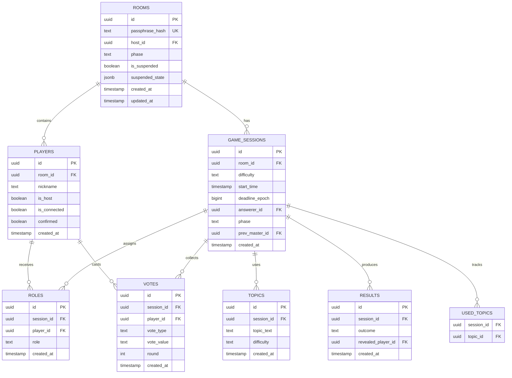

# 技術仕様書

最終更新: 2025-11-21
バージョン: 2.0

> **Note**: このドキュメントはインサイダーゲーム V2 の技術仕様です。
> V1 は `archive/v1` ブランチおよび `v1.0.0` タグにアーカイブされています。

---

## 目次

1. [アーキテクチャ概要](#アーキテクチャ概要)
2. [データベース設計](#データベース設計)
3. [API仕様](#api仕様)
4. [Supabase Edge Functions](#supabase-edge-functions)
5. [Row Level Security (RLS)](#row-level-security-rls)
6. [フロントエンド設計](#フロントエンド設計)
7. [セキュリティ実装](#セキュリティ実装)
8. [デプロイ・CI/CD](#デプロイcicd)

---

## アーキテクチャ概要

### システム構成図

```
┌─────────────────────────────────────────────────────────────┐
│                         ユーザー                             │
│                  (ブラウザ: Chrome/Safari/Firefox)           │
└────────────────────────┬────────────────────────────────────┘
                         │ HTTPS
                         ▼
┌─────────────────────────────────────────────────────────────┐
│                    Vercel Edge Network                       │
│  ┌──────────────────────────────────────────────────────┐   │
│  │          Next.js 15 (App Router)                     │   │
│  │  - Server Components                                 │   │
│  │  - Client Components (React 19)                      │   │
│  │  - Tailwind CSS 4                                    │   │
│  └──────────────────────────────────────────────────────┘   │
└────────────────────────┬────────────────────────────────────┘
                         │ HTTPS + WebSocket
                         ▼
┌─────────────────────────────────────────────────────────────┐
│                     Supabase Platform                        │
│  ┌──────────────┐  ┌──────────────┐  ┌──────────────┐      │
│  │ PostgreSQL   │  │   Realtime   │  │Edge Functions│      │
│  │   + RLS      │  │  (WebSocket) │  │  (Deno)      │      │
│  └──────────────┘  └──────────────┘  └──────────────┘      │
│  ┌──────────────┐  ┌──────────────┐                         │
│  │  Auth        │  │   Storage    │                         │
│  │  (Anonymous) │  │  (Future)    │                         │
│  └──────────────┘  └──────────────┘                         │
└─────────────────────────────────────────────────────────────┘
                         │
                         ▼
              ┌──────────────────────┐
              │  External Services   │
              │  - Discord (Voice)   │
              │  - LINE (Voice)      │
              └──────────────────────┘
```

### データフロー

#### 1. ルーム作成・参加フロー
```
Client → POST /api/rooms
       → Supabase: INSERT rooms, players
       → Realtime: Broadcast 'player_joined'
       → All Clients: Update UI
```

#### 2. ゲーム進行フロー
```
Host → POST /api/sessions/start
     → Edge Function: assign-roles
     → Supabase: INSERT game_sessions, roles
     → Realtime: Broadcast 'phase_change'
     → All Clients: Transition to new phase (XState)
```

#### 3. タイマー同期フロー
```
Server → Calculate deadline_epoch = now() + 300
       → UPDATE game_sessions SET deadline_epoch
       → Realtime: Broadcast deadline_epoch
Client → Calculate remaining = deadline - Date.now()/1000
       → Update UI every 100ms
```

---

## データベース設計

### ER図



### テーブル詳細仕様

#### rooms
```sql
CREATE TABLE rooms (
  id UUID PRIMARY KEY DEFAULT gen_random_uuid(),
  passphrase_hash TEXT NOT NULL UNIQUE,
  host_id UUID REFERENCES players(id) ON DELETE SET NULL,
  phase TEXT NOT NULL DEFAULT 'LOBBY' CHECK (phase IN (
    'LOBBY', 'DEAL', 'TOPIC', 'QUESTION', 'DEBATE',
    'VOTE1', 'VOTE2', 'VOTE2_RUNOFF', 'RESULT'
  )),
  is_suspended BOOLEAN DEFAULT false,
  suspended_state JSONB,
  created_at TIMESTAMP WITH TIME ZONE DEFAULT now(),
  updated_at TIMESTAMP WITH TIME ZONE DEFAULT now()
);

CREATE INDEX idx_rooms_passphrase ON rooms(passphrase_hash);
CREATE INDEX idx_rooms_phase ON rooms(phase);
CREATE INDEX idx_rooms_suspended ON rooms(is_suspended, updated_at);

-- 自動更新トリガー
CREATE OR REPLACE FUNCTION update_updated_at()
RETURNS TRIGGER AS $$
BEGIN
  NEW.updated_at = now();
  RETURN NEW;
END;
$$ LANGUAGE plpgsql;

CREATE TRIGGER trigger_rooms_updated_at
  BEFORE UPDATE ON rooms
  FOR EACH ROW
  EXECUTE FUNCTION update_updated_at();
```

#### players
```sql
CREATE TABLE players (
  id UUID PRIMARY KEY DEFAULT gen_random_uuid(),
  room_id UUID NOT NULL REFERENCES rooms(id) ON DELETE CASCADE,
  nickname TEXT NOT NULL,
  is_host BOOLEAN DEFAULT false,
  is_connected BOOLEAN DEFAULT true,
  confirmed BOOLEAN DEFAULT false,
  created_at TIMESTAMP WITH TIME ZONE DEFAULT now(),
  UNIQUE(room_id, nickname)
);

CREATE INDEX idx_players_room ON players(room_id);
CREATE INDEX idx_players_connected ON players(is_connected);
```

#### game_sessions
```sql
CREATE TABLE game_sessions (
  id UUID PRIMARY KEY DEFAULT gen_random_uuid(),
  room_id UUID NOT NULL REFERENCES rooms(id) ON DELETE CASCADE,
  difficulty TEXT NOT NULL CHECK (difficulty IN ('Easy', 'Normal', 'Hard')),
  start_time TIMESTAMP WITH TIME ZONE,
  deadline_epoch BIGINT,
  answerer_id UUID REFERENCES players(id) ON DELETE SET NULL,
  phase TEXT NOT NULL,
  prev_master_id UUID REFERENCES players(id) ON DELETE SET NULL,
  created_at TIMESTAMP WITH TIME ZONE DEFAULT now()
);

CREATE INDEX idx_sessions_room ON game_sessions(room_id);
CREATE INDEX idx_sessions_phase ON game_sessions(phase);
```

#### roles
```sql
CREATE TABLE roles (
  id UUID PRIMARY KEY DEFAULT gen_random_uuid(),
  session_id UUID NOT NULL REFERENCES game_sessions(id) ON DELETE CASCADE,
  player_id UUID NOT NULL REFERENCES players(id) ON DELETE CASCADE,
  role TEXT NOT NULL CHECK (role IN ('MASTER', 'INSIDER', 'CITIZEN')),
  created_at TIMESTAMP WITH TIME ZONE DEFAULT now(),
  UNIQUE(session_id, player_id)
);

CREATE INDEX idx_roles_session ON roles(session_id);
CREATE INDEX idx_roles_player ON roles(player_id);
```

#### topics
```sql
CREATE TABLE topics (
  id UUID PRIMARY KEY DEFAULT gen_random_uuid(),
  session_id UUID REFERENCES game_sessions(id) ON DELETE CASCADE,
  topic_text TEXT NOT NULL,
  difficulty TEXT NOT NULL CHECK (difficulty IN ('Easy', 'Normal', 'Hard')),
  created_at TIMESTAMP WITH TIME ZONE DEFAULT now()
);

CREATE INDEX idx_topics_session ON topics(session_id);
CREATE INDEX idx_topics_difficulty ON topics(difficulty);
```

#### master_topics (お題マスターデータ)
```sql
CREATE TABLE master_topics (
  id UUID PRIMARY KEY DEFAULT gen_random_uuid(),
  topic_text TEXT NOT NULL UNIQUE,
  difficulty TEXT NOT NULL CHECK (difficulty IN ('Easy', 'Normal', 'Hard')),
  category TEXT, -- 将来の拡張用
  created_at TIMESTAMP WITH TIME ZONE DEFAULT now()
);

CREATE INDEX idx_master_topics_difficulty ON master_topics(difficulty);
```

#### used_topics
```sql
CREATE TABLE used_topics (
  session_id UUID NOT NULL REFERENCES game_sessions(id) ON DELETE CASCADE,
  topic_id UUID NOT NULL,
  PRIMARY KEY(session_id, topic_id)
);
```

#### votes
```sql
CREATE TABLE votes (
  id UUID PRIMARY KEY DEFAULT gen_random_uuid(),
  session_id UUID NOT NULL REFERENCES game_sessions(id) ON DELETE CASCADE,
  player_id UUID NOT NULL REFERENCES players(id) ON DELETE CASCADE,
  vote_type TEXT NOT NULL CHECK (vote_type IN ('VOTE1', 'VOTE2', 'RUNOFF')),
  vote_value TEXT, -- VOTE1: 'yes'/'no', VOTE2/RUNOFF: player_id
  round INT DEFAULT 1,
  created_at TIMESTAMP WITH TIME ZONE DEFAULT now()
);

CREATE INDEX idx_votes_session ON votes(session_id);
CREATE INDEX idx_votes_player ON votes(player_id);
CREATE INDEX idx_votes_type_round ON votes(vote_type, round);
```

#### results
```sql
CREATE TABLE results (
  id UUID PRIMARY KEY DEFAULT gen_random_uuid(),
  session_id UUID NOT NULL REFERENCES game_sessions(id) ON DELETE CASCADE,
  outcome TEXT NOT NULL CHECK (outcome IN ('CITIZENS_WIN', 'INSIDER_WIN', 'ALL_LOSE')),
  revealed_player_id UUID REFERENCES players(id) ON DELETE SET NULL,
  created_at TIMESTAMP WITH TIME ZONE DEFAULT now()
);

CREATE INDEX idx_results_session ON results(session_id);
```

---

## API仕様

### REST API Endpoints

#### 1. ルーム管理

##### POST /api/rooms
ルームを作成する

**Request Body:**
```json
{
  "passphrase": "テスト部屋",
  "nickname": "プレイヤー1"
}
```

**Response (201 Created):**
```json
{
  "room_id": "550e8400-e29b-41d4-a716-446655440000",
  "player_id": "660e8400-e29b-41d4-a716-446655440000",
  "is_host": true
}
```

**Errors:**
- 400: `{ "error": "Passphrase must be 3-10 characters" }`
- 409: `{ "error": "Room with this passphrase already exists" }`

##### POST /api/rooms/join
既存ルームに参加する

**Request Body:**
```json
{
  "passphrase": "テスト部屋",
  "nickname": "プレイヤー2"
}
```

**Response (200 OK):**
```json
{
  "room_id": "550e8400-e29b-41d4-a716-446655440000",
  "player_id": "770e8400-e29b-41d4-a716-446655440000",
  "nickname": "プレイヤー2", // or "プレイヤー2-2" if duplicate
  "is_host": false
}
```

**Errors:**
- 404: `{ "error": "Room not found" }`

##### GET /api/rooms/[id]
ルーム情報を取得

**Response (200 OK):**
```json
{
  "id": "550e8400-e29b-41d4-a716-446655440000",
  "phase": "LOBBY",
  "is_suspended": false,
  "players": [
    {
      "id": "660e8400-e29b-41d4-a716-446655440000",
      "nickname": "プレイヤー1",
      "is_host": true,
      "is_connected": true
    }
  ]
}
```

#### 2. ゲームセッション

##### POST /api/sessions/start
ゲームを開始する（ホストのみ）

**Request Body:**
```json
{
  "room_id": "550e8400-e29b-41d4-a716-446655440000",
  "difficulty": "Normal"
}
```

**Response (200 OK):**
```json
{
  "session_id": "880e8400-e29b-41d4-a716-446655440000",
  "phase": "DEAL"
}
```

**Errors:**
- 403: `{ "error": "Only host can start game" }`
- 400: `{ "error": "Player count must be 3-15" }`

##### POST /api/sessions/[id]/correct
正解を報告する（マスターのみ）

**Request Body:**
```json
{
  "answerer_id": "770e8400-e29b-41d4-a716-446655440000"
}
```

**Response (200 OK):**
```json
{
  "phase": "DEBATE",
  "deadline_epoch": 1729444800,
  "debate_duration": 240
}
```

**Errors:**
- 403: `{ "error": "Only master can report correct answer" }`
- 410: `{ "error": "Time has expired" }`

##### POST /api/sessions/[id]/vote1
第一投票を投じる

**Request Body:**
```json
{
  "player_id": "770e8400-e29b-41d4-a716-446655440000",
  "vote": "yes" // or "no"
}
```

**Response (200 OK):**
```json
{
  "vote_recorded": true,
  "all_voted": false
}
```

##### POST /api/sessions/[id]/vote2
第二投票を投じる

**Request Body:**
```json
{
  "player_id": "770e8400-e29b-41d4-a716-446655440000",
  "candidate_id": "990e8400-e29b-41d4-a716-446655440000"
}
```

**Response (200 OK):**
```json
{
  "vote_recorded": true,
  "all_voted": true,
  "result": {
    "phase": "RESULT",
    "outcome": "CITIZENS_WIN",
    "revealed_player_id": "990e8400-e29b-41d4-a716-446655440000",
    "revealed_role": "INSIDER"
  }
}
```

#### 3. 中断・再開

##### POST /api/rooms/[id]/suspend
ゲームを中断する（ホストのみ）

**Request Body:**
```json
{
  "player_id": "660e8400-e29b-41d4-a716-446655440000"
}
```

**Response (200 OK):**
```json
{
  "suspended": true,
  "snapshot_saved": true
}
```

##### POST /api/rooms/[id]/resume
ゲームを再開する（ホストのみ）

**Request Body:**
```json
{
  "player_id": "660e8400-e29b-41d4-a716-446655440000"
}
```

**Response (200 OK):**
```json
{
  "resumed": true,
  "phase": "QUESTION",
  "deadline_epoch": 1729445000
}
```

**Errors:**
- 400: `{ "error": "Not all original members present", "missing": ["プレイヤー3"] }`

---

## Supabase Edge Functions

### 1. assign-roles

**パス**: `supabase/functions/assign-roles/index.ts`

**トリガー**: `POST /api/sessions/start` から呼び出し

**処理フロー**:
```typescript
export default async function handler(req: Request) {
  const { session_id, room_id } = await req.json();

  // 1. 前回マスターIDを取得
  const prevMaster = await getPrevMaster(room_id);

  // 2. 全プレイヤーを取得
  const players = await getPlayers(room_id);

  // 3. マスター選出（前回マスター除外）
  const eligibleForMaster = players.filter(p => p.id !== prevMaster);
  const master = randomSelect(eligibleForMaster);

  // 4. インサイダー選出（マスター除外）
  const eligibleForInsider = players.filter(p => p.id !== master.id);
  const insider = randomSelect(eligibleForInsider);

  // 5. 庶民設定
  const citizens = players.filter(p =>
    p.id !== master.id && p.id !== insider.id
  );

  // 6. DBに保存（トランザクション）
  await supabase.rpc('assign_roles_tx', {
    session_id,
    master_id: master.id,
    insider_id: insider.id,
    citizen_ids: citizens.map(c => c.id)
  });

  return new Response(JSON.stringify({ success: true }), {
    headers: { 'Content-Type': 'application/json' }
  });
}
```

### 2. select-topic

**パス**: `supabase/functions/select-topic/index.ts`

**トリガー**: お題確認フェーズ開始時

**処理フロー**:
```typescript
export default async function handler(req: Request) {
  const { session_id, difficulty } = await req.json();

  // 1. 難易度フィルタ
  const allTopics = await supabase
    .from('master_topics')
    .select('*')
    .eq('difficulty', difficulty);

  // 2. 使用済み除外
  const usedTopics = await supabase
    .from('used_topics')
    .select('topic_id')
    .eq('session_id', session_id);

  const usedIds = usedTopics.data.map(t => t.topic_id);
  const available = allTopics.data.filter(t => !usedIds.includes(t.id));

  // 3. ランダム選択
  const selected = randomSelect(available);

  // 4. DB保存
  await supabase.from('topics').insert({
    session_id,
    topic_text: selected.topic_text,
    difficulty: selected.difficulty
  });

  await supabase.from('used_topics').insert({
    session_id,
    topic_id: selected.id
  });

  return new Response(JSON.stringify({ topic: selected.topic_text }), {
    headers: { 'Content-Type': 'application/json' }
  });
}
```

### 3. tally-votes

**パス**: `supabase/functions/tally-votes/index.ts`

**トリガー**: 全員投票完了時

**処理フロー**:
```typescript
export default async function handler(req: Request) {
  const { session_id, vote_type } = await req.json();

  if (vote_type === 'VOTE1') {
    // 第一投票集計
    const votes = await getVotes(session_id, 'VOTE1');
    const yesCount = votes.filter(v => v.vote_value === 'yes').length;
    const total = votes.length;

    if (yesCount > total / 2) {
      // Yes過半数 → 正解者の役職公開
      const answerer = await getAnswerer(session_id);
      const role = await getRole(session_id, answerer.id);

      const outcome = role.role === 'INSIDER' ? 'CITIZENS_WIN' : 'INSIDER_WIN';

      await saveResult(session_id, outcome, answerer.id);
      await updatePhase(session_id, 'RESULT');

      return new Response(JSON.stringify({
        phase: 'RESULT',
        outcome,
        revealed_player_id: answerer.id,
        revealed_role: role.role
      }));
    } else {
      // No過半数 → 第二投票へ
      await updatePhase(session_id, 'VOTE2');
      return new Response(JSON.stringify({ phase: 'VOTE2' }));
    }
  }

  if (vote_type === 'VOTE2' || vote_type === 'RUNOFF') {
    // 第二投票/決選投票集計
    const votes = await getVotes(session_id, vote_type);
    const tally = countVotes(votes);

    const maxVotes = Math.max(...Object.values(tally));
    const topCandidates = Object.keys(tally).filter(
      id => tally[id] === maxVotes
    );

    if (topCandidates.length === 1) {
      // 最多票1人 → 役職公開
      const candidateId = topCandidates[0];
      const role = await getRole(session_id, candidateId);

      const outcome = role.role === 'INSIDER' ? 'CITIZENS_WIN' : 'INSIDER_WIN';

      await saveResult(session_id, outcome, candidateId);
      await updatePhase(session_id, 'RESULT');

      return new Response(JSON.stringify({
        phase: 'RESULT',
        outcome,
        revealed_player_id: candidateId,
        revealed_role: role.role
      }));
    } else {
      // 同票複数
      const currentRound = await getCurrentRound(session_id);

      if (currentRound >= 2) {
        // 3回目同票 → インサイダー勝利
        await saveResult(session_id, 'INSIDER_WIN', null);
        await updatePhase(session_id, 'RESULT');

        return new Response(JSON.stringify({
          phase: 'RESULT',
          outcome: 'INSIDER_WIN'
        }));
      } else {
        // 決選投票へ
        await updatePhase(session_id, 'VOTE2_RUNOFF');
        await incrementRound(session_id);

        return new Response(JSON.stringify({
          phase: 'VOTE2_RUNOFF',
          round: currentRound + 1,
          candidates: topCandidates
        }));
      }
    }
  }
}
```

### 4. cleanup-suspended-rooms

**パス**: `supabase/functions/cleanup-suspended-rooms/index.ts`

**トリガー**: Cron Job（毎日1回）

**処理フロー**:
```typescript
import { serve } from 'https://deno.land/std@0.168.0/http/server.ts';
import { createClient } from 'https://esm.sh/@supabase/supabase-js@2';

serve(async (req) => {
  const supabase = createClient(
    Deno.env.get('SUPABASE_URL')!,
    Deno.env.get('SUPABASE_SERVICE_ROLE_KEY')!
  );

  // 24時間以上前に中断されたルームを削除
  const { data, error } = await supabase
    .from('rooms')
    .delete()
    .eq('is_suspended', true)
    .lt('updated_at', new Date(Date.now() - 24 * 60 * 60 * 1000).toISOString());

  if (error) {
    return new Response(JSON.stringify({ error: error.message }), {
      status: 500
    });
  }

  return new Response(JSON.stringify({
    deleted_count: data?.length || 0
  }), {
    headers: { 'Content-Type': 'application/json' }
  });
});
```

**Cron設定** (`supabase/functions/.cron`):
```
# 毎日午前3時（JST）に実行
0 18 * * * cleanup-suspended-rooms
```

---

## Row Level Security (RLS)

### 役職秘匿ポリシー

```sql
-- rolesテーブル: 自分の役職のみ見える
CREATE POLICY "role_secrecy" ON roles
  FOR SELECT
  USING (
    player_id = auth.uid() OR
    (SELECT phase FROM game_sessions WHERE id = session_id) = 'RESULT'
  );

-- 全員がINSERTできる（Edge Functionからのみ）
CREATE POLICY "role_insert" ON roles
  FOR INSERT
  WITH CHECK (true);
```

### お題秘匿ポリシー

```sql
-- topicsテーブル: マスターとインサイダーのみ見える
CREATE POLICY "topic_secrecy" ON topics
  FOR SELECT
  USING (
    EXISTS (
      SELECT 1
      FROM roles
      WHERE session_id = topics.session_id
        AND player_id = auth.uid()
        AND role IN ('MASTER', 'INSIDER')
    )
  );

CREATE POLICY "topic_insert" ON topics
  FOR INSERT
  WITH CHECK (true);
```

### プレイヤー管理ポリシー

```sql
-- playersテーブル: 同じルームの人全員が見える
CREATE POLICY "players_visibility" ON players
  FOR SELECT
  USING (
    EXISTS (
      SELECT 1
      FROM players AS p
      WHERE p.room_id = players.room_id
        AND p.id = auth.uid()
    )
  );

-- 自分で自分を追加できる
CREATE POLICY "players_insert" ON players
  FOR INSERT
  WITH CHECK (id = auth.uid());

-- 自分の情報のみ更新できる
CREATE POLICY "players_update" ON players
  FOR UPDATE
  USING (id = auth.uid())
  WITH CHECK (id = auth.uid());
```

### 投票秘匿ポリシー

```sql
-- votesテーブル: 投票中は自分の票のみ、結果フェーズで全員見える
CREATE POLICY "vote_secrecy" ON votes
  FOR SELECT
  USING (
    player_id = auth.uid() OR
    (SELECT phase FROM game_sessions WHERE id = session_id) = 'RESULT'
  );

CREATE POLICY "vote_insert" ON votes
  FOR INSERT
  WITH CHECK (player_id = auth.uid());
```

---

## フロントエンド設計

### ディレクトリ構造

```
src/
├── app/                          # Next.js App Router
│   ├── layout.tsx               # Root layout
│   ├── page.tsx                 # Top page (room create/join)
│   ├── rooms/
│   │   └── [id]/
│   │       ├── lobby/
│   │       │   └── page.tsx     # Lobby screen
│   │       ├── deal/
│   │       │   └── page.tsx     # Role assignment screen
│   │       ├── topic/
│   │       │   └── page.tsx     # Topic confirmation screen
│   │       ├── question/
│   │       │   └── page.tsx     # Question phase screen
│   │       ├── debate/
│   │       │   └── page.tsx     # Debate phase screen
│   │       ├── vote1/
│   │       │   └── page.tsx     # First vote screen
│   │       ├── vote2/
│   │       │   └── page.tsx     # Second vote screen
│   │       └── result/
│   │           └── page.tsx     # Result screen
│   └── api/
│       ├── rooms/
│       │   ├── route.ts         # POST /api/rooms
│       │   └── join/
│       │       └── route.ts     # POST /api/rooms/join
│       └── sessions/
│           ├── start/
│           │   └── route.ts     # POST /api/sessions/start
│           └── [id]/
│               ├── correct/
│               │   └── route.ts # POST /api/sessions/[id]/correct
│               ├── vote1/
│               │   └── route.ts # POST /api/sessions/[id]/vote1
│               └── vote2/
│                   └── route.ts # POST /api/sessions/[id]/vote2
├── components/
│   ├── ui/                      # Headless UI components
│   │   ├── Button.tsx
│   │   ├── Card.tsx
│   │   ├── Modal.tsx
│   │   └── Toast.tsx
│   ├── features/
│   │   ├── RoleCard.tsx         # Role assignment card
│   │   ├── TopicDisplay.tsx     # Topic display (Master/Insider)
│   │   ├── Timer.tsx            # Countdown timer
│   │   ├── PlayerList.tsx       # Participant list
│   │   ├── VoteButton.tsx       # Vote button (Yes/No, Candidate)
│   │   └── ResultDisplay.tsx    # Result display
│   └── layout/
│       ├── Header.tsx
│       └── Footer.tsx
├── lib/
│   ├── supabase/
│   │   ├── client.ts            # Supabase client
│   │   └── realtime.ts          # Realtime subscription helpers
│   ├── state-machine/
│   │   ├── game-machine.ts      # XState game state machine
│   │   └── types.ts             # State machine types
│   ├── stores/
│   │   ├── room-store.ts        # Zustand room store
│   │   └── player-store.ts      # Zustand player store
│   └── utils/
│       ├── timer.ts             # Timer calculation utilities
│       ├── validation.ts        # Input validation
│       └── argon2.ts            # Argon2 hashing wrapper
└── types/
    ├── database.ts              # Supabase generated types
    └── game.ts                  # Game domain types
```

### XState ステートマシン

```typescript
// lib/state-machine/game-machine.ts
import { createMachine, assign } from 'xstate';

export const gameMachine = createMachine({
  id: 'game',
  initial: 'lobby',
  context: {
    roomId: null,
    sessionId: null,
    playerId: null,
    role: null,
    phase: 'lobby',
    deadlineEpoch: null,
  },
  states: {
    lobby: {
      on: {
        START: 'deal',
        RESUME: {
          target: 'question', // or other suspended phase
          actions: assign({ /* restore context */ }),
        },
      },
    },
    deal: {
      on: {
        ROLE_ASSIGNED: {
          target: 'topic',
          actions: assign({ role: (_, event) => event.role }),
        },
        SUSPEND: 'lobby',
      },
    },
    topic: {
      on: {
        TOPIC_CONFIRMED: 'question',
        SUSPEND: 'lobby',
      },
    },
    question: {
      on: {
        CORRECT_ANSWER: 'debate',
        TIMEOUT: 'result',
        SUSPEND: 'lobby',
      },
    },
    debate: {
      on: {
        DEBATE_END: 'vote1',
        SUSPEND: 'lobby',
      },
    },
    vote1: {
      on: {
        MAJORITY_YES: 'result',
        MAJORITY_NO: 'vote2',
        SUSPEND: 'lobby',
      },
    },
    vote2: {
      on: {
        MOST_VOTES: 'result',
        TIE: 'runoff',
        SUSPEND: 'lobby',
      },
    },
    runoff: {
      on: {
        MOST_VOTES: 'result',
        TIE_THIRD: 'result',
        SUSPEND: 'lobby',
      },
    },
    result: {
      on: {
        NEXT_ROUND: 'deal',
        BACK_TO_LOBBY: 'lobby',
        DISBAND: 'exit',
      },
    },
    exit: {
      type: 'final',
    },
  },
});
```

### Supabase Realtime購読

```typescript
// lib/supabase/realtime.ts
export function subscribeToRoom(roomId: string, callbacks: {
  onPhaseChange: (phase: string) => void;
  onPlayerJoin: (player: Player) => void;
  onPlayerLeave: (playerId: string) => void;
}) {
  const channel = supabase.channel(`room:${roomId}`)
    .on('postgres_changes', {
      event: 'UPDATE',
      schema: 'public',
      table: 'rooms',
      filter: `id=eq.${roomId}`,
    }, (payload) => {
      callbacks.onPhaseChange(payload.new.phase);
    })
    .on('postgres_changes', {
      event: 'INSERT',
      schema: 'public',
      table: 'players',
      filter: `room_id=eq.${roomId}`,
    }, (payload) => {
      callbacks.onPlayerJoin(payload.new as Player);
    })
    .on('postgres_changes', {
      event: 'DELETE',
      schema: 'public',
      table: 'players',
      filter: `room_id=eq.${roomId}`,
    }, (payload) => {
      callbacks.onPlayerLeave(payload.old.id);
    })
    .subscribe();

  return () => {
    channel.unsubscribe();
  };
}
```

---

## セキュリティ実装

### Argon2ハッシュ化

```typescript
// lib/utils/argon2.ts
import { hash, verify } from '@node-rs/argon2';

const HASH_OPTIONS = {
  memoryCost: 19456, // 19MB
  timeCost: 2,
  parallelism: 1,
};

export async function hashPassphrase(passphrase: string): Promise<string> {
  return await hash(passphrase, HASH_OPTIONS);
}

export async function verifyPassphrase(
  passphrase: string,
  hashedPassphrase: string
): Promise<boolean> {
  return await verify(hashedPassphrase, passphrase);
}
```

### 入力検証

```typescript
// lib/utils/validation.ts
import { z } from 'zod';

export const passphraseSchema = z.string()
  .min(3, 'Passphrase must be at least 3 characters')
  .max(10, 'Passphrase must be at most 10 characters')
  .transform(s => s.normalize('NFC')); // Unicode正規化

export const nicknameSchema = z.string()
  .min(1, 'Nickname must be at least 1 character')
  .max(20, 'Nickname must be at most 20 characters')
  .regex(/^[a-zA-Z0-9ぁ-んァ-ヶー一-龯\s]+$/, 'Invalid characters in nickname');

export function validatePassphrase(passphrase: string) {
  return passphraseSchema.safeParse(passphrase);
}

export function validateNickname(nickname: string) {
  return nicknameSchema.safeParse(nickname);
}
```

---

## デプロイ・CI/CD

### Vercel設定

**`vercel.json`**:
```json
{
  "version": 2,
  "buildCommand": "npm run build",
  "devCommand": "npm run dev",
  "installCommand": "npm install",
  "framework": "nextjs",
  "regions": ["nrt1"],
  "env": {
    "NEXT_PUBLIC_SUPABASE_URL": "@supabase_url",
    "NEXT_PUBLIC_SUPABASE_ANON_KEY": "@supabase_anon_key"
  },
  "headers": [
    {
      "source": "/(.*)",
      "headers": [
        {
          "key": "X-Frame-Options",
          "value": "DENY"
        },
        {
          "key": "X-Content-Type-Options",
          "value": "nosniff"
        },
        {
          "key": "Referrer-Policy",
          "value": "origin-when-cross-origin"
        }
      ]
    }
  ]
}
```

### GitHub Actions

**`.github/workflows/ci.yml`**:
```yaml
name: CI

on:
  push:
    branches: [main, develop]
  pull_request:
    branches: [main]

jobs:
  test:
    runs-on: ubuntu-latest
    steps:
      - uses: actions/checkout@v3
      - uses: actions/setup-node@v3
        with:
          node-version: '18'
      - run: npm ci
      - run: npm run lint
      - run: npm run type-check
      - run: npm test
      - run: npm run build

  deploy:
    needs: test
    if: github.ref == 'refs/heads/main'
    runs-on: ubuntu-latest
    steps:
      - uses: actions/checkout@v3
      - uses: amondnet/vercel-action@v20
        with:
          vercel-token: ${{ secrets.VERCEL_TOKEN }}
          vercel-org-id: ${{ secrets.VERCEL_ORG_ID }}
          vercel-project-id: ${{ secrets.VERCEL_PROJECT_ID }}
          vercel-args: '--prod'
```

---

## まとめ

本技術仕様書は、システム要件定義書を基に実装に必要な詳細を定義しました。

**次のステップ**:
1. Supabase Migration ファイル作成
2. Next.js プロジェクト初期化
3. Phase 1 開発開始

**参考資料**:
- Supabase公式ドキュメント: https://supabase.com/docs
- Next.js 14 App Router: https://nextjs.org/docs/app
- XState v5: https://statelyai.com/docs
