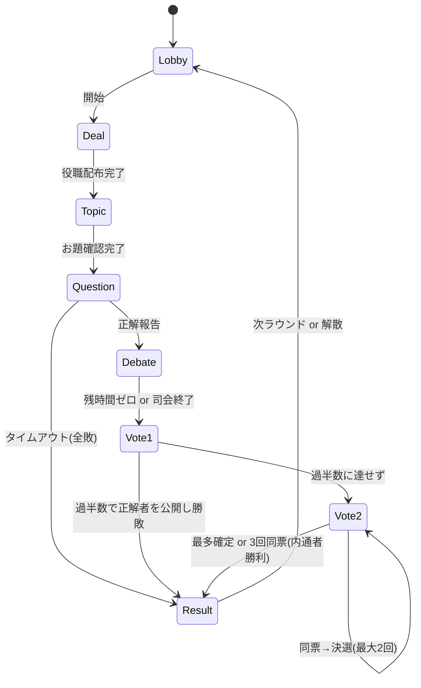

# インサイダー オンライン対戦アプリ概要（実装図ベース）
最終更新: 2025-10-20 (JST)

本書は、添付の「実装図一覧」を要約し、**企画/デザイン/実装/運用**の全体像を1ファイルで把握できるようにしたアプリ概要です。高校生でも理解できる表現を心がけています。

---

## 1. プロダクト概要（Why / Who / What）
- **目的（Why）**: オフラインの『インサイダー（オリジナル）』を、Discordの音声通話と連携しながら、ブラウザ（PC/スマホ）で気軽に遊べるようにする。
- **対象（Who）**: 友人グループ、オンラインサークル、社内懇親など。**3〜12人**でのプレイを最適化。
- **コア価値（What）**:
  - 役職/お題の**秘匿**をアプリが厳密に管理。
  - **タイマー・投票・結果集計**を自動化し、進行の負担を軽くする。
  - **中断/再開/再接続**に強く、オンラインでも安心して遊べる。

---

## 2. ゲーム仕様（オリジナル準拠のオンライン化）
- **役職**: マスター1・インサイダー1・庶民（残り）
- **フェーズ**:
  1) 役職配布 → 2) お題確認 → 3) 質問（5分） → 4) 討論（残り時間） → 5) 第一投票（正解者告発・多数決） →
  6) 第二投票（マスター/正解者を除外した候補から1人指名。**同票は決選投票**を最大2回、3回同票ならインサイダー勝利） → 7) 結果/全役職公開
- **進行**: 人間が司会（Discord）。アプリは**時間・投票・秘匿**を担当。
- **スマホ対応**: iPhoneで片手操作しやすいUI。

---

## 3. 画面一覧（レスポンシブ、iPhoneライク）
1. **トップ**: 「部屋を作る / 探す」。合言葉（3〜10文字）で入室。
2. **ロビー**: 参加者一覧、ホストに開始/再開ボタン。入退室をリアルタイム反映。
3. **役職配布**: 各自に秘密カード表示（マスター=「!」/ インサイダー=目 / 庶民=「?」）。
4. **お題確認**: マスター=常時小表示、インサイダー=ポップアップ（例: 10秒）。庶民は非表示。
5. **質問フェーズ**: 大きなカウントダウン（**締切epoch**で同期）。マスター用「正解報告」ボタン。
6. **討論フェーズ**: 残時間カウント、正解者ハイライト。
7. **第一投票**: 「正解者をインサイダーとして告発しますか？」Yes/No二択、大きいタップ領域。
8. **第二投票/決選**: 候補リストから単一選択。最多得票→公開。**同票時は決選×2**、なおダメならインサイダー勝利。
9. **結果/スコア**: 勝敗、全員の役職公開、（任意）累計スコア、次ラウンド/解散。
10. **中断/再開**: 任意フェーズでスナップショット保存→全員復帰で再開。

> **デザイン方針**: 余白多め/角丸/フラット/軽いフェード&スライド。配色は**赤（#E50012 目安）×黒×白**を基調に、文字はコントラストAA以上。役職・フェーズは**色だけでなくアイコン/ラベル**でも伝達。

---

## 4. ゲームフロー（簡易）

---

## 5. 技術アーキテクチャ（実装図の骨子）
### 5.1 クライアント（React）
- フレームワーク: React + Vite/Next.js、TypeScript推奨
- 状態管理: Redux Toolkit または XState（フェーズを**明示的なステートマシン**で）
- UI: Tailwind / MUI / Chakra 任意（iPhoneライクなコンポーネント）
- タイマー: サーバから**締切epoch**を受け、クライアントで差分表示
- リアルタイム: Supabase Realtime（または socket.io）購読

### 5.2 サーバ/DB（例: Supabase）
- DBテーブル（要点）
  - `rooms`（合言葉・phase・中断状態）
  - `players`（room紐づけ・接続状態・確認フラグ）
  - `game_sessions`（difficulty・start/deadline・正解者ID・前回マスター）
  - `roles`（session×playerの役職）
  - `topics` / `used_topics`（お題管理）
  - `votes`（第一/第二/決選の投票ログ）
  - `results`（勝敗・公開対象）
- Realtime: ルーム単位購読でフェーズ/参加者/投票を反映
- Edge Functions/RPC: 役職配布、投票集計、フェーズ遷移の原子処理
- RLS（Row Level Security）: 役職/お題の**秘匿**（本人だけ読める）

### 5.3 同期/回復
- 再接続: 現フェーズへ**状態再構築**（未投票なら投票可）
- 中断/再開: スナップショット保存→全員復帰で再開（残り時間は再計算）

---

## 6. 機能要件（MVP）
- 合言葉ルーム作成/参加（重複&存在チェック）
- ロビー（入退室/人数制限/開始）
- 役職配布（前回マスター除外ランダム）
- お題配信（難易度/重複除外、M→常時/ I→一時）
- 質問タイマー（5分、正解→残時間を討論に継承）
- 第一投票（Yes/No 過半数）
- 第二投票（候補から1名、決選×2、3回同票は内通者勝利）
- 結果/全役職公開/次ラウンド
- 中断・再開 / 離脱・再接続
- モバイル最適化 / アクセシビリティ（44pxタップ、16px+ フォント）

### あると嬉しい（将来）
- 質問ログ/順番支援、個人メモ
- スコア制/ランキング、成績エクスポート
- ルーム設定（同票処理・お題表示秒・難易度）
- 連戦の**マスター持ち回り**オプション

---

## 7. 主要ユースケースと受け入れ基準（簡易）
- **役職秘匿**: 他人の役職・お題が見えない（RLS/スコープ確認）。
- **正解→残時間継承**: 正解ボタン押下の瞬間に経過/残りを正しく計算。
- **投票**: 第一=過半数/ 第二=最多票/ 決選×2/ 3回同票=内通者勝利。
- **再接続**: 直前フェーズに復旧、未投票は投票画面へ。
- **中断/再開**: 同一メンバー全員復帰でのみ再開可能。

---

## 8. 非機能要件
- **パフォーマンス**: 1ルーム8人で快適。イベント反映<500ms目標。
- **可用性**: セッション切断時の自己回復。エッジ障害でも再接続誘導。
- **セキュリティ**: ルームトークン/認証、RLS、イベントの整合性検証（不正操作はサーバで拒否）。
- **ログ/監査**: 最小限のイベントログ（誰がいつ何をしたか）。個人情報は持たない。

---

## 9. ブランド/デザイン指針
- **テーマ**: 本家リスペクト（赤×黒×白、目/!/?のモチーフ）。
- **iPhoneライク**: シンプル、指で押しやすい、分かりやすい言葉。
- **著作権/商標**: 公式画像/ロゴの無断使用は避ける。**連想できるが固有表現に依存しない**抽象化アイコンを自作。

---

## 10. テスト観点（抜粋）
- 役職配布の偏り・重複防止、前回マスター除外
- 正解の境界秒（0秒/1秒前）での挙動
- 投票の全パターン（過半数/最多票/同票×3/再投票権）
- 離脱/再接続/中断/再開の復元
- モバイル操作（誤タップ防止、縦長デザイン）

---

## 11. 開発ロードマップ（3スプリント例）
**S1（基盤）**: ルーム/参加/Realtime、役職配布、RLS、タイマー(epoch)

**S2（ゲーム進行）**: お題配信、質問→討論→投票（第一/第二/決選）、結果公開

**S3（運用強化）**: 中断/再開、再接続、UX磨き（モバイル/アクセシビリティ/トースト）、簡易スコア

---

## 12. 開発メモ（実装図に沿ったTips）
- **SSOT**: 状態は**サーバが真実**。クライアントは表示に専念。
- **フェーズ制御**: XState等で**遷移を厳密化**（フェーズ外イベントは無視）。
- **投票**: 匿名・同時公開。**全員投了で即集計**。長期未投票はホストがスキップ/中断。
- **UI**: 主要操作を**下部固定ボタン**に集約（モバイル片手）。
- **可観測性**: 重要イベントにトレースID（デバッグ容易）。

---

## 13. まとめ
- オンラインならではの**秘匿・時間・投票**の自動化で、司会は会話に集中。
- 実装図の詳細（フロー/シーケンス/DB）を、上記のMVPに落とし込めば**短期で動く体験**が作れます。
- デザインは**iPhoneライク × 本家リスペクト**。安全に、軽快に、迷わず遊べるUIを目指します。

